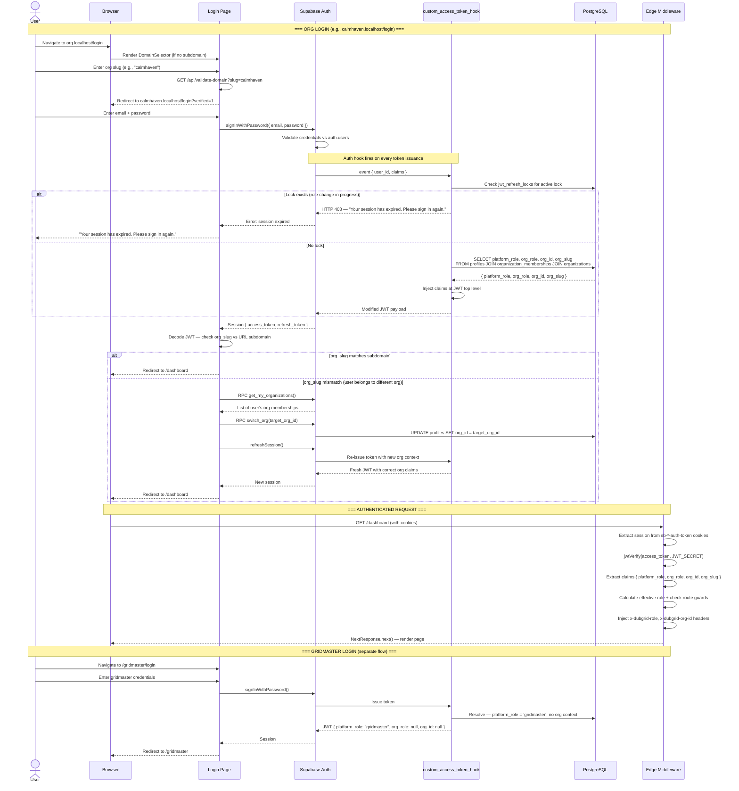
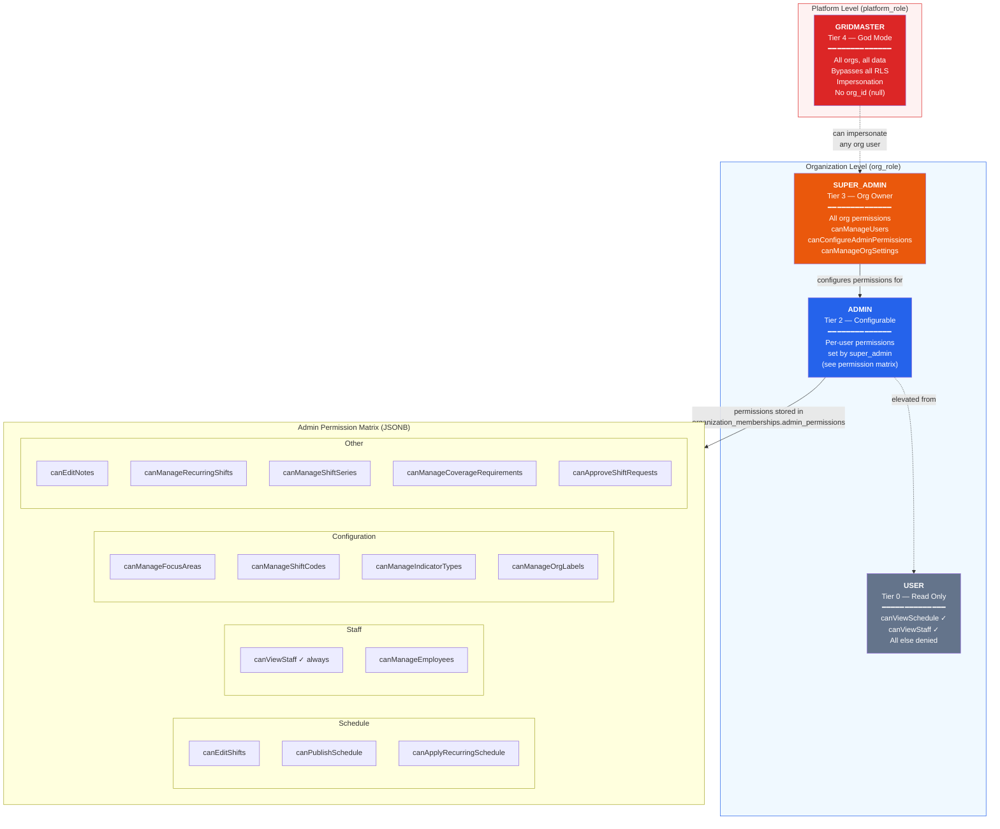
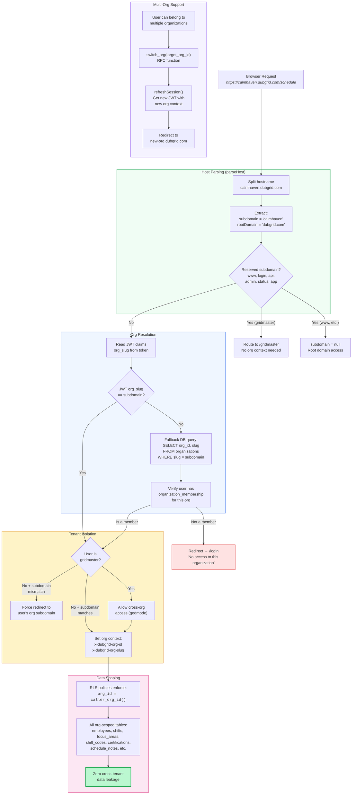
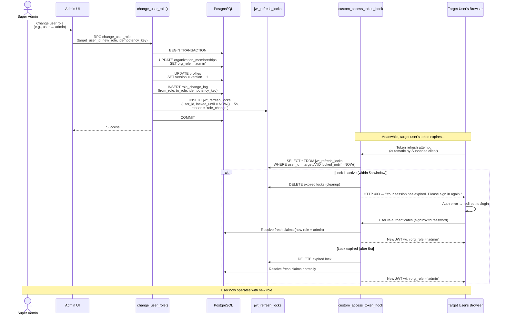
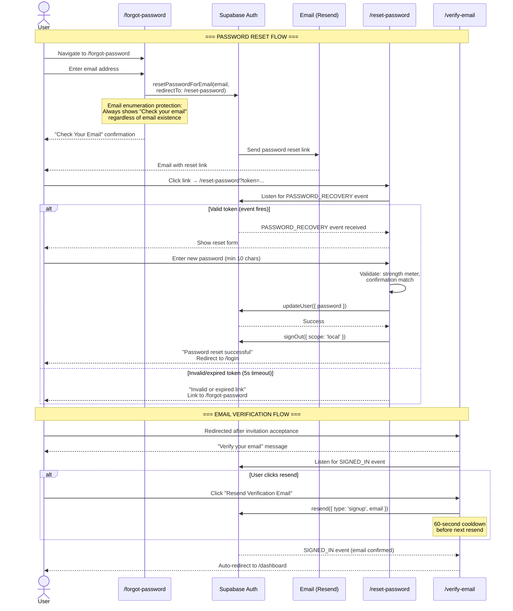
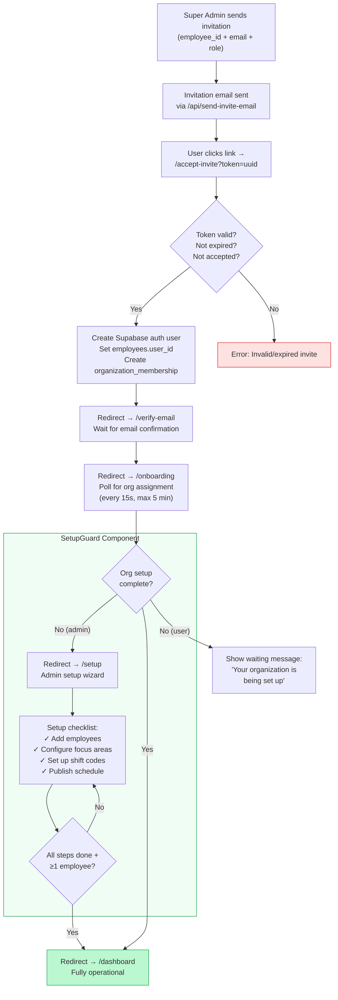
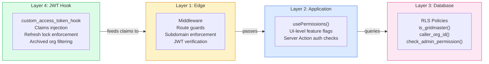

# DubGrid System Flowcharts

> All diagrams are Mermaid-based. Render in GitHub, VS Code (Mermaid extension), or any Mermaid-compatible viewer.

---

## 1. Authentication Flow

---

## 2. RBAC Hierarchy & Permission Model

---

## 3. Request Lifecycle (Browser to Database)

```mermaid
flowchart TD
    REQ["Browser Request<br/><i>GET calmhaven.localhost/schedule</i>"]

    subgraph MW["Edge Middleware (middleware.ts)"]
        direction TB
        PUB{"Public route?<br/>/login, /api, /,<br/>/accept-invite"}
        SESS["Extract session<br/>from sb-*-auth-token cookies<br/>(multi-chunk reconstruction)"]
        NOSESS{"Session<br/>exists?"}
        JWT["Verify JWT signature<br/>jwtVerify(token, JWT_SECRET)"]
        CLAIMS["Extract claims:<br/>platform_role, org_role,<br/>org_id, org_slug"]
        FALLBACK{"Claims<br/>complete?"}
        DBFALLBACK["Fallback: Query DB<br/>profiles + organization_memberships<br/>+ organizations"]
        EFFROLE["Calculate effective role:<br/>gridmaster > super_admin > admin > user"]
        SUBDOMAIN{"Subdomain matches<br/>org_slug?"}
        ROUTEGUARD{"Route access<br/>allowed?"}
        HEADERS["Inject headers:<br/>x-dubgrid-role<br/>x-dubgrid-org-id<br/>x-dubgrid-org-slug"]
    end

    subgraph PAGE["Next.js Page Render"]
        direction TB
        LAYOUT["Root Layout<br/>(AuthProvider + AppShell)"]
        COMPONENT["Page Component<br/>(Client or Server)"]
        PERMS["usePermissions() hook<br/>Decode JWT → extract role<br/>Admin? → fetch admin_permissions"]
        RENDER["Render with RBAC context<br/>(show/hide UI based on perms)"]
    end

    subgraph ACTION["Server Action / Data Mutation"]
        direction TB
        AUTHCHECK["Server-side auth check<br/>getSession() + verify user"]
        MUTATION["Execute DB query<br/>(parameterized)"]
    end

    subgraph RLS["PostgreSQL RLS Layer"]
        direction TB
        RLSCHECK{"RLS Policy Check"}
        ISGM["is_gridmaster()?"]
        ORGMATCH["caller_org_id() = row.org_id?"]
        PERMCHECK["check_admin_permission()<br/>(e.g., 'canEditShifts')"]
        ALLOW["✓ Allow"]
        DENY["✗ Deny"]
    end

    REQ --> PUB
    PUB -->|Yes| PASS1["NextResponse.next()"]
    PUB -->|No| SESS
    SESS --> NOSESS
    NOSESS -->|No session| REDIR1["Redirect → /login"]
    NOSESS -->|Yes| JWT
    JWT --> CLAIMS
    CLAIMS --> FALLBACK
    FALLBACK -->|Yes| EFFROLE
    FALLBACK -->|No| DBFALLBACK
    DBFALLBACK --> EFFROLE
    EFFROLE --> SUBDOMAIN
    SUBDOMAIN -->|No| REDIR2["Redirect → correct subdomain"]
    SUBDOMAIN -->|Yes| ROUTEGUARD
    ROUTEGUARD -->|"/staff, /settings<br/>but role < admin"| REDIR3["Redirect → /schedule"]
    ROUTEGUARD -->|"/gridmaster<br/>but not gridmaster"| REDIR4["Redirect → /schedule"]
    ROUTEGUARD -->|Allowed| HEADERS

    HEADERS --> LAYOUT
    LAYOUT --> COMPONENT
    COMPONENT --> PERMS
    PERMS --> RENDER

    RENDER -->|"User action<br/>(e.g., edit shift)"| AUTHCHECK
    AUTHCHECK --> MUTATION

    MUTATION --> RLSCHECK
    RLSCHECK --> ISGM
    ISGM -->|Yes| ALLOW
    ISGM -->|No| ORGMATCH
    ORGMATCH -->|No| DENY
    ORGMATCH -->|Yes| PERMCHECK
    PERMCHECK -->|Pass| ALLOW
    PERMCHECK -->|Fail| DENY

    style MW fill:#fef3c7,stroke:#d97706
    style PAGE fill:#dbeafe,stroke:#2563eb
    style ACTION fill:#dcfce7,stroke:#16a34a
    style RLS fill:#fce7f3,stroke:#db2777
    style REDIR1 fill:#fee2e2,stroke:#dc2626
    style REDIR2 fill:#fee2e2,stroke:#dc2626
    style REDIR3 fill:#fee2e2,stroke:#dc2626
    style REDIR4 fill:#fee2e2,stroke:#dc2626
    style ALLOW fill:#bbf7d0,stroke:#16a34a
    style DENY fill:#fecaca,stroke:#dc2626
```

---

## 4. Data Model (Entity Relationship Diagram)

```mermaid
erDiagram
    auth_users {
        uuid id PK
    }

    organizations {
        uuid id PK
        text name
        text slug UK "subdomain"
        text address
        text phone
        integer employee_count
        text logo_url
        text app_name
        jsonb theme_config
        jsonb landing_page_config
        text focus_area_label "custom terminology"
        text certification_label "custom terminology"
        text role_label "custom terminology"
        text timezone
        timestamptz archived_at "soft delete"
    }

    profiles {
        uuid id PK,FK "→ auth.users"
        uuid org_id FK "→ organizations"
        platform_role platform_role "gridmaster | none"
        bigint version "optimistic lock"
        boolean role_locked
    }

    organization_memberships {
        bigint id PK
        uuid user_id FK "→ auth.users"
        uuid org_id FK "→ organizations"
        org_role org_role "super_admin | admin | user"
        jsonb admin_permissions "fine-grained perms"
    }

    employees {
        uuid id PK
        uuid org_id FK "→ organizations"
        text first_name
        text last_name
        integer seniority
        text email
        text phone
        bigint certification_id FK "→ certifications"
        bigint_arr role_ids "→ organization_roles[]"
        bigint_arr focus_area_ids "→ focus_areas[]"
        employee_status status "active | benched | terminated"
        uuid user_id FK "→ auth.users (nullable)"
    }

    focus_areas {
        bigint id PK
        uuid org_id FK "→ organizations"
        text name
        text color_bg
        text color_text
        integer sort_order
        integer break_minutes
    }

    certifications {
        bigint id PK
        uuid org_id FK "→ organizations"
        text name
        text abbr
        integer sort_order
    }

    organization_roles {
        bigint id PK
        uuid org_id FK "→ organizations"
        text name
        text abbr
        integer sort_order
    }

    shift_categories {
        bigint id PK
        uuid org_id FK "→ organizations"
        text name
        text color
        time start_time
        time end_time
        bigint focus_area_id FK "→ focus_areas (nullable)"
        integer break_minutes
    }

    shift_codes {
        bigint id PK
        uuid org_id FK "→ organizations"
        text label "e.g. D, EVE, N"
        text name "e.g. Day Shift"
        text color
        text border_color
        text text_color
        bigint category_id FK "→ shift_categories"
        bigint focus_area_id FK "→ focus_areas"
        bigint_arr required_certification_ids "→ certifications[]"
        time default_start_time
        time default_end_time
        numeric default_duration_hours
        integer default_duration_minutes
    }

    absence_types {
        bigint id PK
        uuid org_id FK "→ organizations"
        text label "e.g. X, V, S"
        text name "e.g. Day Off, PTO, Sick"
        text color
        text border_color
        text text_color
        integer sort_order
    }

    shifts {
        uuid emp_id PK,FK "→ employees"
        date date PK
        uuid org_id FK "→ organizations"
        bigint version "optimistic lock"
        uuid series_id FK "→ shift_series"
        boolean from_recurring
        bigint_arr draft_shift_code_ids "→ shift_codes[]"
        bigint_arr published_shift_code_ids "→ shift_codes[]"
        boolean draft_is_delete
        bigint focus_area_id FK "→ focus_areas"
    }

    recurring_shifts {
        uuid id PK
        uuid emp_id FK "→ employees"
        uuid org_id FK "→ organizations"
        smallint day_of_week "0=Sun 6=Sat"
        bigint shift_code_id FK "→ shift_codes"
        bigint absence_type_id FK "→ absence_types"
        date effective_from
        date effective_until
    }

    shift_series {
        uuid id PK
        uuid emp_id FK "→ employees"
        uuid org_id FK "→ organizations"
        shift_series_frequency frequency "daily|weekly|biweekly"
        smallint_arr days_of_week
        date start_date
        date end_date
        bigint shift_code_id FK "→ shift_codes"
    }

    schedule_notes {
        bigint id PK
        uuid org_id FK "→ organizations"
        uuid emp_id FK "→ employees"
        date date
        integer indicator_type_id FK "→ indicator_types"
        text status "published | draft | draft_deleted"
    }

    indicator_types {
        integer id PK
        uuid org_id FK "→ organizations"
        text name
        text color
    }

    coverage_requirements {
        bigint id PK
        uuid org_id FK "→ organizations"
        bigint focus_area_id FK "→ focus_areas"
        bigint shift_code_id FK "→ shift_codes"
        smallint day_of_week "nullable = all days"
        integer min_staff
    }

    shift_requests {
        uuid id PK
        uuid org_id FK "→ organizations"
        shift_request_type type "pickup | swap"
        shift_request_status status
        uuid requester_emp_id FK "→ employees"
        date requester_shift_date
        bigint_arr requester_shift_code_ids "→ shift_codes[]"
        bigint requester_focus_area_id FK "→ focus_areas"
        time requester_custom_start_time
        time requester_custom_end_time
        uuid target_emp_id FK "→ employees (swap)"
        date target_shift_date
        bigint_arr target_shift_code_ids "→ shift_codes[]"
        bigint target_focus_area_id FK "→ focus_areas"
        time target_custom_start_time
        time target_custom_end_time
        uuid admin_user_id FK "→ auth.users"
        text admin_note
        timestamptz expires_at "72h default"
        timestamptz resolved_at
        uuid idempotency_key UK
    }

    invitations {
        uuid id PK
        uuid org_id FK "→ organizations"
        uuid invited_by FK "→ auth.users"
        text email
        org_role role_to_assign
        uuid token UK "secret link"
        timestamptz expires_at "72h default"
        uuid employee_id FK "→ employees"
    }

    role_change_log {
        uuid id PK
        uuid target_user_id FK "→ auth.users"
        uuid changed_by_id FK "→ auth.users"
        text from_role
        text to_role
        text idempotency_key UK
        text change_type "role_change | permission_change"
        jsonb permissions_before
        jsonb permissions_after
    }

    jwt_refresh_locks {
        uuid user_id PK,FK "→ auth.users"
        timestamptz locked_until
        text reason
    }

    impersonation_sessions {
        uuid session_id PK
        uuid gridmaster_id FK "→ auth.users"
        uuid target_user_id FK "→ auth.users"
        uuid target_org_id FK "→ organizations"
        timestamptz expires_at "30min default"
    }

    user_sessions {
        uuid id PK
        uuid user_id FK "→ auth.users"
        text device_label
        inet ip_address
        text refresh_token_hash UK
    }

    schedule_draft_sessions {
        uuid id PK
        uuid org_id FK,UK "→ organizations (one per org)"
        uuid saved_by FK "→ auth.users"
        date start_date
        date end_date
    }

    recurring_shifts_draft_sessions {
        uuid id PK
        uuid org_id FK,UK "→ organizations (one per org)"
        uuid saved_by FK "→ auth.users"
        jsonb draft_data
    }

    publish_history {
        uuid id PK
        uuid org_id FK "→ organizations"
        uuid published_by FK "→ auth.users"
        date start_date
        date end_date
        integer change_count
        jsonb changes
    }

    %% === RELATIONSHIPS ===

    auth_users ||--o| profiles : "has profile"
    auth_users ||--o{ organization_memberships : "belongs to orgs"
    auth_users ||--o{ user_sessions : "has sessions"
    auth_users ||--o| jwt_refresh_locks : "may have lock"

    organizations ||--o{ organization_memberships : "has members"
    organizations ||--o{ employees : "employs"
    organizations ||--o{ focus_areas : "has areas"
    organizations ||--o{ certifications : "has certs"
    organizations ||--o{ organization_roles : "has roles"
    organizations ||--o{ shift_categories : "has categories"
    organizations ||--o{ shift_codes : "has codes"
    organizations ||--o{ absence_types : "has absence types"
    organizations ||--o{ indicator_types : "has indicators"
    organizations ||--o{ coverage_requirements : "has requirements"
    organizations ||--o{ invitations : "sends invites"
    organizations ||--o{ shift_requests : "has requests"
    organizations ||--o| schedule_draft_sessions : "has draft"
    organizations ||--o| recurring_shifts_draft_sessions : "has recurring draft"
    organizations ||--o{ publish_history : "has publishes"
    organizations ||--o| impersonation_sessions : "target org"

    profiles }o--o| organizations : "primary org"

    employees ||--o{ shifts : "assigned shifts"
    employees ||--o{ recurring_shifts : "recurring patterns"
    employees ||--o{ shift_series : "shift series"
    employees ||--o{ schedule_notes : "has notes"
    employees }o--o| certifications : "certified as"
    employees }o--o| auth_users : "linked user"

    focus_areas ||--o{ shift_categories : "scoped categories"
    focus_areas ||--o{ shift_codes : "scoped codes"
    focus_areas ||--o{ coverage_requirements : "staffing rules"

    shift_categories ||--o{ shift_codes : "categorizes"
    absence_types ||--o{ recurring_shifts : "template absence"
    shift_codes ||--o{ recurring_shifts : "template code"
    shift_codes ||--o{ shift_series : "series code"
    shift_codes ||--o{ coverage_requirements : "requirement for"

    shift_series ||--o{ shifts : "generated shifts"

    indicator_types ||--o{ schedule_notes : "note type"

    invitations }o--o| employees : "links to employee"
```

---

## 5. Organization Routing & Multi-Tenancy

---

## 6. Role Change & JWT Lock Mechanism

---

## 7. Schedule Draft/Publish Workflow

```mermaid
flowchart LR
    subgraph Draft["Draft Phase"]
        EDIT["Admin edits shifts<br/>(drag/drop/type)"]
        DRAFTCODES["draft_shift_code_ids<br/>updated in shifts table"]
        SAVE["Auto-save draft session<br/>(schedule_draft_sessions)"]
        PREVIEW["Visual diff:<br/>draft vs published"]
    end

    subgraph Publish["Publish Phase"]
        PUB["Admin clicks Publish"]
        VALIDATE["Validate changes<br/>(coverage requirements)"]
        COPY["Copy draft → published<br/>published_shift_code_ids =<br/>draft_shift_code_ids"]
        CLEAR["Clear draft flags<br/>draft_is_delete = false"]
        LOG["Insert publish_history<br/>(changes JSONB, date range)"]
    end

    subgraph Realtime["Realtime Updates"]
        RT["Supabase Realtime<br/>broadcasts changes"]
        USERS["All connected users<br/>see updated schedule"]
    end

    EDIT --> DRAFTCODES
    DRAFTCODES --> SAVE
    SAVE --> PREVIEW
    PREVIEW --> PUB
    PUB --> VALIDATE
    VALIDATE --> COPY
    COPY --> CLEAR
    CLEAR --> LOG
    LOG --> RT
    RT --> USERS

    style Draft fill:#fef3c7,stroke:#d97706
    style Publish fill:#dbeafe,stroke:#2563eb
    style Realtime fill:#dcfce7,stroke:#16a34a
```

---

## 8. Password Reset & Email Verification Flow

---

## 9. Organization Setup & Onboarding Flow

---

## Quick Reference: Defense in Depth

