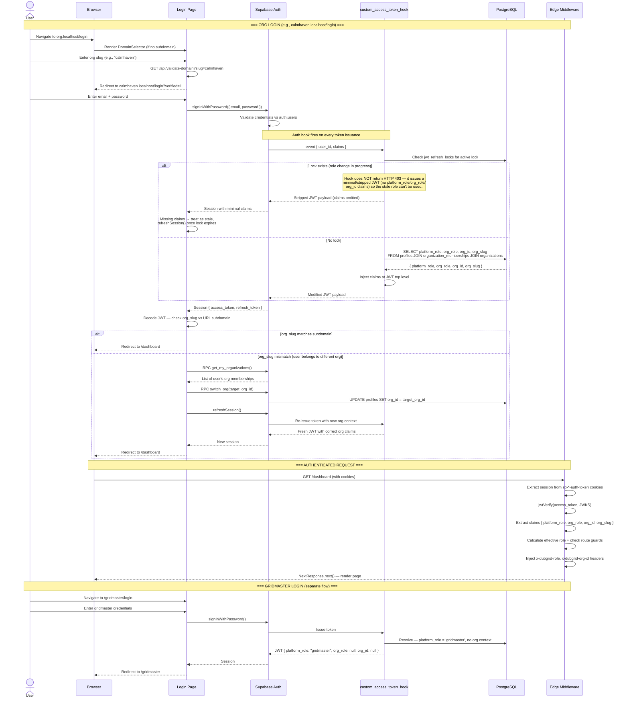
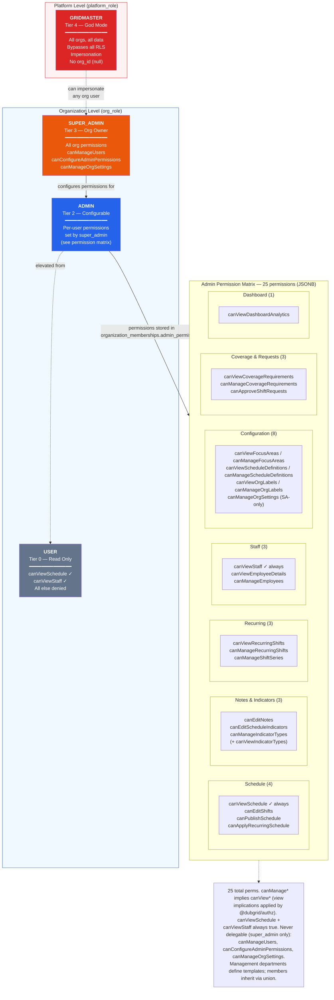
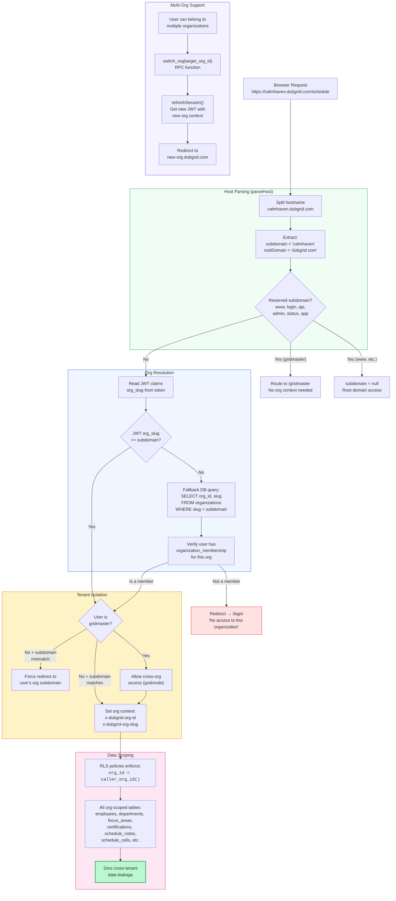
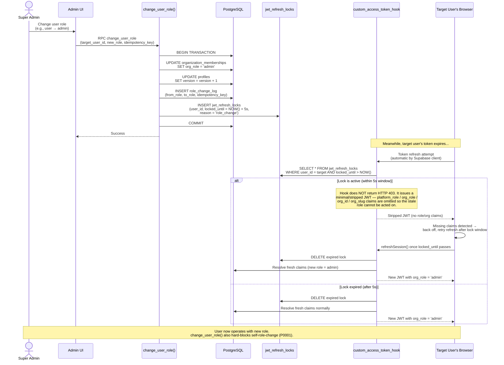
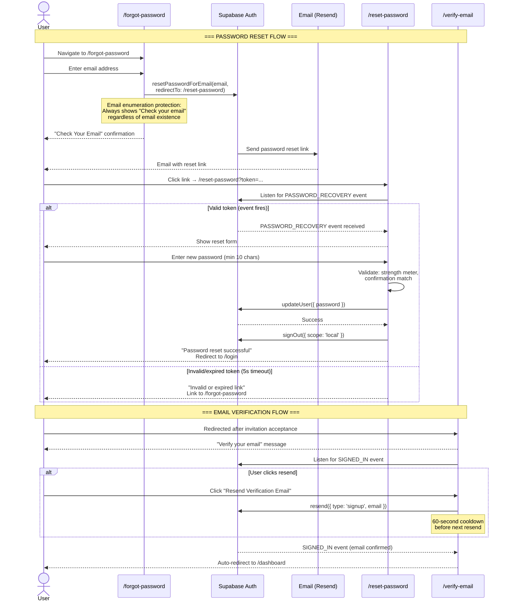
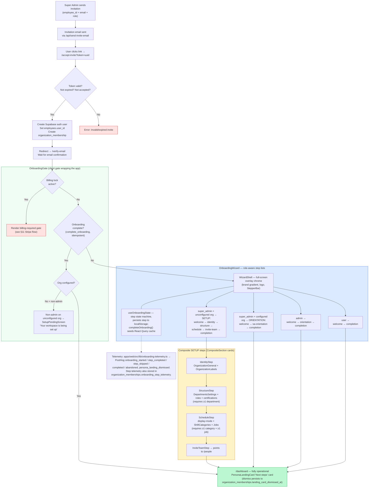
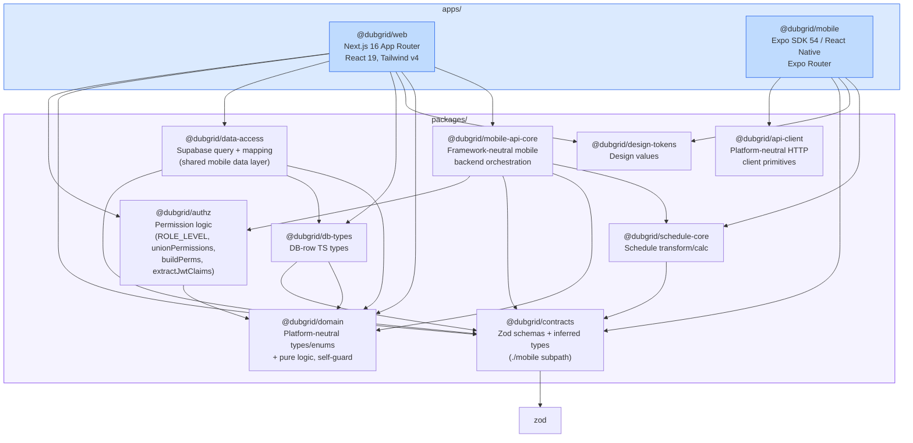
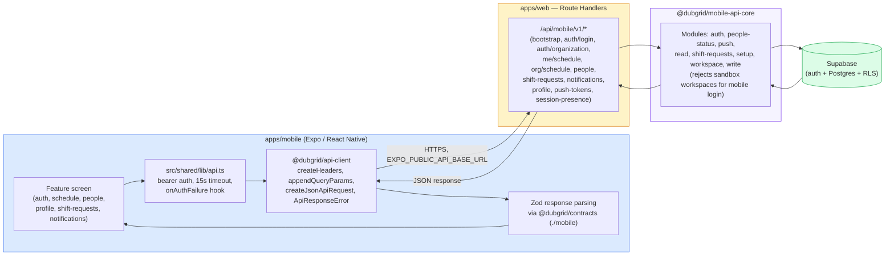
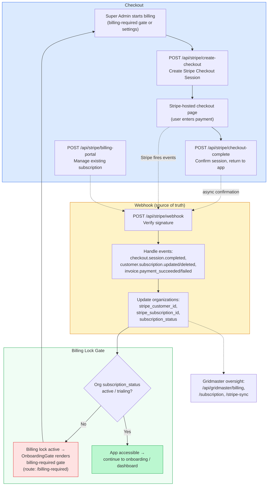
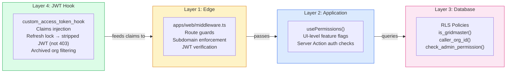

# DubGrid System Flowcharts

> All diagrams are Mermaid-based. Render in GitHub, VS Code (Mermaid extension), or any Mermaid-compatible viewer.

---

## 1. Authentication Flow

```mermaid
sequenceDiagram
    actor User
    participant Browser
    participant LoginPage as Login Page
    participant SupaAuth as Supabase Auth
    participant JWTHook as custom_access_token_hook
    participant DB as PostgreSQL
    participant Middleware as Edge Middleware

    Note over User,Middleware: === ORG LOGIN (e.g., calmhaven.localhost/login) ===

    User->>Browser: Navigate to org.localhost/login
    Browser->>LoginPage: Render DomainSelector (if no subdomain)
    User->>LoginPage: Enter org slug (e.g., "calmhaven")
    LoginPage->>LoginPage: GET /api/validate-domain?slug=calmhaven
    LoginPage-->>Browser: Redirect to calmhaven.localhost/login?verified=1

    User->>LoginPage: Enter email + password
    LoginPage->>SupaAuth: signInWithPassword({ email, password })
    SupaAuth->>SupaAuth: Validate credentials vs auth.users

    Note over SupaAuth,JWTHook: Auth hook fires on every token issuance

    SupaAuth->>JWTHook: event { user_id, claims }
    JWTHook->>DB: Check jwt_refresh_locks for active lock
    alt Lock exists (role change in progress)
        Note over JWTHook: Hook does NOT return HTTP 403 — it issues a<br/>minimal/stripped JWT (no platform_role/org_role/<br/>org_id claims) so the stale role can't be used.
        JWTHook-->>SupaAuth: Stripped JWT payload (claims omitted)
        SupaAuth-->>LoginPage: Session with minimal claims
        LoginPage->>LoginPage: Missing claims → treat as stale,<br/>refreshSession() once lock expires
    else No lock
        JWTHook->>DB: SELECT platform_role, org_role, org_id, org_slug<br/>FROM profiles JOIN organization_memberships JOIN organizations
        DB-->>JWTHook: { platform_role, org_role, org_id, org_slug }
        JWTHook->>JWTHook: Inject claims at JWT top level
        JWTHook-->>SupaAuth: Modified JWT payload
    end

    SupaAuth-->>LoginPage: Session { access_token, refresh_token }
    LoginPage->>LoginPage: Decode JWT — check org_slug vs URL subdomain

    alt org_slug matches subdomain
        LoginPage-->>Browser: Redirect to /dashboard
    else org_slug mismatch (user belongs to different org)
        LoginPage->>SupaAuth: RPC get_my_organizations()
        SupaAuth-->>LoginPage: List of user's org memberships
        LoginPage->>SupaAuth: RPC switch_org(target_org_id)
        SupaAuth->>DB: UPDATE profiles SET org_id = target_org_id
        LoginPage->>SupaAuth: refreshSession()
        SupaAuth->>JWTHook: Re-issue token with new org context
        JWTHook-->>SupaAuth: Fresh JWT with correct org claims
        SupaAuth-->>LoginPage: New session
        LoginPage-->>Browser: Redirect to /dashboard
    end

    Note over Browser,Middleware: === AUTHENTICATED REQUEST ===

    Browser->>Middleware: GET /dashboard (with cookies)
    Middleware->>Middleware: Extract session from sb-*-auth-token cookies
    Middleware->>Middleware: jwtVerify(access_token, JWKS)
    Middleware->>Middleware: Extract claims { platform_role, org_role, org_id, org_slug }
    Middleware->>Middleware: Calculate effective role + check route guards
    Middleware->>Middleware: Inject x-dubgrid-role, x-dubgrid-org-id headers
    Middleware-->>Browser: NextResponse.next() — render page

    Note over User,Middleware: === GRIDMASTER LOGIN (separate flow) ===

    User->>LoginPage: Navigate to /gridmaster/login
    User->>LoginPage: Enter gridmaster credentials
    LoginPage->>SupaAuth: signInWithPassword()
    SupaAuth->>JWTHook: Issue token
    JWTHook->>DB: Resolve — platform_role = 'gridmaster', no org context
    JWTHook-->>SupaAuth: JWT { platform_role: "gridmaster", org_role: null, org_id: null }
    SupaAuth-->>LoginPage: Session
    LoginPage-->>Browser: Redirect to /gridmaster
```

---

## 2. RBAC Hierarchy & Permission Model

```mermaid
flowchart TB
    subgraph PlatformLevel["Platform Level (platform_role)"]
        GM["<b>GRIDMASTER</b><br/>Tier 4 — God Mode<br/>━━━━━━━━━━━━━━<br/>All orgs, all data<br/>Bypasses all RLS<br/>Impersonation<br/>No org_id (null)"]
    end

    subgraph OrgLevel["Organization Level (org_role)"]
        SA["<b>SUPER_ADMIN</b><br/>Tier 3 — Org Owner<br/>━━━━━━━━━━━━━━<br/>All org permissions<br/>canManageUsers<br/>canConfigureAdminPermissions<br/>canManageOrgSettings"]

        AD["<b>ADMIN</b><br/>Tier 2 — Configurable<br/>━━━━━━━━━━━━━━<br/>Per-user permissions<br/>set by super_admin<br/>(see permission matrix)"]

        US["<b>USER</b><br/>Tier 0 — Read Only<br/>━━━━━━━━━━━━━━<br/>canViewSchedule ✓<br/>canViewStaff ✓<br/>All else denied"]
    end

    GM -.->|"can impersonate<br/>any org user"| SA
    SA -->|"configures permissions for"| AD
    AD -.->|"elevated from"| US

    subgraph PermMatrix["Admin Permission Matrix — 25 permissions (JSONB)"]
        direction LR
        subgraph Schedule["Schedule (4)"]
            P1["canViewSchedule ✓ always<br/>canEditShifts<br/>canPublishSchedule<br/>canApplyRecurringSchedule"]
        end
        subgraph Indicators["Notes & Indicators (3)"]
            P2["canEditNotes<br/>canEditScheduleIndicators<br/>canManageIndicatorTypes<br/>(+ canViewIndicatorTypes)"]
        end
        subgraph Recurring["Recurring (3)"]
            P3["canViewRecurringShifts<br/>canManageRecurringShifts<br/>canManageShiftSeries"]
        end
        subgraph Staff["Staff (3)"]
            P4["canViewStaff ✓ always<br/>canViewEmployeeDetails<br/>canManageEmployees"]
        end
        subgraph Config["Configuration (8)"]
            P5["canViewFocusAreas / canManageFocusAreas<br/>canViewScheduleDefinitions / canManageScheduleDefinitions<br/>canViewOrgLabels / canManageOrgLabels<br/>canManageOrgSettings (SA-only)"]
        end
        subgraph Coverage["Coverage & Requests (3)"]
            P6["canViewCoverageRequirements<br/>canManageCoverageRequirements<br/>canApproveShiftRequests"]
        end
        subgraph Dashboard["Dashboard (1)"]
            P7["canViewDashboardAnalytics"]
        end
    end

    AD -->|"permissions stored in<br/>organization_memberships.admin_permissions"| PermMatrix

    Note1["25 total perms. canManage* implies canView* (view<br/>implications applied by @dubgrid/authz). canViewSchedule +<br/>canViewStaff always true. Never delegable (super_admin only):<br/>canManageUsers, canConfigureAdminPermissions, canManageOrgSettings.<br/>Management departments define templates; members inherit via union."]
    PermMatrix -.-> Note1

    style GM fill:#dc2626,color:#fff
    style SA fill:#ea580c,color:#fff
    style AD fill:#2563eb,color:#fff
    style US fill:#64748b,color:#fff
    style PlatformLevel fill:#fef2f2,stroke:#dc2626
    style OrgLevel fill:#f0f9ff,stroke:#2563eb
```

---

## 3. Request Lifecycle (Browser to Database)

```mermaid
flowchart TD
    REQ["Browser Request<br/><i>GET calmhaven.localhost/schedule</i>"]

    subgraph MW["Edge Middleware (apps/web/middleware.ts)"]
        direction TB
        PUB{"Public route?<br/>/login, /api, /,<br/>/accept-invite"}
        SESS["Extract session<br/>from sb-*-auth-token cookies<br/>(multi-chunk reconstruction)"]
        NOSESS{"Session<br/>exists?"}
        JWT["Verify JWT signature<br/>jwtVerify(token, JWKS)"]
        CLAIMS["Extract claims:<br/>platform_role, org_role,<br/>org_id, org_slug"]
        FALLBACK{"Claims<br/>complete?"}
        DBFALLBACK["Fallback: Query DB<br/>profiles + organization_memberships<br/>+ organizations"]
        EFFROLE["Calculate effective role:<br/>gridmaster > super_admin > admin > user"]
        SUBDOMAIN{"Subdomain matches<br/>org_slug?"}
        ROUTEGUARD{"Route access<br/>allowed?"}
        HEADERS["Inject headers:<br/>x-dubgrid-role<br/>x-dubgrid-org-id<br/>x-dubgrid-org-slug"]
    end

    subgraph PAGE["Next.js Page Render"]
        direction TB
        LAYOUT["Root Layout<br/>(AuthProvider + AppShell)"]
        COMPONENT["Page Component<br/>(Client or Server)"]
        PERMS["usePermissions() hook<br/>Decode JWT → extract role<br/>Admin? → fetch admin_permissions"]
        RENDER["Render with RBAC context<br/>(show/hide UI based on perms)"]
    end

    subgraph ACTION["Server Action / Data Mutation"]
        direction TB
        AUTHCHECK["Server-side auth check<br/>getSession() + verify user"]
        MUTATION["Execute DB query<br/>(parameterized)"]
    end

    subgraph RLS["PostgreSQL RLS Layer"]
        direction TB
        RLSCHECK{"RLS Policy Check"}
        ISGM["is_gridmaster()?"]
        ORGMATCH["caller_org_id() = row.org_id?"]
        PERMCHECK["check_admin_permission()<br/>(e.g., 'canEditShifts')"]
        ALLOW["✓ Allow"]
        DENY["✗ Deny"]
    end

    REQ --> PUB
    PUB -->|Yes| PASS1["NextResponse.next()"]
    PUB -->|No| SESS
    SESS --> NOSESS
    NOSESS -->|No session| REDIR1["Redirect → /login"]
    NOSESS -->|Yes| JWT
    JWT --> CLAIMS
    CLAIMS --> FALLBACK
    FALLBACK -->|Yes| EFFROLE
    FALLBACK -->|No| DBFALLBACK
    DBFALLBACK --> EFFROLE
    EFFROLE --> SUBDOMAIN
    SUBDOMAIN -->|No| REDIR2["Redirect → correct subdomain"]
    SUBDOMAIN -->|Yes| ROUTEGUARD
    ROUTEGUARD -->|"/people, /settings<br/>but role < admin"| REDIR3["Redirect → /schedule"]
    ROUTEGUARD -->|"/gridmaster<br/>but not gridmaster"| REDIR4["Redirect → /schedule"]
    ROUTEGUARD -->|Allowed| HEADERS

    HEADERS --> LAYOUT
    LAYOUT --> COMPONENT
    COMPONENT --> PERMS
    PERMS --> RENDER

    RENDER -->|"User action<br/>(e.g., edit shift)"| AUTHCHECK
    AUTHCHECK --> MUTATION

    MUTATION --> RLSCHECK
    RLSCHECK --> ISGM
    ISGM -->|Yes| ALLOW
    ISGM -->|No| ORGMATCH
    ORGMATCH -->|No| DENY
    ORGMATCH -->|Yes| PERMCHECK
    PERMCHECK -->|Pass| ALLOW
    PERMCHECK -->|Fail| DENY

    style MW fill:#fef3c7,stroke:#d97706
    style PAGE fill:#dbeafe,stroke:#2563eb
    style ACTION fill:#dcfce7,stroke:#16a34a
    style RLS fill:#fce7f3,stroke:#db2777
    style REDIR1 fill:#fee2e2,stroke:#dc2626
    style REDIR2 fill:#fee2e2,stroke:#dc2626
    style REDIR3 fill:#fee2e2,stroke:#dc2626
    style REDIR4 fill:#fee2e2,stroke:#dc2626
    style ALLOW fill:#bbf7d0,stroke:#16a34a
    style DENY fill:#fecaca,stroke:#dc2626
```

---

## 4. Data Model (Entity Relationship Diagram)

```mermaid
erDiagram
    auth_users {
        uuid id PK
    }

    organizations {
        uuid id PK
        text name
        text slug UK "subdomain"
        text address
        text phone
        integer employee_count
        text logo_url
        text app_name
        jsonb theme_config
        jsonb landing_page_config
        text focus_area_label "custom terminology"
        text certification_label "custom terminology"
        text role_label "custom terminology"
        text timezone
        timestamptz suspended_at "soft delete / suspension"
        jsonb feature_overrides "per-org feature flags"
        text stripe_customer_id "billing"
        text stripe_subscription_id "billing"
        text subscription_status "billing state"
        text workspace_kind "production | sandbox (default production)"
        uuid sandbox_source_org_id FK "→ organizations (nullable)"
        uuid sandbox_owner_user_id FK "→ auth.users (nullable)"
        timestamptz sandbox_expires_at "30-day TTL"
        text sandbox_template_version
    }

    profiles {
        uuid id PK,FK "→ auth.users"
        uuid org_id FK "→ organizations"
        platform_role platform_role "gridmaster | none"
        bigint version "optimistic lock"
        boolean role_locked
    }

    organization_memberships {
        bigint id PK
        uuid user_id FK "→ auth.users"
        uuid org_id FK "→ organizations"
        org_role org_role "super_admin | admin | user"
        jsonb admin_permissions "fine-grained perms (25)"
        bigint_arr department_ids "→ departments[]"
        timestamptz landing_card_dismissed_at "PersonaLandingCard dismissed"
        jsonb onboarding_step_telemetry "default {}"
        timestamptz archived_at "soft removal"
    }

    departments {
        bigint id PK
        uuid org_id FK "→ organizations"
        text type "scheduled | management"
        text name
        text abbr
        bigint parent_department_id FK "→ departments (nullable)"
        jsonb permissions "management depts: perm template"
        integer sort_order
    }

    employees {
        uuid id PK
        uuid org_id FK "→ organizations"
        text first_name
        text last_name
        integer seniority
        text email
        text phone
        bigint certification_id FK "→ certifications"
        bigint_arr role_ids "→ organization_roles[]"
        bigint_arr focus_area_ids "→ focus_areas[]"
        employee_status status "active | benched | terminated"
        uuid user_id FK "→ auth.users (nullable)"
    }

    focus_areas {
        bigint id PK
        uuid org_id FK "→ organizations"
        bigint department_id FK "→ departments (scheduled parent)"
        text name
        text color_bg
        text color_text
        integer sort_order
        integer break_minutes
    }

    certifications {
        bigint id PK
        uuid org_id FK "→ organizations"
        text name
        text abbr
        integer sort_order
    }

    organization_roles {
        bigint id PK
        uuid org_id FK "→ organizations"
        text name
        text abbr
        integer sort_order
    }

    shift_categories {
        bigint id PK
        uuid org_id FK "→ organizations"
        text name
        text color
        time start_time
        time end_time
        bigint focus_area_id FK "→ focus_areas (nullable)"
        integer break_minutes
    }

    absence_types {
        bigint id PK
        uuid org_id FK "→ organizations"
        text label "e.g. X, V, S"
        text name "e.g. Day Off, PTO, Sick"
        text color
        text border_color
        text text_color
        integer sort_order
    }

    schedule_cells {
        uuid id PK
        uuid emp_id FK "→ employees"
        date date
        uuid org_id FK "→ organizations"
        bigint version "optimistic lock"
        uuid series_id FK "→ shift_series"
        boolean from_recurring
        bigint focus_area_id FK "→ focus_areas"
    }

    schedule_cell_snapshots {
        uuid id PK
        uuid cell_id FK "→ schedule_cells"
        text snapshot_kind
        text state_kind
        bigint absence_type_id FK "→ absence_types"
    }

    schedule_cell_segments {
        uuid id PK
        uuid snapshot_id FK "→ schedule_cell_snapshots"
        integer position
        bigint shift_id
        bigint job_id
    }

    recurring_shifts {
        uuid id PK
        uuid emp_id FK "→ employees"
        uuid org_id FK "→ organizations"
        smallint day_of_week "0=Sun 6=Sat"
        jsonb state "ScheduleCellState"
        date effective_from
        date effective_until
    }

    shift_series {
        uuid id PK
        uuid emp_id FK "→ employees"
        uuid org_id FK "→ organizations"
        shift_series_frequency frequency "daily|weekly|biweekly"
        smallint_arr days_of_week
        date start_date
        date end_date
        jsonb state "ScheduleCellState"
    }

    schedule_notes {
        bigint id PK
        uuid org_id FK "→ organizations"
        uuid emp_id FK "→ employees"
        date date
        integer indicator_type_id FK "→ indicator_types"
        text status "published | draft | draft_deleted"
    }

    indicator_types {
        integer id PK
        uuid org_id FK "→ organizations"
        text name
        text color
    }

    coverage_requirements {
        bigint id PK
        uuid org_id FK "→ organizations"
        bigint focus_area_id FK "→ focus_areas"
        bigint preferred_shift_id FK "→ shift_categories"
        bigint preferred_job_id
        smallint day_of_week "nullable = all days"
        integer min_staff
    }

    shift_requests {
        uuid id PK
        uuid org_id FK "→ organizations"
        shift_request_type type "pickup | swap"
        shift_request_status status
        uuid requester_emp_id FK "→ employees"
        date requester_shift_date
        jsonb requester_state
        bigint requester_focus_area_id FK "→ focus_areas"
        time requester_custom_start_time
        time requester_custom_end_time
        uuid target_emp_id FK "→ employees (swap)"
        date target_shift_date
        jsonb target_state
        bigint target_focus_area_id FK "→ focus_areas"
        time target_custom_start_time
        time target_custom_end_time
        uuid admin_user_id FK "→ auth.users"
        text admin_note
        timestamptz expires_at "72h default"
        timestamptz resolved_at
        uuid idempotency_key UK
    }

    invitations {
        uuid id PK
        uuid org_id FK "→ organizations"
        uuid invited_by FK "→ auth.users"
        text email
        org_role role_to_assign
        uuid token UK "secret link"
        timestamptz expires_at "72h default"
        uuid employee_id FK "→ employees"
    }

    role_change_log {
        uuid id PK
        uuid target_user_id FK "→ auth.users"
        uuid changed_by_id FK "→ auth.users"
        text from_role
        text to_role
        text idempotency_key UK
        text change_type "role_change | permission_change"
        jsonb permissions_before
        jsonb permissions_after
    }

    jwt_refresh_locks {
        uuid user_id PK,FK "→ auth.users"
        timestamptz locked_until
        text reason
    }

    impersonation_sessions {
        uuid session_id PK
        uuid gridmaster_id FK "→ auth.users"
        uuid target_user_id FK "→ auth.users"
        uuid target_org_id FK "→ organizations"
        timestamptz expires_at "30min default"
    }

    user_sessions {
        uuid id PK
        uuid user_id FK "→ auth.users"
        text device_label
        inet ip_address
        text refresh_token_hash UK
    }

    schedule_draft_sessions {
        uuid id PK
        uuid org_id FK,UK "→ organizations (one per org)"
        uuid saved_by FK "→ auth.users"
        date start_date
        date end_date
    }

    recurring_shifts_draft_sessions {
        uuid id PK
        uuid org_id FK,UK "→ organizations (one per org)"
        uuid saved_by FK "→ auth.users"
        jsonb draft_data
    }

    publish_history {
        uuid id PK
        uuid org_id FK "→ organizations"
        uuid published_by FK "→ auth.users"
        date start_date
        date end_date
        integer change_count
        jsonb changes
    }

    %% === RELATIONSHIPS ===

    auth_users ||--o| profiles : "has profile"
    auth_users ||--o{ organization_memberships : "belongs to orgs"
    auth_users ||--o{ user_sessions : "has sessions"
    auth_users ||--o| jwt_refresh_locks : "may have lock"

    organizations ||--o{ organization_memberships : "has members"
    organizations ||--o{ employees : "employs"
    organizations ||--o{ departments : "has departments"
    organizations ||--o{ focus_areas : "has areas"
    organizations ||--o{ certifications : "has certs"
    organizations }o--o| organizations : "sandbox source org"
    organizations ||--o{ organization_roles : "has roles"
    organizations ||--o{ shift_categories : "has categories"
    organizations ||--o{ absence_types : "has absence types"
    organizations ||--o{ indicator_types : "has indicators"
    organizations ||--o{ coverage_requirements : "has requirements"
    organizations ||--o{ invitations : "sends invites"
    organizations ||--o{ shift_requests : "has requests"
    organizations ||--o| schedule_draft_sessions : "has draft"
    organizations ||--o| recurring_shifts_draft_sessions : "has recurring draft"
    organizations ||--o{ publish_history : "has publishes"
    organizations ||--o| impersonation_sessions : "target org"

    profiles }o--o| organizations : "primary org"

    departments ||--o{ departments : "management → scheduled (parent/child)"
    departments ||--o{ focus_areas : "scheduled dept → focus areas (children)"
    departments }o--o{ organization_memberships : "membership department_ids[]"

    employees ||--o{ schedule_cells : "assigned schedule cells"
    employees ||--o{ recurring_shifts : "recurring patterns"
    employees ||--o{ shift_series : "shift series"
    employees ||--o{ schedule_notes : "has notes"
    employees }o--o| certifications : "certified as"
    employees }o--o| auth_users : "linked user"

    focus_areas ||--o{ shift_categories : "scoped categories"
    focus_areas ||--o{ coverage_requirements : "staffing rules"
    absence_types ||--o{ schedule_cell_snapshots : "cell absence"

    shift_series ||--o{ schedule_cells : "linked cells"

    indicator_types ||--o{ schedule_notes : "note type"

    invitations }o--o| employees : "links to employee"
```

---

## 5. Organization Routing & Multi-Tenancy

```mermaid
flowchart TD
    REQ["Browser Request<br/><i>https://calmhaven.dubgrid.com/schedule</i>"]

    subgraph Parse["Host Parsing (parseHost)"]
        SPLIT["Split hostname<br/>calmhaven.dubgrid.com"]
        EXTRACT["Extract:<br/>subdomain = 'calmhaven'<br/>rootDomain = 'dubgrid.com'"]
        RESERVED{"Reserved subdomain?<br/>www, login, api,<br/>admin, status, app"}
    end

    subgraph Resolve["Org Resolution"]
        JWTCLAIMS["Read JWT claims<br/>org_slug from token"]
        MATCH{"JWT org_slug<br/>== subdomain?"}
        DBQUERY["Fallback DB query:<br/>SELECT org_id, slug<br/>FROM organizations<br/>WHERE slug = subdomain"]
        MEMBERSHIP["Verify user has<br/>organization_membership<br/>for this org"]
    end

    subgraph Enforce["Tenant Isolation"]
        GMCHECK{"User is<br/>gridmaster?"}
        FORCESUB["Force redirect to<br/>user's org subdomain"]
        ALLOWCROSS["Allow cross-org<br/>access (godmode)"]
        INJECT["Set org context:<br/>x-dubgrid-org-id<br/>x-dubgrid-org-slug"]
    end

    subgraph DataScope["Data Scoping"]
        direction TB
        RLS["RLS policies enforce:<br/><code>org_id = caller_org_id()</code>"]
        TABLES["All org-scoped tables:<br/>employees, departments, focus_areas,<br/>certifications, schedule_notes,<br/>schedule_cells, etc."]
        ZERO["Zero cross-tenant<br/>data leakage"]
    end

    subgraph MultiOrg["Multi-Org Support"]
        direction TB
        MEMBERSHIPS["User can belong to<br/>multiple organizations"]
        SWITCH["switch_org(target_org_id)<br/>RPC function"]
        REFRESH["refreshSession()<br/>Get new JWT with<br/>new org context"]
        NEWDOMAIN["Redirect to<br/>new-org.dubgrid.com"]
    end

    REQ --> SPLIT
    SPLIT --> EXTRACT
    EXTRACT --> RESERVED
    RESERVED -->|"Yes (gridmaster)"| GM_ROUTE["Route to /gridmaster<br/>No org context needed"]
    RESERVED -->|"Yes (www, etc.)"| NULL_SUB["subdomain = null<br/>Root domain access"]
    RESERVED -->|"No"| JWTCLAIMS

    JWTCLAIMS --> MATCH
    MATCH -->|Yes| GMCHECK
    MATCH -->|No| DBQUERY
    DBQUERY --> MEMBERSHIP
    MEMBERSHIP -->|"Not a member"| REJECT["Redirect → /login<br/>'No access to this organization'"]
    MEMBERSHIP -->|"Is a member"| GMCHECK

    GMCHECK -->|Yes| ALLOWCROSS
    GMCHECK -->|"No + subdomain<br/>mismatch"| FORCESUB
    GMCHECK -->|"No + subdomain<br/>matches"| INJECT

    ALLOWCROSS --> INJECT
    INJECT --> RLS
    RLS --> TABLES
    TABLES --> ZERO

    MEMBERSHIPS --> SWITCH
    SWITCH --> REFRESH
    REFRESH --> NEWDOMAIN

    style Parse fill:#f0fdf4,stroke:#16a34a
    style Resolve fill:#eff6ff,stroke:#2563eb
    style Enforce fill:#fef3c7,stroke:#d97706
    style DataScope fill:#fce7f3,stroke:#db2777
    style MultiOrg fill:#f5f3ff,stroke:#7c3aed
    style REJECT fill:#fee2e2,stroke:#dc2626
    style ZERO fill:#bbf7d0,stroke:#16a34a,stroke-width:2px
```

---

## 6. Role Change & JWT Lock Mechanism

```mermaid
sequenceDiagram
    actor Admin as Super Admin
    participant UI as Admin UI
    participant RPC as change_user_role()
    participant DB as PostgreSQL
    participant Lock as jwt_refresh_locks
    participant Hook as custom_access_token_hook
    participant Target as Target User's Browser

    Admin->>UI: Change user role<br/>(e.g., user → admin)
    UI->>RPC: RPC change_user_role<br/>(target_user_id, new_role, idempotency_key)

    RPC->>DB: BEGIN TRANSACTION
    RPC->>DB: UPDATE organization_memberships<br/>SET org_role = 'admin'
    RPC->>DB: UPDATE profiles<br/>SET version = version + 1
    RPC->>DB: INSERT role_change_log<br/>(from_role, to_role, idempotency_key)
    RPC->>Lock: INSERT jwt_refresh_locks<br/>(user_id, locked_until = NOW() + 5s,<br/>reason = 'role_change')
    RPC->>DB: COMMIT

    RPC-->>UI: Success

    Note over Target,Hook: Meanwhile, target user's token expires...

    Target->>Hook: Token refresh attempt<br/>(automatic by Supabase client)
    Hook->>Lock: SELECT * FROM jwt_refresh_locks<br/>WHERE user_id = target AND locked_until > NOW()

    alt Lock is active (within 5s window)
        Note over Hook: Hook does NOT return HTTP 403. It issues a<br/>minimal/stripped JWT — platform_role / org_role /<br/>org_id / org_slug claims are omitted so the stale<br/>role cannot be acted on.
        Hook-->>Target: Stripped JWT (no role/org claims)
        Target->>Target: Missing claims detected →<br/>back off, retry refresh after lock window
        Target->>Hook: refreshSession() once locked_until passes
        Hook->>Lock: DELETE expired lock
        Hook->>DB: Resolve fresh claims (new role = admin)
        Hook-->>Target: New JWT with org_role = 'admin'
    else Lock expired (after 5s)
        Hook->>Lock: DELETE expired lock
        Hook->>DB: Resolve fresh claims normally
        Hook-->>Target: New JWT with org_role = 'admin'
    end

    Note over Admin,Target: User now operates with new role.<br/>change_user_role() also hard-blocks self-role-change (P0001).
```

---

## 7. Schedule Draft/Publish Workflow

```mermaid
flowchart LR
    subgraph Draft["Draft Phase"]
        EDIT["Admin edits shifts<br/>(drag/drop/type)"]
        DRAFTCODES["draft snapshot + segments<br/>updated in schedule_cells"]
        SAVE["Auto-save draft session<br/>(schedule_draft_sessions)"]
        PREVIEW["Visual diff:<br/>draft vs published"]
    end

    subgraph Publish["Publish Phase"]
        PUB["Admin clicks Publish"]
        VALIDATE["Validate changes<br/>(coverage requirements)"]
        COPY["Replace published snapshot<br/>with current draft snapshot"]
        CLEAR["Delete draft snapshot<br/>after publish"]
        LOG["Insert publish_history<br/>(changes JSONB, date range)"]
    end

    subgraph Realtime["Realtime Updates"]
        RT["Supabase Realtime<br/>broadcasts changes"]
        USERS["All connected users<br/>see updated schedule"]
    end

    EDIT --> DRAFTCODES
    DRAFTCODES --> SAVE
    SAVE --> PREVIEW
    PREVIEW --> PUB
    PUB --> VALIDATE
    VALIDATE --> COPY
    COPY --> CLEAR
    CLEAR --> LOG
    LOG --> RT
    RT --> USERS

    style Draft fill:#fef3c7,stroke:#d97706
    style Publish fill:#dbeafe,stroke:#2563eb
    style Realtime fill:#dcfce7,stroke:#16a34a
```

---

## 8. Password Reset & Email Verification Flow

```mermaid
sequenceDiagram
    actor User
    participant ForgotPage as /forgot-password
    participant SupaAuth as Supabase Auth
    participant Email as Email (Resend)
    participant ResetPage as /reset-password
    participant VerifyPage as /verify-email

    Note over User,VerifyPage: === PASSWORD RESET FLOW ===

    User->>ForgotPage: Navigate to /forgot-password
    User->>ForgotPage: Enter email address
    ForgotPage->>SupaAuth: resetPasswordForEmail(email,<br/>redirectTo: /reset-password)

    Note over ForgotPage: Email enumeration protection:<br/>Always shows "Check your email"<br/>regardless of email existence

    ForgotPage-->>User: "Check Your Email" confirmation
    SupaAuth->>Email: Send password reset link
    Email-->>User: Email with reset link

    User->>ResetPage: Click link → /reset-password?token=...
    ResetPage->>SupaAuth: Listen for PASSWORD_RECOVERY event

    alt Valid token (event fires)
        SupaAuth-->>ResetPage: PASSWORD_RECOVERY event received
        ResetPage-->>User: Show reset form
        User->>ResetPage: Enter new password (min 10 chars)
        ResetPage->>ResetPage: Validate: strength meter,<br/>confirmation match
        ResetPage->>SupaAuth: updateUser({ password })
        SupaAuth-->>ResetPage: Success
        ResetPage->>SupaAuth: signOut({ scope: 'local' })
        ResetPage-->>User: "Password reset successful"<br/>Redirect to /login
    else Invalid/expired token (5s timeout)
        ResetPage-->>User: "Invalid or expired link"<br/>Link to /forgot-password
    end

    Note over User,VerifyPage: === EMAIL VERIFICATION FLOW ===

    User->>VerifyPage: Redirected after invitation acceptance
    VerifyPage-->>User: "Verify your email" message
    VerifyPage->>SupaAuth: Listen for SIGNED_IN event

    alt User clicks resend
        User->>VerifyPage: Click "Resend Verification Email"
        VerifyPage->>SupaAuth: resend({ type: 'signup', email })
        Note over VerifyPage: 60-second cooldown<br/>before next resend
    end

    SupaAuth-->>VerifyPage: SIGNED_IN event (email confirmed)
    VerifyPage-->>User: Auto-redirect to /dashboard
```

---

## 9. Onboarding Flow (Role-Aware Composite Wizard)

> The old standalone 8-step wizard and the `/setup` route are **deleted**. Onboarding
> now renders inline via `OnboardingGate`, which wraps the authenticated app and
> hands off to a role-aware `OnboardingWizard`. Components live in
> `apps/web/src/components/onboarding/`.

```mermaid
flowchart TD
    INVITE["Super Admin sends invitation<br/>(employee_id + email + role)"]
    EMAIL["Invitation email sent<br/>via /api/send-invite-email"]
    ACCEPT["User clicks link →<br/>/accept-invite?token=uuid"]
    VALIDATE{"Token valid?<br/>Not expired? Not accepted?"}
    CREATE["Create Supabase auth user<br/>Set employees.user_id<br/>Create organization_membership"]
    VERIFY["Redirect → /verify-email<br/>Wait for email confirmation"]

    subgraph Gate["OnboardingGate (client gate wrapping the app)"]
        direction TB
        BILLING{"Billing lock<br/>active?"}
        BILLLOCK["Render billing-required gate<br/>(see §11 Stripe flow)"]
        ONBSTATUS{"Onboarding<br/>complete?<br/>(complete_onboarding, idempotent)"}
        ORGSETUP{"Org configured?"}
        PENDING["Non-admin on unconfigured org →<br/>SetupPendingScreen<br/>'Your workspace is being set up'"]
    end

    subgraph Wizard["OnboardingWizard — role-aware step lists"]
        direction TB
        SHELL["WizardShell — full-screen overlay chrome<br/>(brand gradient, logo, StepperBar)"]
        SASETUP["super_admin + unconfigured org → SETUP:<br/>welcome → identity → structure →<br/>schedule → invite-team → completion"]
        SAORIENT["super_admin + configured org → ORIENTATION:<br/>welcome → sa-orientation → completion"]
        ADMIN["admin →<br/>welcome → orientation → completion"]
        USER["user →<br/>welcome → completion"]
        STATE["useOnboardingState — step state machine,<br/>persists step to localStorage;<br/>completeOnboarding() seeds React Query cache"]
    end

    subgraph SetupSteps["Composite SETUP steps (CompositeSection cards)"]
        direction TB
        S_IDENTITY["IdentityStep<br/>OrganizationGeneral + OrganizationLabels"]
        S_STRUCTURE["StructureStep<br/>DepartmentsSettings + roles + certifications<br/>(requires ≥1 department)"]
        S_SCHEDULE["ScheduleStep<br/>display-mode + ShiftCategories + Jobs<br/>(requires ≥1 category + ≥1 job)"]
        S_INVITE["InviteTeamStep → points to /people"]
    end

    DASHBOARD["/dashboard — fully operational<br/>PersonaLandingCard 'Next steps' card<br/>(dismiss persists to<br/>organization_memberships.landing_card_dismissed_at)"]

    INVITE --> EMAIL --> ACCEPT --> VALIDATE
    VALIDATE -->|No| REJECT["Error: Invalid/expired invite"]
    VALIDATE -->|Yes| CREATE --> VERIFY --> BILLING

    BILLING -->|Yes| BILLLOCK
    BILLING -->|No| ONBSTATUS
    ONBSTATUS -->|Yes| ORGSETUP
    ONBSTATUS -->|No| SHELL
    ORGSETUP -->|"No + non-admin"| PENDING
    ORGSETUP -->|Yes| DASHBOARD

    SHELL --> SASETUP
    SHELL --> SAORIENT
    SHELL --> ADMIN
    SHELL --> USER
    SHELL --- STATE

    SASETUP --> S_IDENTITY --> S_STRUCTURE --> S_SCHEDULE --> S_INVITE
    S_INVITE --> DASHBOARD
    SAORIENT --> DASHBOARD
    ADMIN --> DASHBOARD
    USER --> DASHBOARD

    NOTE_TEL["Telemetry: apps/web/src/lib/onboarding-telemetry.ts →<br/>PostHog onboarding_started / step_completed / step_skipped /<br/>completed / abandoned, persona_landing_dismissed.<br/>Step telemetry also stored in<br/>organization_memberships.onboarding_step_telemetry."]
    STATE -.-> NOTE_TEL

    style REJECT fill:#fee2e2,stroke:#dc2626
    style DASHBOARD fill:#bbf7d0,stroke:#16a34a
    style Gate fill:#f0fdf4,stroke:#16a34a
    style Wizard fill:#dbeafe,stroke:#2563eb
    style SetupSteps fill:#fef3c7,stroke:#d97706
    style BILLLOCK fill:#fee2e2,stroke:#dc2626
```

---

## 10. Monorepo Layout & Package Graph

> npm workspaces (`apps/*`, `packages/*`) orchestrated by **Turborepo**. Node 22.13,
> npm 10.9.2. Two apps, nine private `0.1.0` ESM packages (built via `tsc` to `dist/`).

```mermaid
flowchart TD
    subgraph Apps["apps/"]
        WEB["@dubgrid/web<br/>Next.js 16 App Router<br/>React 19, Tailwind v4"]
        MOBILE["@dubgrid/mobile<br/>Expo SDK 54 / React Native<br/>Expo Router"]
    end

    subgraph Packages["packages/"]
        DOMAIN["@dubgrid/domain<br/>Platform-neutral types/enums<br/>+ pure logic, self-guard"]
        CONTRACTS["@dubgrid/contracts<br/>Zod schemas + inferred types<br/>(./mobile subpath)"]
        DBTYPES["@dubgrid/db-types<br/>DB-row TS types"]
        AUTHZ["@dubgrid/authz<br/>Permission logic<br/>(ROLE_LEVEL, unionPermissions,<br/>buildPerms, extractJwtClaims)"]
        SCHEDCORE["@dubgrid/schedule-core<br/>Schedule transform/calc"]
        DATAACCESS["@dubgrid/data-access<br/>Supabase query + mapping<br/>(shared mobile data layer)"]
        MOBAPICORE["@dubgrid/mobile-api-core<br/>Framework-neutral mobile<br/>backend orchestration"]
        APICLIENT["@dubgrid/api-client<br/>Platform-neutral HTTP<br/>client primitives"]
        TOKENS["@dubgrid/design-tokens<br/>Design values"]
    end

    WEB --> AUTHZ
    WEB --> CONTRACTS
    WEB --> DATAACCESS
    WEB --> DBTYPES
    WEB --> TOKENS
    WEB --> DOMAIN
    WEB --> MOBAPICORE

    MOBILE --> APICLIENT
    MOBILE --> CONTRACTS
    MOBILE --> TOKENS
    MOBILE --> SCHEDCORE

    CONTRACTS --> DOMAIN_Z["zod"]
    DBTYPES --> CONTRACTS
    DBTYPES --> DOMAIN
    AUTHZ --> DOMAIN
    SCHEDCORE --> CONTRACTS
    DATAACCESS --> CONTRACTS
    DATAACCESS --> DBTYPES
    DATAACCESS --> DOMAIN
    MOBAPICORE --> AUTHZ
    MOBAPICORE --> CONTRACTS
    MOBAPICORE --> DOMAIN
    MOBAPICORE --> SCHEDCORE

    style Apps fill:#dbeafe,stroke:#2563eb
    style Packages fill:#f5f3ff,stroke:#7c3aed
    style WEB fill:#bfdbfe,stroke:#2563eb
    style MOBILE fill:#bfdbfe,stroke:#2563eb
```

---

## 11. Mobile App ↔ `/api/mobile/v1` Data Flow

> `apps/mobile` never touches Supabase data tables directly. All traffic goes through
> the web app's versioned mobile Route Handlers, which delegate to
> `@dubgrid/mobile-api-core`.

```mermaid
flowchart LR
    subgraph Mobile["apps/mobile (Expo / React Native)"]
        SCREEN["Feature screen<br/>(auth, schedule, people,<br/>profile, shift-requests, notifications)"]
        APILIB["src/shared/lib/api.ts<br/>bearer auth, 15s timeout,<br/>onAuthFailure hook"]
        CLIENT["@dubgrid/api-client<br/>createHeaders, appendQueryParams,<br/>createJsonApiRequest, ApiResponseError"]
        ZODPARSE["Zod response parsing<br/>via @dubgrid/contracts (./mobile)"]
    end

    subgraph Web["apps/web — Route Handlers"]
        ROUTE["/api/mobile/v1/*<br/>(bootstrap, auth/login, auth/organization,<br/>me/schedule, org/schedule, people,<br/>shift-requests, notifications,<br/>profile, push-tokens, session-presence)"]
    end

    subgraph Core["@dubgrid/mobile-api-core"]
        MODULES["Modules: auth, people-status, push,<br/>read, shift-requests, setup, workspace, write<br/>(rejects sandbox workspaces for mobile login)"]
    end

    SUPA[("Supabase<br/>(auth + Postgres + RLS)")]

    SCREEN --> APILIB
    APILIB --> CLIENT
    CLIENT -->|"HTTPS, EXPO_PUBLIC_API_BASE_URL"| ROUTE
    ROUTE --> MODULES
    MODULES --> SUPA
    SUPA --> MODULES
    MODULES --> ROUTE
    ROUTE -->|"JSON response"| CLIENT
    CLIENT --> ZODPARSE
    ZODPARSE --> SCREEN

    style Mobile fill:#dbeafe,stroke:#2563eb
    style Web fill:#fef3c7,stroke:#d97706
    style Core fill:#f5f3ff,stroke:#7c3aed
    style SUPA fill:#dcfce7,stroke:#16a34a
```

---

## 12. Stripe Billing & Subscription Flow

```mermaid
flowchart TD
    subgraph Checkout["Checkout"]
        START["Super Admin starts billing<br/>(billing-required gate or settings)"]
        CREATE["POST /api/stripe/create-checkout<br/>Create Stripe Checkout Session"]
        STRIPE["Stripe-hosted checkout page<br/>(user enters payment)"]
        COMPLETE["POST /api/stripe/checkout-complete<br/>Confirm session, return to app"]
        PORTAL["POST /api/stripe/billing-portal<br/>Manage existing subscription"]
    end

    subgraph Webhook["Webhook (source of truth)"]
        HOOK["POST /api/stripe/webhook<br/>Verify signature"]
        EVENTS["Handle events:<br/>checkout.session.completed,<br/>customer.subscription.updated/deleted,<br/>invoice.payment_succeeded/failed"]
        UPDATE["Update organizations:<br/>stripe_customer_id,<br/>stripe_subscription_id,<br/>subscription_status"]
    end

    subgraph Gate["Billing Lock Gate"]
        CHECK{"Org subscription_status<br/>active / trialing?"}
        LOCKED["Billing lock active →<br/>OnboardingGate renders<br/>billing-required gate<br/>(route: /billing-required)"]
        UNLOCKED["App accessible →<br/>continue to onboarding / dashboard"]
    end

    GM["Gridmaster oversight:<br/>/api/gridmaster/billing,<br/>/subscription, /stripe-sync"]

    START --> CREATE --> STRIPE --> COMPLETE
    COMPLETE -.->|"async confirmation"| HOOK
    STRIPE -.->|"Stripe fires events"| HOOK
    PORTAL -.-> HOOK
    HOOK --> EVENTS --> UPDATE
    UPDATE --> CHECK
    CHECK -->|No| LOCKED
    CHECK -->|Yes| UNLOCKED
    LOCKED --> START
    UPDATE -.-> GM

    style Checkout fill:#dbeafe,stroke:#2563eb
    style Webhook fill:#fef3c7,stroke:#d97706
    style Gate fill:#f0fdf4,stroke:#16a34a
    style LOCKED fill:#fee2e2,stroke:#dc2626
    style UNLOCKED fill:#bbf7d0,stroke:#16a34a
```

---

## Quick Reference: Defense in Depth

```mermaid
flowchart LR
    subgraph L1["Layer 1: Edge"]
        MW["apps/web/middleware.ts<br/>Route guards<br/>Subdomain enforcement<br/>JWT verification"]
    end

    subgraph L2["Layer 2: Application"]
        PERMS["usePermissions()<br/>UI-level feature flags<br/>Server Action auth checks"]
    end

    subgraph L3["Layer 3: Database"]
        RLSP["RLS Policies<br/>is_gridmaster()<br/>caller_org_id()<br/>check_admin_permission()"]
    end

    subgraph L4["Layer 4: JWT Hook"]
        HOOK["custom_access_token_hook<br/>Claims injection<br/>Refresh lock → stripped JWT (not 403)<br/>Archived org filtering"]
    end

    L1 -->|"passes"| L2
    L2 -->|"queries"| L3
    L4 -->|"feeds claims to"| L1

    style L1 fill:#fef3c7,stroke:#d97706
    style L2 fill:#dbeafe,stroke:#2563eb
    style L3 fill:#fce7f3,stroke:#db2777
    style L4 fill:#dcfce7,stroke:#16a34a
```
