# DubGrid System Flowcharts

> All diagrams are Mermaid-based. Render in GitHub, VS Code (Mermaid extension), or any Mermaid-compatible viewer.

---

## 1. Authentication Flow

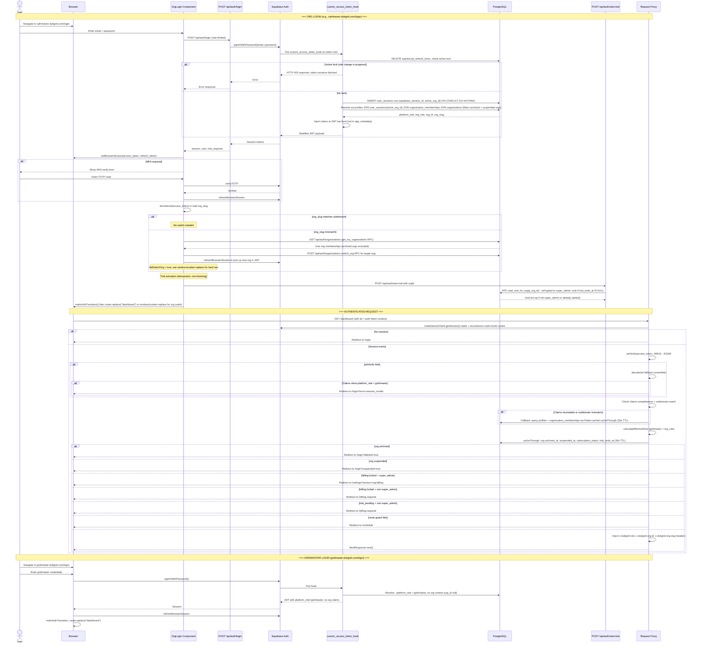
```mermaid
sequenceDiagram
    actor User
    participant Browser
    participant OrgLoginPage as OrgLogin Component
    participant APILogin as POST /api/auth/login
    participant SupaAuth as Supabase Auth
    participant JWTHook as custom_access_token_hook
    participant DB as PostgreSQL
    participant TrialAPI as POST /api/auth/start-trial
    participant Middleware as Request Proxy

    Note over User,Middleware: === ORG LOGIN (e.g., calmhaven.dubgrid.com/login) ===

    User->>Browser: Navigate to calmhaven.dubgrid.com/login
    User->>OrgLoginPage: Enter email + password
    OrgLoginPage->>APILogin: POST /api/auth/login (rate-limited)
    APILogin->>SupaAuth: signInWithPassword(email, password)
    SupaAuth->>JWTHook: Fire custom_access_token_hook on token mint
    JWTHook->>DB: DELETE expired jwt_refresh_locks, check active lock
    alt Active lock (role change in progress)
        JWTHook-->>SupaAuth: HTTP 403 response, token issuance blocked
        SupaAuth-->>APILogin: Error
        APILogin-->>OrgLoginPage: Error response
    else No lock
        JWTHook->>DB: INSERT user_sessions row (supabase_session_id, active_org_id) ON CONFLICT DO NOTHING
        JWTHook->>DB: Resolve via profiles JOIN user_sessions(active_org_id) JOIN organization_memberships JOIN organizations (filters archived + suspended orgs)
        DB-->>JWTHook: platform_role, org_role, org_id, org_slug
        JWTHook->>JWTHook: Inject claims at JWT top level (not in app_metadata)
        JWTHook-->>SupaAuth: Modified JWT payload
    end
    SupaAuth-->>APILogin: Session tokens
    APILogin-->>OrgLoginPage: session, user, mfa_required

    OrgLoginPage->>Browser: setBrowserSession(access_token, refresh_token)

    alt MFA required
        OrgLoginPage-->>User: Show MFA verify form
        User->>OrgLoginPage: Enter TOTP code
        OrgLoginPage->>SupaAuth: verifyTOTP
        SupaAuth-->>OrgLoginPage: Verified
        OrgLoginPage->>SupaAuth: refreshBrowserSession
    end

    OrgLoginPage->>OrgLoginPage: decodeJwt(access_token) to read org_slug
    alt org_slug matches subdomain
        Note over OrgLoginPage: No switch needed
    else org_slug mismatch
        OrgLoginPage->>DB: GET /api/auth/organizations (get_my_organizations RPC)
        DB-->>OrgLoginPage: User org memberships (archived orgs excluded)
        OrgLoginPage->>DB: POST /api/auth/organizations (switch_org RPC for target org)
        OrgLoginPage->>SupaAuth: refreshBrowserSession to pick up new org in JWT
        Note over OrgLoginPage: didSwitchOrg = true, use window.location.replace for hard nav
    end

    Note over OrgLoginPage: Trial activation (idempotent, non-blocking)
    OrgLoginPage->>TrialAPI: POST /api/auth/start-trial with orgId
    TrialAPI->>DB: RPC start_trial_for_org(p_org_id) - self-gated to super_admin, only if trial_ends_at IS NULL
    DB-->>TrialAPI: Void (no-op if not super_admin or already started)

    OrgLoginPage->>Browser: markAuthTransition() then router.replace("/dashboard") or window.location.replace for org switch

    Note over Browser,Middleware: === AUTHENTICATED REQUEST ===

    Browser->>Middleware: GET /dashboard (with sb-*-auth-token cookies)
    Middleware->>SupaAuth: createServerClient.getSession() reads + reconstructs multi-chunk cookie
    alt No session
        Middleware-->>Browser: Redirect to /login
    else Session exists
        Middleware->>Middleware: jwtVerify(access_token, JWKS) - ES256
        alt jwtVerify fails
            Middleware->>Middleware: decodeJwt fallback (unverified)
            alt Claims show platform_role = gridmaster
                Middleware-->>Browser: Redirect to /login?error=session_invalid
            end
        end
        Middleware->>Middleware: Check claims completeness + subdomain match
        alt Claims incomplete or subdomain mismatch
            Middleware->>DB: Fallback: query profiles + organization_memberships via Redis-cached cacheThrough (30s TTL)
        end
        Middleware->>Middleware: calculateEffectiveRole (gridmaster > org_role)
        Middleware->>DB: cacheThrough: org archived_at, suspended_at, subscription_status, trial_ends_at (30s TTL)
        alt org archived
            Middleware-->>Browser: Redirect to /login?deleted=true
        else org suspended
            Middleware-->>Browser: Redirect to /login?suspended=true
        else billing locked + super_admin
            Middleware-->>Browser: Redirect to /settings?section=org-billing
        else billing locked + non-super_admin
            Middleware-->>Browser: Redirect to /billing-required
        else trial_pending + non-super_admin
            Middleware-->>Browser: Redirect to /billing-required
        else route guard fails
            Middleware-->>Browser: Redirect to /schedule
        else
            Middleware->>Middleware: Inject x-dubgrid-role, x-dubgrid-org-id, x-dubgrid-org-slug headers
            Middleware-->>Browser: NextResponse.next()
        end
    end

    Note over User,Middleware: === GRIDMASTER LOGIN (gridmaster.dubgrid.com/login) ===

    User->>Browser: Navigate to gridmaster.dubgrid.com/login
    User->>Browser: Enter gridmaster credentials
    Browser->>SupaAuth: signInWithPassword()
    SupaAuth->>JWTHook: Fire hook
    JWTHook->>DB: Resolve - platform_role = gridmaster, no org context (org_id null)
    JWTHook-->>SupaAuth: JWT with platform_role=gridmaster, no org claims
    SupaAuth-->>Browser: Session
    Browser->>SupaAuth: refreshBrowserSession
    Browser->>Browser: markAuthTransition, router.replace("/dashboard")
```

---

## 2. Post-Login Navigation and Logout

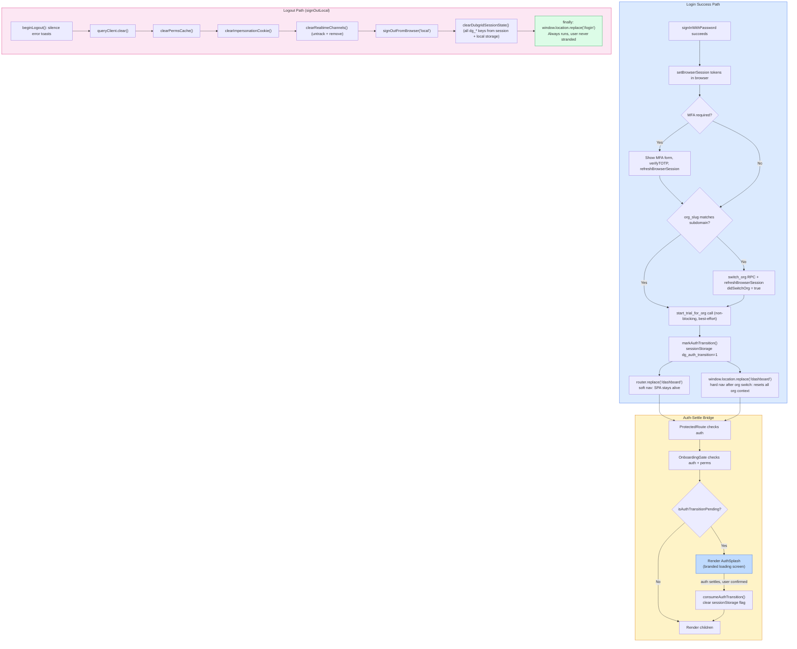
```mermaid
flowchart TD
    subgraph Login["Login Success Path"]
        L1["signInWithPassword succeeds"]
        L2["setBrowserSession tokens in browser"]
        L3{"MFA required?"}
        L4["Show MFA form, verifyTOTP, refreshBrowserSession"]
        L5{"org_slug matches subdomain?"}
        L6["switch_org RPC + refreshBrowserSession\ndidSwitchOrg = true"]
        L7["start_trial_for_org call (non-blocking, best-effort)"]
        L8["markAuthTransition()\nsessionStorage dg_auth_transition=1"]
        L9A["router.replace('/dashboard')\nsoft nav: SPA stays alive"]
        L9B["window.location.replace('/dashboard')\nhard nav after org switch: resets all org context"]
    end

    subgraph Bridge["Auth-Settle Bridge"]
        PR["ProtectedRoute checks auth"]
        OG["OnboardingGate checks auth + perms"]
        AS{"isAuthTransitionPending?"}
        SPLASH["Render AuthSplash\n(branded loading screen)"]
        SETTLED["consumeAuthTransition()\nclear sessionStorage flag"]
        CHILDREN["Render children"]
    end

    subgraph Logout["Logout Path (signOutLocal)"]
        LO1["beginLogout(): silence error toasts"]
        LO2["queryClient.clear()"]
        LO3["clearPermsCache()"]
        LO4["clearImpersonationCookie()"]
        LO5["clearRealtimeChannels() (untrack + remove)"]
        LO6["signOutFromBrowser('local')"]
        LO7["clearDubgridSessionState() (all dg_* keys from session + local storage)"]
        LO8["finally: window.location.replace('/login')\nAlways runs, user never stranded"]
    end

    L1 --> L2 --> L3
    L3 -->|Yes| L4 --> L5
    L3 -->|No| L5
    L5 -->|Yes| L7
    L5 -->|No| L6 --> L7
    L7 --> L8
    L8 --> L9A
    L8 --> L9B

    L9A --> PR
    L9B --> PR
    PR --> OG
    OG --> AS
    AS -->|Yes| SPLASH
    AS -->|No| CHILDREN
    SPLASH -->|auth settles, user confirmed| SETTLED --> CHILDREN

    LO1 --> LO2 --> LO3 --> LO4 --> LO5 --> LO6 --> LO7 --> LO8

    style Login fill:#dbeafe,stroke:#2563eb
    style Bridge fill:#fef3c7,stroke:#d97706
    style Logout fill:#fce7f3,stroke:#db2777
    style SPLASH fill:#bfdbfe,stroke:#2563eb
    style LO8 fill:#dcfce7,stroke:#16a34a
```

---

## 3. JWT Custom Access Token Hook

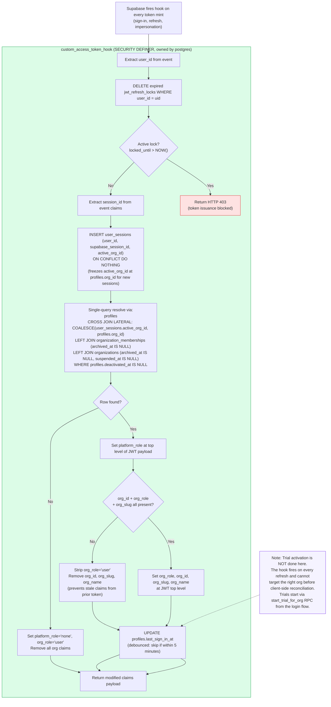
```mermaid
flowchart TD
    TRIGGER["Supabase fires hook on every token mint\n(sign-in, refresh, impersonation)"]

    subgraph Hook["custom_access_token_hook (SECURITY DEFINER, owned by postgres)"]
        GETUID["Extract user_id from event"]
        CLEAN["DELETE expired jwt_refresh_locks WHERE user_id = uid"]
        LOCKCHECK{"Active lock?\nlocked_until > NOW()"}
        RETURN403["Return HTTP 403\n(token issuance blocked)"]

        SESS["Extract session_id from event claims"]
        UPSERT["INSERT user_sessions (user_id, supabase_session_id, active_org_id)\nON CONFLICT DO NOTHING\n(freezes active_org_id at profiles.org_id for new sessions)"]

        RESOLVE["Single-query resolve via:\nprofiles\nCROSS JOIN LATERAL: COALESCE(user_sessions.active_org_id, profiles.org_id)\nLEFT JOIN organization_memberships (archived_at IS NULL)\nLEFT JOIN organizations (archived_at IS NULL, suspended_at IS NULL)\nWHERE profiles.deactivated_at IS NULL"]

        FOUND{"Row found?"}
        SETCLAIMS["Set platform_role at top level of JWT payload"]
        FULLORG{"org_id + org_role\n+ org_slug all present?"}
        SETFULL["Set org_role, org_id, org_slug, org_name\nat JWT top level"]
        STRIPORG["Strip org_role='user'\nRemove org_id, org_slug, org_name\n(prevents stale claims from prior token)"]
        DEBOUNCE["UPDATE profiles.last_sign_in_at\n(debounced: skip if within 5 minutes)"]
        NOTFOUND["Set platform_role='none', org_role='user'\nRemove all org claims"]
        RETURN["Return modified claims payload"]
    end

    NOTE["Note: Trial activation is NOT done here.\nThe hook fires on every refresh and cannot\ntarget the right org before client-side reconciliation.\nTrials start via start_trial_for_org RPC from the login flow."]

    TRIGGER --> GETUID --> CLEAN --> LOCKCHECK
    LOCKCHECK -->|Yes| RETURN403
    LOCKCHECK -->|No| SESS
    SESS --> UPSERT
    UPSERT --> RESOLVE --> FOUND
    FOUND -->|Yes| SETCLAIMS --> FULLORG
    FULLORG -->|Yes| SETFULL --> DEBOUNCE --> RETURN
    FULLORG -->|No| STRIPORG --> DEBOUNCE --> RETURN
    FOUND -->|No| NOTFOUND --> RETURN
    NOTE -.-> DEBOUNCE

    style Hook fill:#dcfce7,stroke:#16a34a
    style RETURN403 fill:#fee2e2,stroke:#dc2626
    style NOTE fill:#f5f3ff,stroke:#7c3aed
```

---

## 4. Per-Session Org Isolation and switch_org

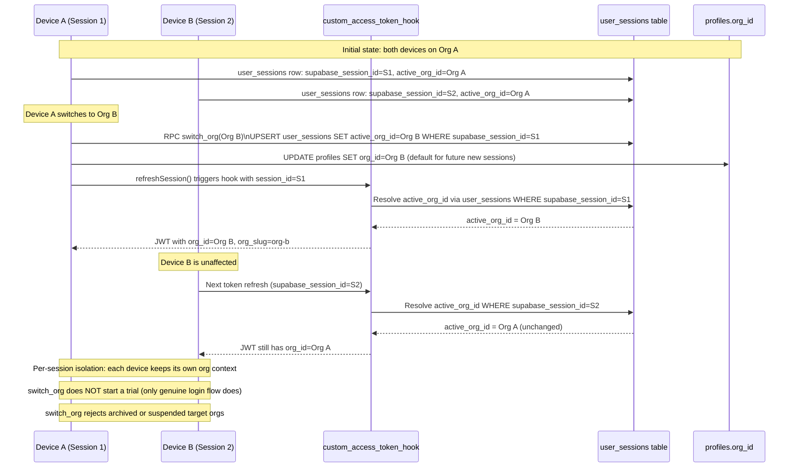
```mermaid
sequenceDiagram
    participant DeviceA as Device A (Session 1)
    participant DeviceB as Device B (Session 2)
    participant Hook as custom_access_token_hook
    participant DB as user_sessions table
    participant Profiles as profiles.org_id

    Note over DeviceA,Profiles: Initial state: both devices on Org A

    DeviceA->>DB: user_sessions row: supabase_session_id=S1, active_org_id=Org A
    DeviceB->>DB: user_sessions row: supabase_session_id=S2, active_org_id=Org A

    Note over DeviceA: Device A switches to Org B

    DeviceA->>DB: RPC switch_org(Org B)\nUPSERT user_sessions SET active_org_id=Org B WHERE supabase_session_id=S1
    DeviceA->>Profiles: UPDATE profiles SET org_id=Org B (default for future new sessions)
    DeviceA->>Hook: refreshSession() triggers hook with session_id=S1
    Hook->>DB: Resolve active_org_id via user_sessions WHERE supabase_session_id=S1
    DB-->>Hook: active_org_id = Org B
    Hook-->>DeviceA: JWT with org_id=Org B, org_slug=org-b

    Note over DeviceB: Device B is unaffected

    DeviceB->>Hook: Next token refresh (supabase_session_id=S2)
    Hook->>DB: Resolve active_org_id WHERE supabase_session_id=S2
    DB-->>Hook: active_org_id = Org A (unchanged)
    Hook-->>DeviceB: JWT still has org_id=Org A

    Note over DeviceA,DeviceB: Per-session isolation: each device keeps its own org context
    Note over DeviceA,DeviceB: switch_org does NOT start a trial (only genuine login flow does)
    Note over DeviceA,DeviceB: switch_org rejects archived or suspended target orgs
```

---

## 5. Trial Activation

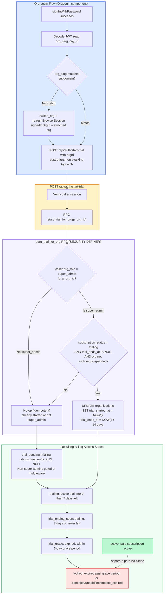
```mermaid
flowchart TD
    subgraph Login["Org Login Flow (OrgLogin component)"]
        SIGNIN["signInWithPassword succeeds"]
        DECODE["Decode JWT: read org_slug, org_id"]
        SWITCHCHECK{"org_slug matches\nsubdomain?"}
        SWITCHORG["switch_org + refreshBrowserSession\nsignedInOrgId = switched org"]
        TRIALCALL["POST /api/auth/start-trial with orgId\nbest-effort, non-blocking try/catch"]
    end

    subgraph TrialRoute["POST /api/auth/start-trial"]
        AUTH["Verify caller session"]
        RPC["RPC start_trial_for_org(p_org_id)"]
    end

    subgraph TrialRPC["start_trial_for_org RPC (SECURITY DEFINER)"]
        GATE{"caller org_role = super_admin\nfor p_org_id?"}
        TRIALING{"subscription_status = trialing\nAND trial_ends_at IS NULL\nAND org not archived/suspended?"}
        UPDATE["UPDATE organizations\nSET trial_started_at = NOW()\ntrial_ends_at = NOW() + 14 days"]
        NOOP["No-op (idempotent)\nalready started or not super_admin"]
    end

    subgraph BillingState["Resulting Billing Access States"]
        S1["trial_pending: trialing status, trial_ends_at IS NULL\nNon-super-admins gated at middleware"]
        S2["trialing: active trial, more than 7 days left"]
        S3["trial_ending_soon: trialing, 7 days or fewer left"]
        S4["trial_grace: expired, within 3-day grace period"]
        S5["locked: expired past grace period, or canceled/unpaid/incomplete_expired"]
        S6["active: paid subscription active"]
    end

    SIGNIN --> DECODE --> SWITCHCHECK
    SWITCHCHECK -->|No match| SWITCHORG --> TRIALCALL
    SWITCHCHECK -->|Match| TRIALCALL
    TRIALCALL --> AUTH --> RPC
    RPC --> GATE
    GATE -->|Not super_admin| NOOP
    GATE -->|Is super_admin| TRIALING
    TRIALING -->|No| NOOP
    TRIALING -->|Yes| UPDATE
    UPDATE --> S2
    NOOP --> S1

    S1 --> S2 --> S3 --> S4 --> S5
    S6 -.->|separate path via Stripe| S5

    style Login fill:#dbeafe,stroke:#2563eb
    style TrialRoute fill:#fef3c7,stroke:#d97706
    style TrialRPC fill:#f5f3ff,stroke:#7c3aed
    style BillingState fill:#f0fdf4,stroke:#16a34a
    style S5 fill:#fee2e2,stroke:#dc2626
    style S6 fill:#bbf7d0,stroke:#16a34a
```

---

## 6. RBAC Hierarchy and Permission Model

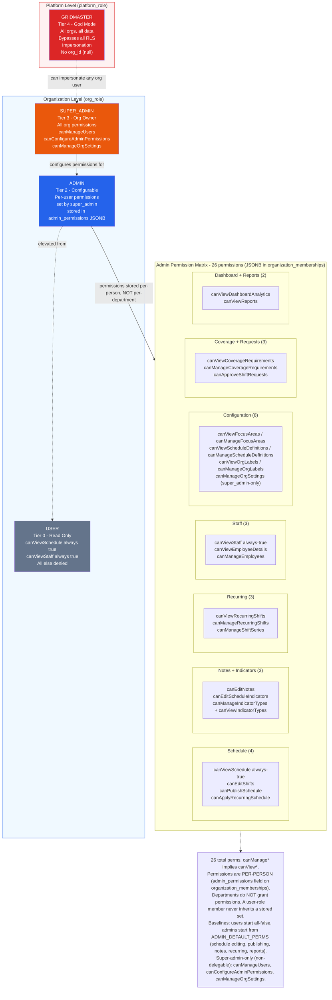
```mermaid
flowchart TB
    subgraph PlatformLevel["Platform Level (platform_role)"]
        GM["GRIDMASTER\nTier 4 - God Mode\nAll orgs, all data\nBypasses all RLS\nImpersonation\nNo org_id (null)"]
    end

    subgraph OrgLevel["Organization Level (org_role)"]
        SA["SUPER_ADMIN\nTier 3 - Org Owner\nAll org permissions\ncanManageUsers\ncanConfigureAdminPermissions\ncanManageOrgSettings"]

        AD["ADMIN\nTier 2 - Configurable\nPer-user permissions\nset by super_admin\nstored in admin_permissions JSONB"]

        US["USER\nTier 0 - Read Only\ncanViewSchedule always true\ncanViewStaff always true\nAll else denied"]
    end

    GM -.->|can impersonate any org user| SA
    SA -->|configures permissions for| AD
    AD -.->|elevated from| US

    subgraph PermMatrix["Admin Permission Matrix - 26 permissions (JSONB in organization_memberships)"]
        direction LR
        subgraph Schedule["Schedule (4)"]
            P1["canViewSchedule always-true\ncanEditShifts\ncanPublishSchedule\ncanApplyRecurringSchedule"]
        end
        subgraph Indicators["Notes + Indicators (3)"]
            P2["canEditNotes\ncanEditScheduleIndicators\ncanManageIndicatorTypes + canViewIndicatorTypes"]
        end
        subgraph Recurring["Recurring (3)"]
            P3["canViewRecurringShifts\ncanManageRecurringShifts\ncanManageShiftSeries"]
        end
        subgraph Staff["Staff (3)"]
            P4["canViewStaff always-true\ncanViewEmployeeDetails\ncanManageEmployees"]
        end
        subgraph Config["Configuration (8)"]
            P5["canViewFocusAreas / canManageFocusAreas\ncanViewScheduleDefinitions / canManageScheduleDefinitions\ncanViewOrgLabels / canManageOrgLabels\ncanManageOrgSettings (super_admin-only)"]
        end
        subgraph Coverage["Coverage + Requests (3)"]
            P6["canViewCoverageRequirements\ncanManageCoverageRequirements\ncanApproveShiftRequests"]
        end
        subgraph Dashboard["Dashboard + Reports (2)"]
            P7["canViewDashboardAnalytics\ncanViewReports"]
        end
    end

    AD -->|permissions stored per-person, NOT per-department| PermMatrix

    NOTE1["26 total perms. canManage* implies canView*.\nPermissions are PER-PERSON (admin_permissions field on organization_memberships).\nDepartments do NOT grant permissions. A user-role member never inherits a stored set.\nBaselines: users start all-false, admins start from ADMIN_DEFAULT_PERMS (schedule editing, publishing, notes, recurring, reports).\nSuper-admin-only (non-delegable): canManageUsers, canConfigureAdminPermissions, canManageOrgSettings."]
    PermMatrix -.-> NOTE1

    style GM fill:#dc2626,color:#fff
    style SA fill:#ea580c,color:#fff
    style AD fill:#2563eb,color:#fff
    style US fill:#64748b,color:#fff
    style PlatformLevel fill:#fef2f2,stroke:#dc2626
    style OrgLevel fill:#f0f9ff,stroke:#2563eb
```

---

## 7. Request Lifecycle (Browser to Database)

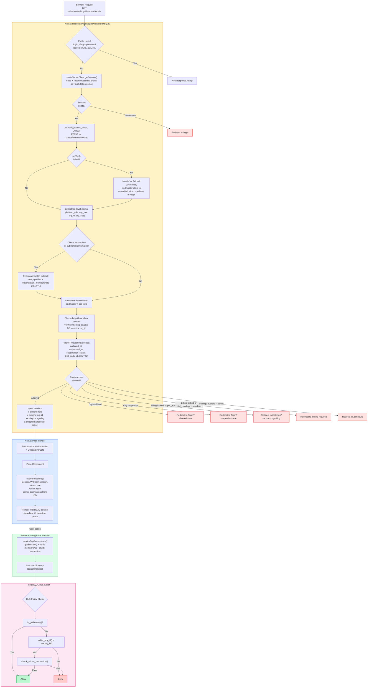
```mermaid
flowchart TD
    REQ["Browser Request\nGET calmhaven.dubgrid.com/schedule"]

    subgraph MW["Next.js Request Proxy (apps/web/src/proxy.ts)"]
        direction TB
        PUB{"Public route?\n/login, /forgot-password,\n/accept-invite, /api, etc."}
        SESS["createServerClient.getSession()\nRead + reconstruct multi-chunk sb-*-auth-token cookie"]
        NOSESS{"Session\nexists?"}
        JWT["jwtVerify(access_token, JWKS)\nES256 via createRemoteJWKSet"]
        FALLBACK{"jwtVerify\nfailed?"}
        DECODE["decodeJwt fallback (unverified)\nGridmaster claim in unverified token = redirect to /login"]
        CLAIMS["Extract top-level claims:\nplatform_role, org_role,\norg_id, org_slug"]
        MISSINGCLAIMS{"Claims incomplete\nor subdomain mismatch?"}
        DBFALLBACK["Redis-cached DB fallback:\nquery profiles + organization_memberships (30s TTL)"]
        EFFROLE["calculateEffectiveRole:\ngridmaster > org_role"]
        SANDBOX["Check dubgrid-sandbox cookie:\nverify ownership against DB, override org_id"]
        ORGCHECK["cacheThrough org access:\narchived_at, suspended_at, subscription_status, trial_ends_at (30s TTL)"]
        ROUTEGUARD{"Route access\nallowed?"}
        HEADERS["Inject headers:\nx-dubgrid-role\nx-dubgrid-org-id\nx-dubgrid-org-slug\nx-dubgrid-sandbox (if active)"]
    end

    subgraph PAGE["Next.js Page Render"]
        direction TB
        LAYOUT["Root Layout: AuthProvider + OnboardingGate"]
        COMPONENT["Page Component"]
        PERMS["usePermissions()\nDecodeJWT from session, extract role\nAdmin: fetch admin_permissions from DB"]
        RENDER["Render with RBAC context\nshow/hide UI based on perms"]
    end

    subgraph ACTION["Server Action / Route Handler"]
        direction TB
        AUTHCHECK["requireOrgPermissions()\ngetSession() + verify membership + check permission"]
        MUTATION["Execute DB query (parameterized)"]
    end

    subgraph RLS["PostgreSQL RLS Layer"]
        direction TB
        RLSCHECK{"RLS Policy Check"}
        ISGM["is_gridmaster()?"]
        ORGMATCH["caller_org_id() = row.org_id?"]
        PERMCHECK["check_admin_permission()"]
        ALLOW["Allow"]
        DENY["Deny"]
    end

    REQ --> PUB
    PUB -->|Yes| PASS1["NextResponse.next()"]
    PUB -->|No| SESS
    SESS --> NOSESS
    NOSESS -->|No session| REDIR1["Redirect to /login"]
    NOSESS -->|Yes| JWT
    JWT --> FALLBACK
    FALLBACK -->|No| CLAIMS
    FALLBACK -->|Yes| DECODE
    DECODE --> CLAIMS
    CLAIMS --> MISSINGCLAIMS
    MISSINGCLAIMS -->|Yes| DBFALLBACK --> EFFROLE
    MISSINGCLAIMS -->|No| EFFROLE
    EFFROLE --> SANDBOX
    SANDBOX --> ORGCHECK
    ORGCHECK --> ROUTEGUARD
    ROUTEGUARD -->|Org archived| REDIR2["Redirect to /login?deleted=true"]
    ROUTEGUARD -->|Org suspended| REDIR3["Redirect to /login?suspended=true"]
    ROUTEGUARD -->|Billing locked, super_admin| REDIR4["Redirect to /settings?section=org-billing"]
    ROUTEGUARD -->|Billing locked or trial_pending, non-admin| REDIR5["Redirect to /billing-required"]
    ROUTEGUARD -->|/settings but role < admin| REDIR6["Redirect to /schedule"]
    ROUTEGUARD -->|Allowed| HEADERS

    HEADERS --> LAYOUT
    LAYOUT --> COMPONENT
    COMPONENT --> PERMS
    PERMS --> RENDER

    RENDER -->|User action| AUTHCHECK
    AUTHCHECK --> MUTATION

    MUTATION --> RLSCHECK
    RLSCHECK --> ISGM
    ISGM -->|Yes| ALLOW
    ISGM -->|No| ORGMATCH
    ORGMATCH -->|No| DENY
    ORGMATCH -->|Yes| PERMCHECK
    PERMCHECK -->|Pass| ALLOW
    PERMCHECK -->|Fail| DENY

    style MW fill:#fef3c7,stroke:#d97706
    style PAGE fill:#dbeafe,stroke:#2563eb
    style ACTION fill:#dcfce7,stroke:#16a34a
    style RLS fill:#fce7f3,stroke:#db2777
    style REDIR1 fill:#fee2e2,stroke:#dc2626
    style REDIR2 fill:#fee2e2,stroke:#dc2626
    style REDIR3 fill:#fee2e2,stroke:#dc2626
    style REDIR4 fill:#fee2e2,stroke:#dc2626
    style REDIR5 fill:#fee2e2,stroke:#dc2626
    style REDIR6 fill:#fee2e2,stroke:#dc2626
    style ALLOW fill:#bbf7d0,stroke:#16a34a
    style DENY fill:#fecaca,stroke:#dc2626
```

---

## 8. Data Model (Entity Relationship Diagram)

```mermaid
erDiagram
    auth_users {
        uuid id PK
    }

    organizations {
        uuid id PK
        text name
        text slug UK "subdomain"
        text address
        text phone
        integer employee_count
        text logo_url
        text app_name
        jsonb theme_config
        jsonb landing_page_config
        text focus_area_label "custom terminology"
        text certification_label "custom terminology"
        text role_label "custom terminology"
        text timezone
        timestamptz suspended_at "soft suspension"
        timestamptz archived_at "soft delete - revokes all access"
        jsonb feature_overrides "per-org feature flags"
        text stripe_customer_id "billing"
        text stripe_subscription_id "billing"
        text subscription_status "billing state"
        timestamptz trial_started_at "set by start_trial_for_org on first super_admin login"
        timestamptz trial_ends_at "NULL = trial_pending state"
        text workspace_kind "real or sandbox"
        uuid sandbox_source_org_id FK "organizations (nullable)"
        uuid sandbox_owner_user_id FK "auth.users (nullable, one active sandbox per user)"
        timestamptz trial_welcome_email_sent_at "claimed once"
        integer data_retention_days
    }

    profiles {
        uuid id PK_FK "auth.users"
        uuid org_id FK "organizations - default for new sessions"
        platform_role platform_role "gridmaster or none"
        bigint version "optimistic lock"
        boolean role_locked
        boolean mfa_enabled
        text terms_version
        timestamptz last_sign_in_at
        timestamptz deactivated_at
        timestamptz scheduled_deletion_at
    }

    organization_memberships {
        bigint id PK
        uuid user_id FK "auth.users"
        uuid org_id FK "organizations"
        org_role org_role "super_admin or admin or user"
        jsonb admin_permissions "fine-grained perms - 26 total, per-person"
        bigint_arr department_ids "departments[]"
        bigint_arr dept_admin_ids "subset of department_ids"
        timestamptz onboarding_completed_at "durable per member and org"
        jsonb tooltip_tours_completed "default {}"
        timestamptz schedule_last_viewed_at
        timestamptz archived_at "soft removal"
    }

    user_sessions {
        uuid id PK
        uuid user_id FK "auth.users"
        uuid supabase_session_id UK "drives per-session org isolation"
        uuid active_org_id FK "organizations - per-device org context"
        text device_label
        inet ip_address
        text refresh_token_hash UK
        timestamptz last_active_at
    }

    departments {
        bigint id PK
        uuid org_id FK "organizations"
        text type "scheduled or management"
        text name
        text abbr
        bigint parent_department_id FK "departments (nullable)"
        jsonb permissions "management depts: vestigial template"
        integer sort_order
    }

    employees {
        uuid id PK
        uuid org_id FK "organizations"
        text first_name
        text last_name
        integer seniority
        text email
        text phone
        bigint certification_id FK "certifications"
        bigint_arr role_ids "organization_roles[]"
        bigint_arr focus_area_ids "focus_areas[]"
        employee_status status "active or benched or terminated"
        uuid user_id FK "auth.users (nullable)"
    }

    focus_areas {
        bigint id PK
        uuid org_id FK "organizations"
        bigint department_id FK "departments (scheduled parent)"
        text name
        text color_bg
        text color_text
        integer sort_order
        integer break_minutes
    }

    certifications {
        bigint id PK
        uuid org_id FK "organizations"
        text name
        text abbr
        integer sort_order
    }

    organization_roles {
        bigint id PK
        uuid org_id FK "organizations"
        text name
        text abbr
        integer sort_order
    }

    shift_categories {
        bigint id PK
        uuid org_id FK "organizations"
        text name
        text color
        time start_time
        time end_time
        bigint focus_area_id FK "focus_areas (nullable)"
        integer break_minutes
    }

    absence_types {
        bigint id PK
        uuid org_id FK "organizations"
        text label "e.g. X, V, S"
        text name "e.g. Day Off, PTO, Sick"
        text color
        text border_color
        text text_color
        integer sort_order
    }

    schedule_cells {
        uuid id PK
        uuid emp_id FK "employees"
        date date
        uuid org_id FK "organizations"
        bigint version "optimistic lock"
        uuid series_id FK "shift_series"
        boolean from_recurring
        bigint focus_area_id FK "focus_areas"
    }

    schedule_cell_snapshots {
        uuid id PK
        uuid cell_id FK "schedule_cells"
        text snapshot_kind
        text state_kind
        bigint absence_type_id FK "absence_types"
    }

    schedule_cell_segments {
        uuid id PK
        uuid snapshot_id FK "schedule_cell_snapshots"
        integer position
        bigint shift_id
        bigint job_id
    }

    recurring_shifts {
        uuid id PK
        uuid emp_id FK "employees"
        uuid org_id FK "organizations"
        smallint day_of_week "0=Sun 6=Sat"
        jsonb state "ScheduleCellState"
        date effective_from
        date effective_until
    }

    shift_series {
        uuid id PK
        uuid emp_id FK "employees"
        uuid org_id FK "organizations"
        shift_series_frequency frequency "daily or weekly or biweekly"
        smallint_arr days_of_week
        date start_date
        date end_date
        jsonb state "ScheduleCellState"
    }

    schedule_notes {
        bigint id PK
        uuid org_id FK "organizations"
        uuid emp_id FK "employees"
        date date
        integer indicator_type_id FK "indicator_types"
        text status "published or draft or draft_deleted"
    }

    indicator_types {
        integer id PK
        uuid org_id FK "organizations"
        text name
        text color
    }

    coverage_requirements {
        bigint id PK
        uuid org_id FK "organizations"
        bigint focus_area_id FK "focus_areas"
        bigint preferred_shift_id FK "shift_categories"
        bigint preferred_job_id
        smallint day_of_week "nullable = all days"
        integer min_staff
    }

    shift_requests {
        uuid id PK
        uuid org_id FK "organizations"
        shift_request_type type "pickup or swap"
        shift_request_status status
        uuid requester_emp_id FK "employees"
        date requester_shift_date
        jsonb requester_state
        bigint requester_focus_area_id FK "focus_areas"
        uuid target_emp_id FK "employees (swap)"
        date target_shift_date
        jsonb target_state
        bigint target_focus_area_id FK "focus_areas"
        uuid admin_user_id FK "auth.users"
        text admin_note
        timestamptz expires_at "72h default"
        timestamptz resolved_at
        uuid idempotency_key UK
    }

    invitations {
        uuid id PK
        uuid org_id FK "organizations"
        uuid invited_by FK "auth.users"
        text email
        org_role role_to_assign
        uuid token UK "secret link"
        timestamptz expires_at "72h default"
        uuid employee_id FK "employees"
    }

    role_change_log {
        uuid id PK
        uuid target_user_id FK "auth.users"
        uuid changed_by_id FK "auth.users"
        text from_role
        text to_role
        text idempotency_key UK
        text change_type "role_change or permission_change"
        jsonb permissions_before
        jsonb permissions_after
    }

    jwt_refresh_locks {
        uuid user_id PK_FK "auth.users"
        timestamptz locked_until
        text reason
    }

    impersonation_sessions {
        uuid session_id PK
        uuid gridmaster_id FK "auth.users"
        uuid target_user_id FK "auth.users"
        uuid target_org_id FK "organizations"
        timestamptz expires_at "30min default"
    }

    schedule_draft_sessions {
        uuid id PK
        uuid org_id FK_UK "organizations (one per org) - draft recovery, not a lock"
        uuid saved_by FK "auth.users"
        date start_date
        date end_date
    }

    recurring_shifts_draft_sessions {
        uuid id PK
        uuid org_id FK_UK "organizations (one per org) - draft recovery, not a lock"
        uuid saved_by FK "auth.users"
        jsonb draft_data
    }

    schedule_editor_session_terminations {
        uuid id PK
        uuid org_id FK "organizations"
        uuid user_id FK "auth.users (owner-only)"
        uuid editor_session_id
        uuid ended_by_editor_session_id
        timestamptz ended_at
    }

    publish_history {
        uuid id PK
        uuid org_id FK "organizations"
        uuid published_by FK "auth.users"
        date start_date
        date end_date
        integer change_count
        jsonb changes
    }

    schedule_publish_changes {
        bigint id PK
        uuid publish_history_id FK "publish_history"
        uuid org_id FK "organizations"
        uuid emp_id FK "employees"
        date date
        text kind
        jsonb from_state "finalize_scheduler_staffed_calloffs trigger (019/020)"
        jsonb to_state
        uuid updated_by FK "auth.users"
    }

    job_shift_overrides {
        bigint id PK
        uuid org_id FK "organizations"
        bigint job_id FK "jobs"
        bigint shift_id FK "shift_categories"
        time start_time
        time end_time
        text color
    }

    calendar_feed_tokens {
        uuid id PK
        uuid user_id FK "auth.users"
        uuid org_id FK "organizations"
        uuid employee_id FK "employees"
        text token_hash "private .ics feed (migration 011)"
        timestamptz issued_at
        timestamptz revoked_at
    }

    notifications {
        uuid id PK
        uuid user_id FK "auth.users"
        uuid org_id FK "organizations"
        text type
        text channel
        text category
        text priority "low/normal/high/critical"
        text title
        text message
        jsonb metadata "destination facts for the alert resolver"
        timestamptz read_at
        timestamptz archived_at
    }

    notification_preferences {
        bigint id PK
        uuid user_id FK "auth.users"
        jsonb prefs
    }

    profile_change_requests {
        uuid id PK
        uuid org_id FK "organizations"
        uuid requester_user_id FK "auth.users"
        uuid requester_employee_id FK "employees"
        profile_change_request_type request_type
        profile_change_request_status status
        jsonb requested_changes
        jsonb current_values
        uuid resolver_user_id FK "auth.users"
        timestamptz resolved_at
        integer version "optimistic lock"
    }

    subscriptions {
        bigint id PK
        uuid org_id FK "organizations"
        text stripe_subscription_id
        text stripe_customer_id
        text status
        text price_id
        integer quantity "seats"
        timestamptz current_period_end
        timestamptz trial_end
    }

    stripe_processed_events {
        text event_id PK "webhook replay idempotency"
        timestamptz processed_at
    }

    platform_feature_flags {
        text key PK "stripe, resend_email, mobile_api, csv_import, csv_export, sentry, posthog, cron_*"
        boolean enabled "false = kill-switched"
        text description
        uuid updated_by FK "auth.users (gridmaster)"
    }

    audit_log {
        bigint id PK
        uuid org_id FK "organizations (nullable for platform rows)"
        uuid actor_id FK "auth.users"
        text actor_email
        text action
        text resource_type
        text resource_id
        jsonb details
        uuid impersonation_session_id FK "impersonation_sessions"
    }

    terms_acceptances {
        bigint id PK
        uuid user_id FK "auth.users"
        text terms_version
        timestamptz accepted_at
    }

    cookie_consents {
        bigint id PK
        uuid user_id FK "auth.users (nullable)"
        text ip_hash
        jsonb consent
        text consent_version
    }

    mobile_device_tokens {
        uuid id PK
        uuid user_id FK "auth.users"
        uuid org_id FK "organizations"
        text platform
        text expo_push_token
        timestamptz last_seen_at
        timestamptz disabled_at
    }

    %% === RELATIONSHIPS ===

    auth_users ||--o| profiles : "has profile"
    auth_users ||--o{ organization_memberships : "belongs to orgs"
    auth_users ||--o{ user_sessions : "has sessions"
    auth_users ||--o| jwt_refresh_locks : "may have lock"

    organizations ||--o{ organization_memberships : "has members"
    organizations ||--o{ employees : "employs"
    organizations ||--o{ departments : "has departments"
    organizations ||--o{ focus_areas : "has areas"
    organizations ||--o{ certifications : "has certs"
    organizations }o--o| organizations : "sandbox source org"
    organizations ||--o{ organization_roles : "has roles"
    organizations ||--o{ shift_categories : "has categories"
    organizations ||--o{ absence_types : "has absence types"
    organizations ||--o{ indicator_types : "has indicators"
    organizations ||--o{ coverage_requirements : "has requirements"
    organizations ||--o{ invitations : "sends invites"
    organizations ||--o{ shift_requests : "has requests"
    organizations ||--o| schedule_draft_sessions : "has draft"
    organizations ||--o| recurring_shifts_draft_sessions : "has recurring draft"
    organizations ||--o{ schedule_editor_session_terminations : "ended editor sessions"
    organizations ||--o{ publish_history : "has publishes"
    publish_history ||--o{ schedule_publish_changes : "per-cell diffs"
    organizations ||--o{ job_shift_overrides : "job shift overrides"
    organizations ||--o{ notifications : "alerts"
    organizations ||--o{ profile_change_requests : "change requests"
    organizations ||--o| subscriptions : "billing"
    organizations ||--o{ audit_log : "activity"
    auth_users ||--o| notification_preferences : "delivery prefs"
    auth_users ||--o{ terms_acceptances : "accepted terms"
    auth_users ||--o{ mobile_device_tokens : "push devices"
    employees ||--o{ calendar_feed_tokens : "private calendar feeds"
    organizations ||--o| impersonation_sessions : "target org"

    profiles }o--o| organizations : "default org for new sessions"

    departments ||--o{ departments : "management to scheduled parent/child"
    departments ||--o{ focus_areas : "scheduled dept to focus areas"
    departments }o--o{ organization_memberships : "membership department_ids[]"

    employees ||--o{ schedule_cells : "assigned schedule cells"
    employees ||--o{ recurring_shifts : "recurring patterns"
    employees ||--o{ shift_series : "shift series"
    employees ||--o{ schedule_notes : "has notes"
    employees }o--o| certifications : "certified as"
    employees }o--o| auth_users : "linked user"

    focus_areas ||--o{ shift_categories : "scoped categories"
    focus_areas ||--o{ coverage_requirements : "staffing rules"
    absence_types ||--o{ schedule_cell_snapshots : "cell absence"

    shift_series ||--o{ schedule_cells : "linked cells"

    indicator_types ||--o{ schedule_notes : "note type"

    invitations }o--o| employees : "links to employee"

    user_sessions }o--o| organizations : "active org per session"
```

---

## 9. Organization Routing and Multi-Tenancy

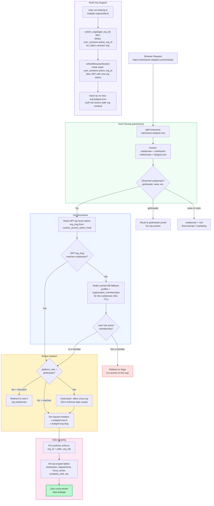
```mermaid
flowchart TD
    REQ["Browser Request\nhttps://calmhaven.dubgrid.com/schedule"]

    subgraph Parse["Host Parsing (parseHost)"]
        SPLIT["Split hostname:\ncalmhaven.dubgrid.com"]
        EXTRACT["Extract:\nsubdomain = calmhaven\nrootDomain = dubgrid.com"]
        RESERVED{"Reserved subdomain?\ngridmaster, www, etc."}
    end

    subgraph Resolve["Org Resolution"]
        JWTCLAIMS["Read JWT top-level claims:\norg_slug from custom_access_token_hook"]
        MATCH{"JWT org_slug\nmatches subdomain?"}
        DBFALLBACK["Redis-cached DB fallback:\nprofiles + organization_memberships\nfor this subdomain (30s TTL)"]
        MEMBERCHECK{"User has active\nmembership?"}
    end

    subgraph Enforce["Tenant Isolation"]
        GMCHECK{"platform_role =\ngridmaster?"}
        FORCESUB["Redirect to user's\norg subdomain"]
        ALLOWGM["Gridmaster: allow cross-org\n(RLS enforces data scope)"]
        INJECT["Set request headers:\nx-dubgrid-org-id\nx-dubgrid-org-slug"]
    end

    subgraph DataScope["Data Scoping"]
        direction TB
        RLS["RLS policies enforce:\norg_id = caller_org_id()"]
        TABLES["All org-scoped tables:\nemployees, departments, focus_areas,\nschedule_cells, etc."]
        ZERO["Zero cross-tenant\ndata leakage"]
    end

    subgraph MultiOrg["Multi-Org Support"]
        direction TB
        MEMBERSHIPS["User can belong to\nmultiple organizations"]
        SWITCH["switch_org(target_org_id) RPC\nWrites user_sessions.active_org_id\nfor caller's session only"]
        REFRESH["refreshBrowserSession\nHook reads user_sessions.active_org_id\nNew JWT with new org claims"]
        NEWDOMAIN["Hard nav to new-org.dubgrid.com\n(soft nav leaves stale org context)"]
    end

    REQ --> SPLIT
    SPLIT --> EXTRACT
    EXTRACT --> RESERVED
    RESERVED -->|gridmaster| GM_ROUTE["Route to gridmaster portal\nNo org context"]
    RESERVED -->|www or none| NULL_SUB["subdomain = null\nRoot domain / marketing"]
    RESERVED -->|No| JWTCLAIMS

    JWTCLAIMS --> MATCH
    MATCH -->|Yes| GMCHECK
    MATCH -->|No| DBFALLBACK
    DBFALLBACK --> MEMBERCHECK
    MEMBERCHECK -->|Not a member| REJECT["Redirect to /login\n(no access to this org)"]
    MEMBERCHECK -->|Is a member| GMCHECK

    GMCHECK -->|Yes| ALLOWGM
    GMCHECK -->|No + mismatch| FORCESUB
    GMCHECK -->|No + matches| INJECT

    ALLOWGM --> INJECT
    INJECT --> RLS
    RLS --> TABLES
    TABLES --> ZERO

    MEMBERSHIPS --> SWITCH
    SWITCH --> REFRESH
    REFRESH --> NEWDOMAIN

    style Parse fill:#f0fdf4,stroke:#16a34a
    style Resolve fill:#eff6ff,stroke:#2563eb
    style Enforce fill:#fef3c7,stroke:#d97706
    style DataScope fill:#fce7f3,stroke:#db2777
    style MultiOrg fill:#f5f3ff,stroke:#7c3aed
    style REJECT fill:#fee2e2,stroke:#dc2626
    style ZERO fill:#bbf7d0,stroke:#16a34a,stroke-width:2px
```

---

## 10. Role Change and JWT Lock Mechanism

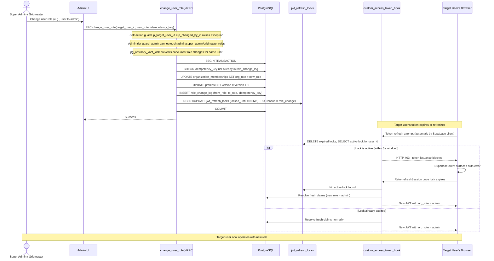
```mermaid
sequenceDiagram
    actor Admin as Super Admin / Gridmaster
    participant UI as Admin UI
    participant RPC as change_user_role() RPC
    participant DB as PostgreSQL
    participant Lock as jwt_refresh_locks
    participant Hook as custom_access_token_hook
    participant Target as Target User's Browser

    Admin->>UI: Change user role (e.g., user to admin)
    UI->>RPC: RPC change_user_role(target_user_id, new_role, idempotency_key)

    Note over RPC: Self-action guard: p_target_user_id = p_changed_by_id raises exception
    Note over RPC: Admin tier guard: admin cannot touch admin/super_admin/gridmaster roles
    Note over RPC: pg_advisory_xact_lock prevents concurrent role changes for same user

    RPC->>DB: BEGIN TRANSACTION
    RPC->>DB: CHECK idempotency_key not already in role_change_log
    RPC->>DB: UPDATE organization_memberships SET org_role = new_role
    RPC->>DB: UPDATE profiles SET version = version + 1
    RPC->>DB: INSERT role_change_log (from_role, to_role, idempotency_key)
    RPC->>Lock: INSERT/UPDATE jwt_refresh_locks (locked_until = NOW() + 5s, reason = role_change)
    RPC->>DB: COMMIT

    RPC-->>UI: Success

    Note over Target,Hook: Target user's token expires or refreshes

    Target->>Hook: Token refresh attempt (automatic by Supabase client)
    Hook->>Lock: DELETE expired locks, SELECT active lock for user_id

    alt Lock is active (within 5s window)
        Hook-->>Target: HTTP 403 - token issuance blocked
        Target->>Target: Supabase client surfaces auth error
        Target->>Hook: Retry refreshSession once lock expires
        Hook->>Lock: No active lock found
        Hook->>DB: Resolve fresh claims (new role = admin)
        Hook-->>Target: New JWT with org_role = admin
    else Lock already expired
        Hook->>DB: Resolve fresh claims normally
        Hook-->>Target: New JWT with org_role = admin
    end

    Note over Admin,Target: Target user now operates with new role
```

---

## 11. Org Soft-Delete and Access Revocation

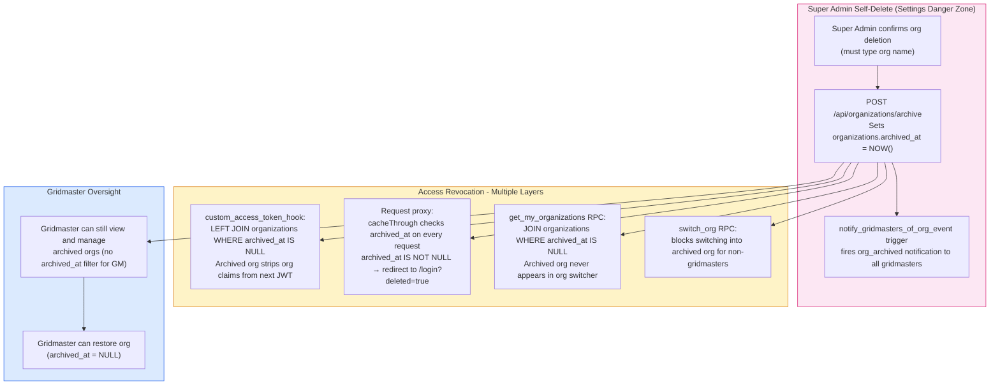
```mermaid
flowchart TD
    subgraph Delete["Super Admin Self-Delete (Settings Danger Zone)"]
        CONFIRM["Super Admin confirms org deletion\n(must type org name)"]
        ARCHIVE["POST /api/organizations/archive\nSets organizations.archived_at = NOW()"]
        NOTIF["notify_gridmasters_of_org_event trigger\nfires org_archived notification to all gridmasters"]
    end

    subgraph Revoke["Access Revocation - Multiple Layers"]
        direction TB
        HOOK["custom_access_token_hook:\nLEFT JOIN organizations WHERE archived_at IS NULL\nArchived org strips org claims from next JWT"]
        MIDDLEWARE["Request proxy:\ncacheThrough checks archived_at on every request\narchived_at IS NOT NULL → redirect to /login?deleted=true"]
        GETMYORGS["get_my_organizations RPC:\nJOIN organizations WHERE archived_at IS NULL\nArchived org never appears in org switcher"]
        SWITCHORG["switch_org RPC:\nblocks switching into archived org for non-gridmasters"]
    end

    subgraph Gridmaster["Gridmaster Oversight"]
        VIEW["Gridmaster can still view and manage\narchived orgs (no archived_at filter for GM)"]
        RESTORE["Gridmaster can restore org\n(archived_at = NULL)"]
    end

    CONFIRM --> ARCHIVE
    ARCHIVE --> NOTIF
    ARCHIVE --> HOOK
    ARCHIVE --> MIDDLEWARE
    ARCHIVE --> GETMYORGS
    ARCHIVE --> SWITCHORG
    ARCHIVE --> VIEW
    VIEW --> RESTORE

    style Delete fill:#fce7f3,stroke:#db2777
    style Revoke fill:#fef3c7,stroke:#d97706
    style Gridmaster fill:#dbeafe,stroke:#2563eb
```

---

## 12. Test Sandbox (Cookie-Based Mode)

```mermaid
flowchart LR
    subgraph Enter["Entering Sandbox Mode"]
        SA["Super Admin clicks 'Enter Sandbox'"]
        CREATE["POST /api/test-sandbox { action: enter }\nadmin+ by real source-org role, CSRF + rate-limited\nCreate or reuse sandbox org\n(workspace_kind = sandbox,\nsandbox_owner_user_id = caller,\nsandbox_source_org_id = real org)"]
        SETCOOKIE["Set dubgrid-sandbox cookie (HttpOnly, 7 days):\n{ sandboxOrgId, userId }\nUser stays on SAME subdomain\nNo JWT refresh, no navigation"]
    end

    subgraph Active["Active Sandbox State"]
        COOKIE["Browser carries dubgrid-sandbox cookie"]
        MW["Request proxy reads cookie:\ngetSandboxFromCookie()\nVerifies: workspace_kind=sandbox,\nsandbox_owner_user_id = session.user.id,\narchived_at IS NULL via service client"]
        OVERRIDE["Override claims.org_id to sandboxOrgId\nclaims.org_slug intentionally KEPT as real org\n(user stays on real-org subdomain)"]
        HEADER["Inject x-dubgrid-sandbox: true header"]
        APIGATE["requireOrgPermissions (api-auth.ts):\nsandbox org_id replaces real org_id\nfor all reads and writes\nMutation-only endpoints blocked with 403"]
    end

    subgraph Exit["Exiting Sandbox"]
        EXITBTN["User clicks 'Exit Sandbox'\n(or 'Reset' to wipe and re-clone)"]
        CLEARCOOKIE["POST /api/test-sandbox { action: exit }\nDelete the caller's sandboxes,\nclear dubgrid-sandbox cookie"]
        RESTORE["Next request: no sandbox cookie\nRequest proxy uses real org_id from JWT"]
        REAP["Daily /api/cron/sandbox-cleanup\ndeletes sandboxes older than 14 days"]
    end

    subgraph Isolation["Isolation Guarantees"]
        OWNED["Cookie verified against DB: only owner can use their sandbox"]
        NOSWITCH["sandbox is NOT switch_org: no JWT change, no subdomain hop"]
        MUTATIONS["Destructive mutations blocked in sandbox mode"]
        MOBILEBLOCKED["Mobile login rejects sandbox workspaces"]
    end

    SA --> CREATE --> SETCOOKIE
    SETCOOKIE --> COOKIE
    COOKIE --> MW --> OVERRIDE --> HEADER --> APIGATE
    EXITBTN --> CLEARCOOKIE --> RESTORE
    COOKIE -.->|abandoned| REAP

    style Enter fill:#dbeafe,stroke:#2563eb
    style Active fill:#fef3c7,stroke:#d97706
    style Exit fill:#dcfce7,stroke:#16a34a
    style Isolation fill:#f5f3ff,stroke:#7c3aed
```

---

## 13. Onboarding Flow (Role-Aware Composite Wizard)

> The old standalone 8-step wizard and the `/setup` route are deleted. Onboarding
> now renders inline via `OnboardingGate`, which wraps the authenticated app and
> hands off to a role-aware `OnboardingWizard`. Components live in
> `apps/web/src/components/onboarding/`.

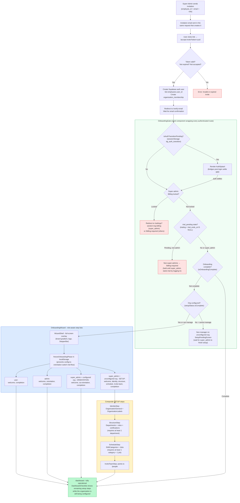
```mermaid
flowchart TD
    INVITE["Super Admin sends invitation\n(employee_id + email + role)"]
    EMAIL["Invitation email sent in the\nsame request that creates it"]
    ACCEPT["User clicks link →\n/accept-invite?token=uuid"]
    VALIDATE{"Token valid?\nNot expired? Not accepted?"}
    CREATE["Create Supabase auth user\nSet employees.user_id\nCreate organization_membership"]
    VERIFY["Redirect to /verify-email\nWait for email confirmation"]

    subgraph Gate["OnboardingGate (client component wrapping every authenticated route)"]
        direction TB
        AUTHTRANS{"isAuthTransitionPending?\n(sessionStorage dg_auth_transition)"}
        SPLASH_A["Render AuthSplash\n(bridges post-login settle gap)"]
        BILLING{"Super admin:\nBilling locked?"}
        BILLLOCK["Redirect to /settings?section=org-billing\n(super_admin)\nor /billing-required (others)"]
        TRIAL_PENDING{"trial_pending state?\n(trialing + trial_ends_at IS NULL)"}
        TRIALLOCK["Non-super-admins → /billing-required\n(held until super_admin starts trial by logging in)"]
        ONBSTATUS{"Onboarding\ncomplete?\n(isOnboardingComplete)"}
        ORGSETUP{"Org configured?\n(setupStatus.isComplete)"}
        PENDING["Non-manager on unconfigured org:\nSetupPendingScreen\n(wait for super_admin to finish setup)"]
    end

    subgraph Wizard["OnboardingWizard - role-aware step lists"]
        direction TB
        SHELL["WizardShell - full-screen overlay\n(brand gradient, logo, StepperBar)"]
        FREEZE["freezeOnboardingPhase in localStorage\n(prevents config-to-orientation switch mid-flow)"]
        SASETUP["super_admin + unconfigured org - SETUP:\nwelcome, identity, structure,\nschedule, invite-team, completion"]
        SAORIENT["super_admin + configured org - ORIENTATION:\nwelcome, sa-orientation, completion"]
        ADMIN["admin:\nwelcome, orientation, completion"]
        USER["user:\nwelcome, completion"]
    end

    subgraph SetupSteps["Composite SETUP steps"]
        direction TB
        S_IDENTITY["IdentityStep:\nOrganizationGeneral + OrganizationLabels"]
        S_STRUCTURE["StructureStep:\nDepartments + roles + certifications\n(requires at least 1 department)"]
        S_SCHEDULE["ScheduleStep:\nShiftCategories + Jobs\n(requires at least 1 category + 1 job)"]
        S_INVITE["InviteTeamStep: points to /people"]
    end

    DASHBOARD["/dashboard - fully operational\nDashboardChecklist shows remaining setup steps\nwhile the organization is still being configured"]

    INVITE --> EMAIL --> ACCEPT --> VALIDATE
    VALIDATE -->|No| REJECT["Error: Invalid or expired invite"]
    VALIDATE -->|Yes| CREATE --> VERIFY --> AUTHTRANS

    AUTHTRANS -->|Yes| SPLASH_A -->|auth settles| BILLING
    AUTHTRANS -->|No| BILLING

    BILLING -->|Locked| BILLLOCK
    BILLING -->|Not locked| TRIAL_PENDING
    TRIAL_PENDING -->|Pending, non-admin| TRIALLOCK
    TRIAL_PENDING -->|No or super_admin| ONBSTATUS
    ONBSTATUS -->|Complete| DASHBOARD
    ONBSTATUS -->|Not complete| ORGSETUP
    ORGSETUP -->|No + cannot manage| PENDING
    ORGSETUP -->|Yes or can manage| SHELL

    SHELL --> FREEZE
    FREEZE --> SASETUP
    FREEZE --> SAORIENT
    FREEZE --> ADMIN
    FREEZE --> USER

    SASETUP --> S_IDENTITY --> S_STRUCTURE --> S_SCHEDULE --> S_INVITE --> DASHBOARD
    SAORIENT --> DASHBOARD
    ADMIN --> DASHBOARD
    USER --> DASHBOARD

    style REJECT fill:#fee2e2,stroke:#dc2626
    style DASHBOARD fill:#bbf7d0,stroke:#16a34a
    style Gate fill:#f0fdf4,stroke:#16a34a
    style Wizard fill:#dbeafe,stroke:#2563eb
    style SetupSteps fill:#fef3c7,stroke:#d97706
    style BILLLOCK fill:#fee2e2,stroke:#dc2626
    style TRIALLOCK fill:#fee2e2,stroke:#dc2626
```

---

## 14. Monorepo Layout and Package Graph

> npm workspaces (`apps/*`, `packages/*`) orchestrated by Turborepo. Node 22.x,
> npm 10.9.2. Two apps, eleven private `0.1.0` ESM packages (built via `tsc` to `dist/`).

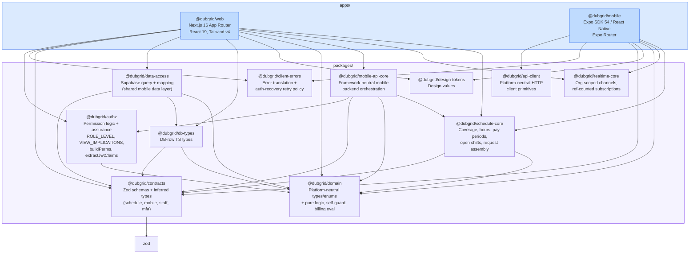
```mermaid
flowchart TD
    subgraph Apps["apps/"]
        WEB["@dubgrid/web\nNext.js 16 App Router\nReact 19, Tailwind v4"]
        MOBILE["@dubgrid/mobile\nExpo SDK 54 / React Native\nExpo Router"]
    end

    subgraph Packages["packages/"]
        DOMAIN["@dubgrid/domain\nPlatform-neutral types/enums\n+ pure logic, self-guard, billing eval"]
        CONTRACTS["@dubgrid/contracts\nZod schemas + inferred types\n(schedule, mobile, staff, mfa)"]
        DBTYPES["@dubgrid/db-types\nDB-row TS types"]
        AUTHZ["@dubgrid/authz\nPermission logic + assurance\nROLE_LEVEL, VIEW_IMPLICATIONS,\nbuildPerms, extractJwtClaims"]
        SCHEDCORE["@dubgrid/schedule-core\nCoverage, hours, pay periods,\nopen shifts, request assembly"]
        CLIENTERR["@dubgrid/client-errors\nError translation +\nauth-recovery retry policy"]
        REALTIME["@dubgrid/realtime-core\nOrg-scoped channels,\nref-counted subscriptions"]
        DATAACCESS["@dubgrid/data-access\nSupabase query + mapping\n(shared mobile data layer)"]
        MOBAPICORE["@dubgrid/mobile-api-core\nFramework-neutral mobile\nbackend orchestration"]
        APICLIENT["@dubgrid/api-client\nPlatform-neutral HTTP\nclient primitives"]
        TOKENS["@dubgrid/design-tokens\nDesign values"]
    end

    WEB --> AUTHZ
    WEB --> CLIENTERR
    WEB --> CONTRACTS
    WEB --> DATAACCESS
    WEB --> DBTYPES
    WEB --> TOKENS
    WEB --> DOMAIN
    WEB --> MOBAPICORE
    WEB --> REALTIME
    WEB --> SCHEDCORE

    MOBILE --> APICLIENT
    MOBILE --> CLIENTERR
    MOBILE --> CONTRACTS
    MOBILE --> TOKENS
    MOBILE --> DOMAIN
    MOBILE --> REALTIME
    MOBILE --> SCHEDCORE

    CONTRACTS --> ZOD["zod"]
    DBTYPES --> CONTRACTS
    DBTYPES --> DOMAIN
    AUTHZ --> DOMAIN
    SCHEDCORE --> CONTRACTS
    SCHEDCORE --> DOMAIN
    DATAACCESS --> CONTRACTS
    DATAACCESS --> DBTYPES
    DATAACCESS --> DOMAIN
    MOBAPICORE --> AUTHZ
    MOBAPICORE --> CONTRACTS
    MOBAPICORE --> DOMAIN
    MOBAPICORE --> SCHEDCORE

    style Apps fill:#dbeafe,stroke:#2563eb
    style Packages fill:#f5f3ff,stroke:#7c3aed
    style WEB fill:#bfdbfe,stroke:#2563eb
    style MOBILE fill:#bfdbfe,stroke:#2563eb
```

---

## 15. Mobile App to /api/mobile/v1 Data Flow

> `apps/mobile` never touches Supabase data tables directly. All traffic goes through
> the web app's versioned mobile Route Handlers, which delegate to
> `@dubgrid/mobile-api-core`.

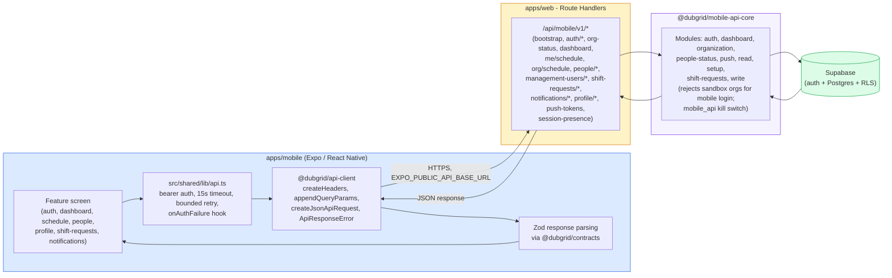
```mermaid
flowchart LR
    subgraph Mobile["apps/mobile (Expo / React Native)"]
        SCREEN["Feature screen\n(auth, dashboard, schedule, people,\nprofile, shift-requests, notifications)"]
        APILIB["src/shared/lib/api.ts\nbearer auth, 15s timeout, bounded retry,\nonAuthFailure hook"]
        CLIENT["@dubgrid/api-client\ncreateHeaders, appendQueryParams,\ncreateJsonApiRequest, ApiResponseError"]
        ZODPARSE["Zod response parsing\nvia @dubgrid/contracts"]
    end

    subgraph Web["apps/web - Route Handlers"]
        ROUTE["/api/mobile/v1/*\n(bootstrap, auth/*, org-status, dashboard,\nme/schedule, org/schedule, people/*,\nmanagement-users/*, shift-requests/*,\nnotifications/*, profile/*, push-tokens,\nsession-presence)"]
    end

    subgraph Core["@dubgrid/mobile-api-core"]
        MODULES["Modules: auth, dashboard, organization,\npeople-status, push, read, setup,\nshift-requests, write\n(rejects sandbox orgs for mobile login;\nmobile_api kill switch)"]
    end

    SUPA[("Supabase\n(auth + Postgres + RLS)")]

    SCREEN --> APILIB
    APILIB --> CLIENT
    CLIENT -->|"HTTPS, EXPO_PUBLIC_API_BASE_URL"| ROUTE
    ROUTE --> MODULES
    MODULES --> SUPA
    SUPA --> MODULES
    MODULES --> ROUTE
    ROUTE -->|"JSON response"| CLIENT
    CLIENT --> ZODPARSE
    ZODPARSE --> SCREEN

    style Mobile fill:#dbeafe,stroke:#2563eb
    style Web fill:#fef3c7,stroke:#d97706
    style Core fill:#f5f3ff,stroke:#7c3aed
    style SUPA fill:#dcfce7,stroke:#16a34a
```

---

## 16. Stripe Billing and Subscription Flow

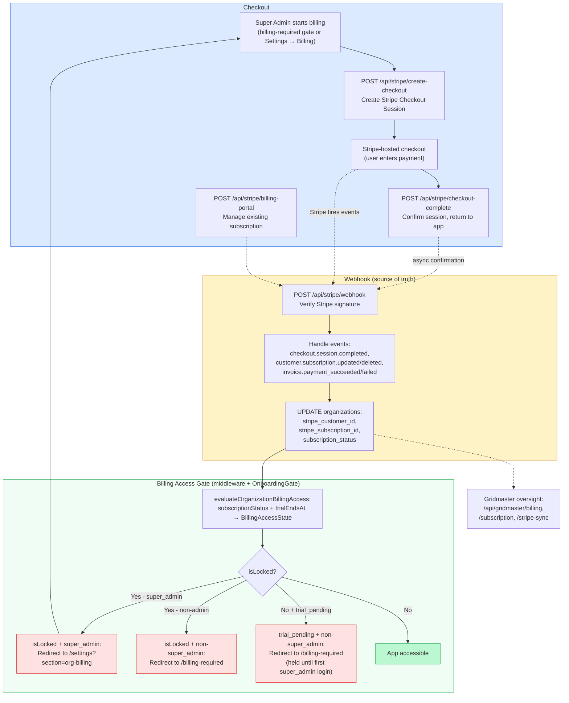
```mermaid
flowchart TD
    subgraph Checkout["Checkout"]
        START["Super Admin starts billing\n(billing-required gate or Settings → Billing)"]
        CREATE["POST /api/stripe/create-checkout\nCreate Stripe Checkout Session"]
        STRIPE["Stripe-hosted checkout\n(user enters payment)"]
        COMPLETE["POST /api/stripe/checkout-complete\nConfirm session, return to app"]
        PORTAL["POST /api/stripe/billing-portal\nManage existing subscription"]
    end

    subgraph Webhook["Webhook (source of truth)"]
        HOOK["POST /api/stripe/webhook\nVerify Stripe signature"]
        EVENTS["Handle events:\ncheckout.session.completed,\ncustomer.subscription.updated/deleted,\ninvoice.payment_succeeded/failed"]
        UPDATE["UPDATE organizations:\nstripe_customer_id,\nstripe_subscription_id,\nsubscription_status"]
    end

    subgraph Gate["Billing Access Gate (middleware + OnboardingGate)"]
        EVAL["evaluateOrganizationBillingAccess:\nsubscriptionStatus + trialEndsAt → BillingAccessState"]
        CHECK{"isLocked?"}
        LOCKED_SA["isLocked + super_admin:\nRedirect to /settings?section=org-billing"]
        LOCKED_USER["isLocked + non-super_admin:\nRedirect to /billing-required"]
        TRIAL_PEND["trial_pending + non-super_admin:\nRedirect to /billing-required\n(held until first super_admin login)"]
        UNLOCKED["App accessible"]
    end

    GM["Gridmaster oversight:\n/api/gridmaster/billing,\n/subscription, /stripe-sync"]

    START --> CREATE --> STRIPE --> COMPLETE
    COMPLETE -.->|async confirmation| HOOK
    STRIPE -.->|Stripe fires events| HOOK
    PORTAL -.-> HOOK
    HOOK --> EVENTS --> UPDATE
    UPDATE --> EVAL
    EVAL --> CHECK
    CHECK -->|Yes - super_admin| LOCKED_SA
    CHECK -->|Yes - non-admin| LOCKED_USER
    CHECK -->|No + trial_pending| TRIAL_PEND
    CHECK -->|No| UNLOCKED
    LOCKED_SA --> START
    UPDATE -.-> GM

    style Checkout fill:#dbeafe,stroke:#2563eb
    style Webhook fill:#fef3c7,stroke:#d97706
    style Gate fill:#f0fdf4,stroke:#16a34a
    style LOCKED_SA fill:#fee2e2,stroke:#dc2626
    style LOCKED_USER fill:#fee2e2,stroke:#dc2626
    style TRIAL_PEND fill:#fee2e2,stroke:#dc2626
    style UNLOCKED fill:#bbf7d0,stroke:#16a34a
```

---

## Quick Reference: Defense in Depth

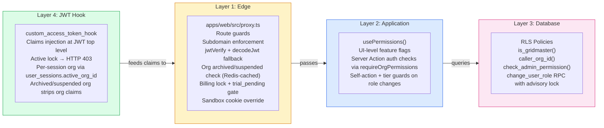
```mermaid
flowchart LR
    subgraph L1["Layer 1: Edge"]
        MW["apps/web/src/proxy.ts\nRoute guards\nSubdomain enforcement\njwtVerify + decodeJwt fallback\nOrg archived/suspended check (Redis-cached)\nBilling lock + trial_pending gate\nSandbox cookie override"]
    end

    subgraph L2["Layer 2: Application"]
        PERMS["usePermissions()\nUI-level feature flags\nServer Action auth checks via requireOrgPermissions\nSelf-action + tier guards on role changes"]
    end

    subgraph L3["Layer 3: Database"]
        RLSP["RLS Policies\nis_gridmaster()\ncaller_org_id()\ncheck_admin_permission()\nchange_user_role RPC with advisory lock"]
    end

    subgraph L4["Layer 4: JWT Hook"]
        HOOKL["custom_access_token_hook\nClaims injection at JWT top level\nActive lock → HTTP 403\nPer-session org via user_sessions.active_org_id\nArchived/suspended org strips org claims"]
    end

    L1 -->|passes| L2
    L2 -->|queries| L3
    L4 -->|feeds claims to| L1

    style L1 fill:#fef3c7,stroke:#d97706
    style L2 fill:#dbeafe,stroke:#2563eb
    style L3 fill:#fce7f3,stroke:#db2777
    style L4 fill:#dcfce7,stroke:#16a34a
```
