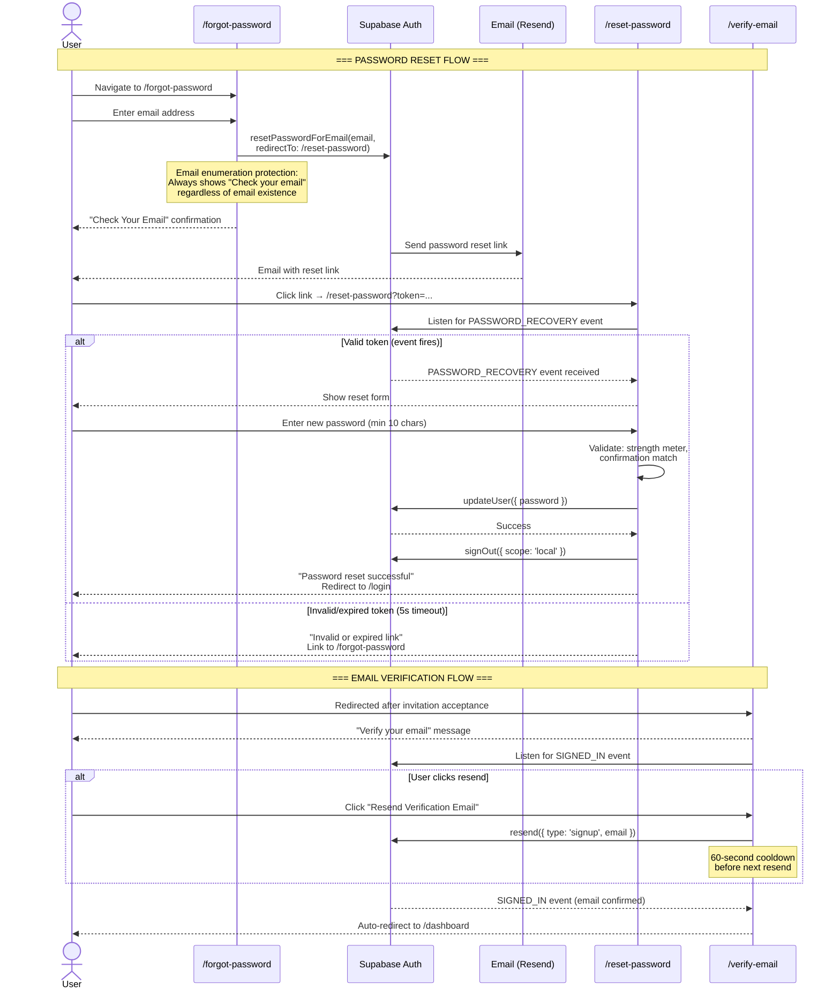

# DubGrid — Authentication & Session Management

This document covers authentication flows, session management, and security features that are separate from the core RBAC model. For role-based access control, see [RBAC_SYSTEM_DESIGN.md](../RBAC_SYSTEM_DESIGN.md). For the auth-surface edge cases and the audit of what is already hardened, see [AUTH_EDGE_CASES.md](../AUTH_EDGE_CASES.md).

> **Monorepo note.** DubGrid is an npm-workspaces + Turborepo monorepo: `apps/web`
> (Next.js 16 / React 19), `apps/mobile` (Expo), and shared `packages/*`. Auth logic that
> must run on both apps lives in the platform-neutral packages (`@dubgrid/authz`,
> `@dubgrid/domain`, `@dubgrid/mobile-api-core`). Paths below use the monorepo layout.

---

## 1. Per-Device Logout (Browser A ≠ Browser B)

### 1.1 Root Cause

> **The Problem: Two Logout Paths Need Different Scopes**
>
> **Voluntary Logout** (user clicks "Sign Out"): should only destroy the current browser's session. Other devices remain active.
>
> **Forced re-auth** (role change / org suspension): every device must pick up the new
> privilege state. DubGrid does **not** use a privileged `admin.signOut` Edge Function for
> this. A `jwt_refresh_locks` row makes the JWT hook return a `403` on the next token mint
> (forcing re-auth after a role change), and for a suspended/archived org the hook strips
> org claims while the middleware denies access — so no stale token retains elevated access.

### 1.2 user_sessions Table (Track Devices Individually)

```sql
CREATE TABLE public.user_sessions (
  id                  UUID PRIMARY KEY DEFAULT gen_random_uuid(),
  user_id             UUID NOT NULL,
  org_id              UUID,            -- audit snapshot of last-seen JWT org (not authoritative)
  active_org_id       UUID,            -- AUTHORITATIVE per-session org read by the JWT hook
  supabase_session_id UUID UNIQUE,     -- correlates web/mobile sessions to the auth session_id
  platform            TEXT,            -- 'web' | 'ios' | 'android'
  app_version         TEXT,
  device_label        TEXT,
  ip_address          INET,
  last_active_at      TIMESTAMPTZ NOT NULL DEFAULT NOW(),
  created_at          TIMESTAMPTZ NOT NULL DEFAULT NOW(),
  refresh_token_hash  TEXT UNIQUE      -- nullable: switch_org may create a row before track-session runs
);

ALTER TABLE user_sessions ENABLE ROW LEVEL SECURITY;
CREATE POLICY "own_sessions_only" ON user_sessions
  USING (user_id = auth.uid());
```

> `active_org_id` drives **per-session org isolation**: the custom access token hook reads
> the calling session's `active_org_id` (falling back to `profiles.org_id`) to decide which
> org that device's JWT is scoped to. `switch_org` writes it for the calling session only,
> so switching orgs on one device never changes another device's session. See
> RBAC_SYSTEM_DESIGN.md §10c.

### 1.3 Voluntary Logout: Local Scope, Swift, No Splash

The hook (`apps/web/src/hooks/useLogout.ts`) signs out `scope: "local"`, sweeps all `dg_*`
session/local keys (view-as-user, onboarding flags, auth-transition) while preserving
device prefs, and **always** lands on `/login` from a `finally` block so a thrown
`signOut` can never strand the user. Logout is deliberately swift, with no `<AuthSplash>`
(unlike login, which shows the splash to bridge the auth-settle gap).

```ts
// apps/web/src/hooks/useLogout.ts (shape)
async function signOutLocal(redirectTo = "/login"): Promise<void> {
  try {
    await signOutFromBrowser("local"); // scope: "local" — this browser only
    clearAllDgState();                 // sweep dg_* keys, keep device prefs
    queryClient.clear();
  } finally {
    window.location.replace(redirectTo); // always reach /login, even on error
  }
}
```

### 1.4 Logout Decision Matrix

| Trigger                             | Scope  | Mechanism                                        | Other Devices Affected?          |
| ----------------------------------- | ------ | ------------------------------------------------ | -------------------------------- |
| User clicks "Sign Out"              | local  | `supabase.auth.signOut({ scope: 'local' })`      | No — all other sessions remain   |
| User clicks "Sign out all devices"  | others | `supabase.auth.signOut({ scope: 'others' })`     | Yes — all other sessions revoked |
| Super admin demotes/changes role    | forced | `jwt_refresh_locks` row → JWT hook returns 403 on next mint; user must re-auth | Yes — every device re-auths with the new role |
| Org suspended/archived              | forced | JWT hook strips org claims + middleware denies access on next request | Yes — all sessions lose access   |
| Session revoked via Active Sessions | single | revoke the target device's session (Profile → sessions) | Only the targeted device         |
| JWT expires naturally               | n/a    | Token not renewed — next request hits middleware | No — each JWT independent        |

---

## 2. Invite-Only Registration

Self-signup is completely disabled. Every user account must be created through an invitation issued by a super admin or gridmaster. A rogue actor who reaches the Supabase sign-up endpoint without a valid invite token is rejected before a profile row is ever created.

### 2.1 Disable Public Sign-Up

In Supabase Dashboard → Authentication → Providers → Email: set "Enable email signup" to OFF. This makes `supabase.auth.signUp()` return an error for any call not initiated through the invite flow.

### 2.2 invitations Table

```sql
CREATE TABLE public.invitations (
  id             UUID PRIMARY KEY DEFAULT gen_random_uuid(),
  org_id         UUID NOT NULL,
  invited_by     UUID,
  email          TEXT NOT NULL,
  employee_id    UUID,                                    -- links to existing employee record
  role_to_assign org_role NOT NULL DEFAULT 'user',
  token          UUID NOT NULL DEFAULT gen_random_uuid(),
  expires_at     TIMESTAMPTZ NOT NULL DEFAULT now() + INTERVAL '72 hours',
  accepted_at    TIMESTAMPTZ,
  revoked_at     TIMESTAMPTZ,
  created_at     TIMESTAMPTZ NOT NULL DEFAULT now(),
  updated_at     TIMESTAMPTZ NOT NULL DEFAULT now(),
  first_name     TEXT,                          -- app-only invites: invitee details
  last_name      TEXT,                          --   stored before account creation
  phone          TEXT,
  department_ids BIGINT[] NOT NULL DEFAULT '{}',
  dept_admin_ids BIGINT[] NOT NULL DEFAULT '{}' -- depts where invitee becomes a dept admin
);

-- Partial UNIQUE: only one PENDING invite per email per org; historical
-- accepted/revoked rows for the same email are allowed.
CREATE UNIQUE INDEX one_pending_invite_per_email
  ON public.invitations (org_id, email)
  WHERE accepted_at IS NULL AND revoked_at IS NULL;

ALTER TABLE invitations ENABLE ROW LEVEL SECURITY;
```

> Acceptance runs through the hardened `accept_invitation(p_token)` RPC: `FOR UPDATE` row
> lock plus checks for already-accepted, revoked, expired, **and recipient email match**.
> The `/api/invitations/lookup` route returns only live invitations and a uniform 404 for
> any dead/expired token (it used to leak org name/slug).

### 2.3 Invitation Flow

| Step | Actor         | Action                                                                      |
| ---- | ------------- | --------------------------------------------------------------------------- |
| 1    | Super Admin   | Fills "Invite User" form: selects employee, enters email + role             |
| 2    | Server        | Inserts `invitations` row with `employee_id` FK, returns token              |
| 3    | API Route     | `/api/send-invite-email` sends invitation via Resend                        |
| 4    | Invitee       | Clicks link → arrives at `/accept-invite?token=<uuid>`                      |
| 5    | Accept Flow   | Validates token, creates Supabase auth user, sets `employees.user_id`       |
| 6    | Auth Hook     | JWT issued with `platform_role`, `org_role`, `org_id`, `org_slug` claims    |
| 7    | Invitee       | Redirected to their org dashboard, fully authenticated                      |

### 2.4 Invitation Edge Cases

| Scenario                            | Behavior                                         | Mechanism                                          |
| ----------------------------------- | ------------------------------------------------ | -------------------------------------------------- |
| Duplicate invite to same email      | Old expired invite cleaned up, new one issued     | DELETE expired + INSERT with UNIQUE constraint      |
| User clicks expired link            | Returns error — invite expired                    | `expires_at` check in validation                   |
| User clicks already-used link       | Returns error — already accepted                  | `accepted_at IS NULL` check                        |
| Two users race to accept same token | First UPDATE wins; second gets no row back        | Atomic UPDATE ... WHERE accepted_at IS NULL         |
| Admin revokes before user accepts   | Returns error — revoked                           | `revoked_at IS NULL` check                         |
| Employee already has linked account | Invite blocked — user_id already set              | Pre-check in invite creation                       |

---

## 3. Password Reset Flow

Self-service password reset is fully implemented with security best practices.

### 3.1 Implementation

1. **Forgot Password** (`/forgot-password`) — User enters email, Supabase sends reset link via `resetPasswordForEmail()`. Includes email enumeration protection: always shows "Check your email" regardless of whether the email exists in the system.
2. **Reset Password** (`/reset-password`) — Token-validated form with:
   - Password strength meter (4 levels: too short → weak → fair → strong)
   - Minimum 10-character requirement
   - Confirmation field with match validation
   - 5-second timeout fallback for invalid/expired tokens
   - Automatic local sign-out after successful reset
3. **Auth components** in `apps/web/src/components/auth/`: `PasswordInput` (show/hide toggle), `PasswordStrength` (visual meter), `AuthCard` (consistent layout)

### 3.2 Flow Diagram



---

## 4. Email Verification

New accounts created via invitation acceptance go through email verification:

- **Verify Email** (`/verify-email`) — Displays verification status with optional `?email=` param
- Resend button with 60-second cooldown to prevent abuse
- Listens for `SIGNED_IN` auth event to auto-redirect when verified
- Email enumeration protection (same UI regardless of email validity)

---

## 4a. Post-Login Soft Nav, Auth Splash, and Onboarding Gate

Login redirects via a **soft** `router.replace("/dashboard")` (not `window.location`).
Because the JWT/session takes a moment to settle, `markAuthTransition()` sets a flag and
`<AuthSplash>` is shown so the route guards / onboarding gate do not bounce a
just-logged-in user back to `/login`. `consumeAuthTransition()` clears the flag from a
`useEffect`, not during render. Logout is the opposite: swift, no splash, always
`finally`-redirecting to `/login` (see §1.3).

Onboarding/setup state is enforced **client-side** by `OnboardingGate`
(`apps/web/src/components/onboarding/OnboardingGate.tsx`), which reads the
`@/features/onboarding/client` guards (`fetchOnboardingStatus`, `isOnboardingComplete`,
`getOnboardingPhase`, `freezeOnboardingPhase`). While setup is incomplete it renders the
onboarding wizard inline on every route for setup-capable users, and a setup-pending
screen for everyone else. This is not in the Edge middleware.

## 4b. Trial Activation (first super_admin login)

The 14-day trial clock starts on the **first genuine super_admin login**, via the
`start_trial_for_org(p_org_id)` RPC called from the web/mobile login flow. The RPC is
idempotent (`trial_ends_at IS NULL` guard), self-gated to a `super_admin` membership, and
only fires when `subscription_status = 'trialing'` and the org is not archived/suspended.
It is **never** called from the JWT hook, `switch_org`, or token refresh, because those
fire on every mint and cannot reliably target the org the user actually logged into. A
NULL `trial_ends_at` is the "trial pending" state, which `packages/domain/src/billing.ts`
maps to billing state `trial_pending` and which gates non-super_admins until activation.
The `/api/auth/start-trial` route additionally verifies the caller's claim is
`super_admin` for the requested org before calling the RPC (defense in depth).

## 5. Rate Limiting

All public-facing API routes are rate-limited via Upstash Redis (`apps/web/src/lib/rate-limit.ts`):

| Limiter | Window | Key | Applied To |
| ------- | ------ | --- | ---------- |
| `apiLimiter` | 10 / 10s | user id (or IP) | general protected mutations (org settings/access/role-change, etc.) |
| `inviteLimiter` | 100 / 1h | user id (per-actor) | `/api/send-invite-email` |
| `emailTargetLimiter` | 5 / 1h | `hashEmail(target)` | layered onto invite + gridmaster password-reset so one actor can't email-bomb one inbox |
| `demoLimiter` | 3 / 1h | IP | `/api/request-demo` |
| `passwordResetLimiter` | 5 / 15m | `hashEmail(email)` | forgot/reset password |
| `loginLimiter` | 15 / 15m | `hashEmail(email)` | login (app-level brute-force protection) |
| `scheduleReviewLimiter` | 60 / 10s | user id | publish/discard review dialogs |

`checkRateLimit` **fails closed** in production (returns a `misconfigured` flag so callers
respond 503) when Upstash Redis is unconfigured or unreachable; in development it allows
through.

---

## 6. Branded Email Templates

Shared email template system in `apps/web/src/lib/email.ts`:
- `sanitizeHeaderValue()` — Prevents email header injection (strips CRLF, null bytes)
- `escapeHtml()` — Prevents XSS in email content
- `emailWrapper()` — Branded HTML template with DubGrid header, card layout, responsive design
- Used by invitation emails and demo request notifications

---

## 7. CSRF Protection

Mutating Route Handlers call `validateCsrfOrigin(req)` (`apps/web/src/lib/csrf.ts`), which
checks the request `Origin` header's root domain against the request host's root domain
(any `*.dubgrid.com` subdomain is accepted; a foreign origin is rejected). Server Actions
also include Next.js's built-in CSRF protection.

---

## 8. Recommended Features Not Yet Implemented

### 8.1 Priority 1 — Security (Implement Before Launch)

#### Multi-Factor Authentication (MFA) — Partially Implemented

| Property         | Detail                                                                                                                |
| ---------------- | --------------------------------------------------------------------------------------------------------------------- |
| Status           | **Partial.** `GET /api/account/mfa-status` reports enrollment state (backed by `profiles.mfa_enabled` + Supabase MFA factors) and the web account + mobile security surfaces read it. The gridmaster MFA verify step is `async` with try/catch (no stuck screen). |
| Gap              | No enrollment flow and no role-based *enforcement* yet. Until enrollment is required, a compromised password gives full access; gridmaster/super_admin are high-value targets. |
| Recommendation   | Build the enrollment flow and enforce TOTP for gridmaster and super_admin. Prompt admin/user roles to enroll optionally. |
| Supabase support | Built-in via `supabase.auth.mfa.enroll()` / `challenge()` / `verify()`                                                |

#### Failed Login Attempt Tracking & Account Lockout — Partial

| Property            | Detail                                                                                                           |
| ------------------- | ---------------------------------------------------------------------------------------------------------------- |
| Status              | **Partial.** App-level brute-force protection exists: `loginLimiter` caps login attempts at 15 per 15 minutes per `hashEmail(email)`. There is still no per-account lockout / email-based unlock flow. |
| Recommendation      | Add failed-attempt tracking with a lockout + email-based unlock after a threshold, on top of the existing rate limit. |

#### IP Allowlisting for Gridmaster

| Property       | Detail                                                                                                       |
| -------------- | ------------------------------------------------------------------------------------------------------------ |
| Gap            | Any authenticated Gridmaster can access from any IP, including a stolen laptop.                               |
| Recommendation | Add a `gridmaster_allowed_ips` table. Middleware checks `req.ip` against the allowlist.                      |

### 8.2 Priority 2 — User Lifecycle

#### Soft Delete — Orgs Done, Users Partial

| Property       | Detail                                                                                                              |
| -------------- | ------------------------------------------------------------------------------------------------------------------- |
| Status         | **Orgs: done.** `organizations.archived_at` soft-deletes an org and revokes access everywhere (middleware, JWT hook, `get_my_organizations`, `switch_org`); a super_admin self-deletes from Settings → Danger Zone. **Users: partial.** `profiles` has `deactivated_at` / `scheduled_deletion_at` and memberships have `archived_at`, but there is no single uniform soft-delete contract across every table. |
| Recommendation | Standardize the user/membership soft-delete path and confirm every relevant query filters the deactivation/archival columns. |

### 8.3 Priority 3 — Operational

#### Refresh Token Rotation & Reuse Detection

| Property       | Detail                                                                                                                     |
| -------------- | -------------------------------------------------------------------------------------------------------------------------- |
| Gap            | If a refresh token is stolen, the attacker can obtain new access tokens indefinitely.                                      |
| Recommendation | Enable Supabase's built-in refresh token rotation. Reuse detection revokes the entire session family on theft detection.   |

#### Role Change Notifications

| Property       | Detail                                                                                                                     |
| -------------- | -------------------------------------------------------------------------------------------------------------------------- |
| Gap            | When a user is promoted or demoted, they receive no communication.                                                         |
| Recommendation | Trigger an email and in-app notification from the role change flow.                                                        |

### 8.4 Feature Priority Summary

| Priority | Feature                                  | Status     | Risk if Skipped                                      |
| -------- | ---------------------------------------- | ---------- | ---------------------------------------------------- |
| P1       | MFA for Gridmaster & Super Admin         | Partial    | Status endpoint exists; enrollment + enforcement still missing → takeover via password compromise |
| P1       | Failed login tracking & lockout          | Partial    | `loginLimiter` (15/15m) added; per-account lockout/unlock still missing |
| P1       | IP allowlisting for Gridmaster           | Not done   | Stolen credentials = full platform access            |
| ~~P1~~   | ~~Password reset flow~~                  | Done       | ~~Users locked out permanently if password lost~~    |
| ~~P2~~   | ~~Email verification~~                   | Done       | ~~Unverified accounts receive org roles~~            |
| ~~P2~~   | ~~Rate limiting on API routes~~          | Done       | ~~Abuse of public endpoints~~                        |
| P2       | Soft delete (users & orgs)               | Partial    | Orgs done (`archived_at`); user path not yet uniform |
| P3       | Refresh token rotation + reuse detection | Not done   | Stolen tokens usable indefinitely                    |
| P3       | Role change notifications                | Not done   | Silent UX — confused users after demotion            |
| ~~P3~~   | ~~GDPR data export~~                     | Done       | ~~Legal compliance gap in EU/UK markets~~            |

---

_DubGrid — Confidential_
