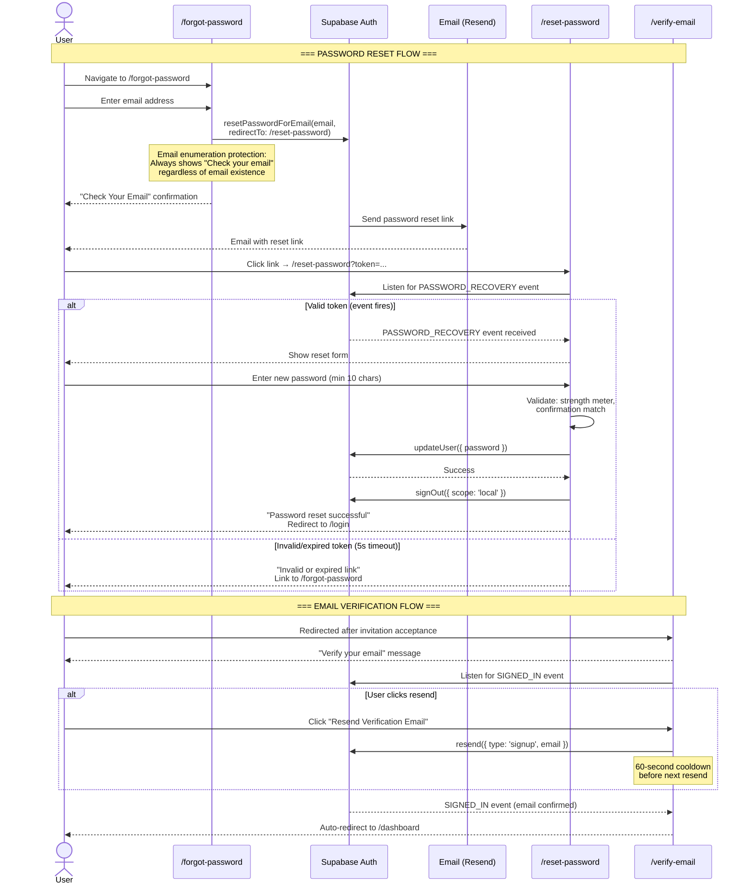

# DubGrid — Authentication & Session Management

This document covers authentication flows, session management, and security features that are separate from the core RBAC model. For role-based access control, see [RBAC_SYSTEM_DESIGN.md](../RBAC_SYSTEM_DESIGN.md).

---

## 1. Per-Device Logout (Browser A ≠ Browser B)

### 1.1 Root Cause

> **The Problem: Two Logout Paths Need Different Scopes**
>
> **Voluntary Logout** (user clicks "Sign Out"): should only destroy the current browser's session. Other devices remain active.
>
> **Forced Logout** (role change / account suspension): MUST destroy all sessions — the user's privilege has changed and no stale session can be tolerated.

### 1.2 user_sessions Table (Track Devices Individually)

```sql
CREATE TABLE public.user_sessions (
  id              UUID PRIMARY KEY DEFAULT gen_random_uuid(),
  user_id         UUID NOT NULL REFERENCES auth.users(id) ON DELETE CASCADE,
  device_label    TEXT,
  ip_address      INET,
  last_active_at  TIMESTAMPTZ NOT NULL DEFAULT NOW(),
  created_at      TIMESTAMPTZ NOT NULL DEFAULT NOW(),
  refresh_token_hash  TEXT UNIQUE NOT NULL
);

CREATE INDEX ON user_sessions (user_id, last_active_at DESC);

ALTER TABLE user_sessions ENABLE ROW LEVEL SECURITY;
CREATE POLICY "own_sessions_only" ON user_sessions
  USING (user_id = auth.uid());
```

### 1.3 Voluntary Logout: Local Scope Only

```ts
// hooks/useLogout.ts
export function useLogout() {
  return async () => {
    // scope: "local" = only clears THIS browser's session
    const { error } = await supabase.auth.signOut({ scope: "local" });
    if (!error) {
      queryClient.clear();
      router.push("/login");
    }
  };
}
```

### 1.4 Logout Decision Matrix

| Trigger                             | Scope  | Mechanism                                        | Other Devices Affected?          |
| ----------------------------------- | ------ | ------------------------------------------------ | -------------------------------- |
| User clicks "Sign Out"              | local  | `supabase.auth.signOut({ scope: 'local' })`      | No — all other sessions remain   |
| User clicks "Sign out all devices"  | others | `supabase.auth.signOut({ scope: 'others' })`     | Yes — all other sessions revoked |
| Super admin demotes/changes role    | global | Edge Function → `admin.signOut(uid, 'others')`   | Yes — forced, security-required  |
| Account suspended by Gridmaster     | global | Edge Function → `admin.signOut(uid, 'others')`   | Yes — forced, security-required  |
| Session revoked via Active Sessions | single | DELETE from user_sessions by refresh_token_hash  | Only the targeted device         |
| JWT expires naturally               | n/a    | Token not renewed — next request hits middleware | No — each JWT independent        |

---

## 2. Invite-Only Registration

Self-signup is completely disabled. Every user account must be created through an invitation issued by a super admin or gridmaster. A rogue actor who reaches the Supabase sign-up endpoint without a valid invite token is rejected before a profile row is ever created.

### 2.1 Disable Public Sign-Up

In Supabase Dashboard → Authentication → Providers → Email: set "Enable email signup" to OFF. This makes `supabase.auth.signUp()` return an error for any call not initiated through the invite flow.

### 2.2 invitations Table

```sql
CREATE TABLE public.invitations (
  id             UUID PRIMARY KEY DEFAULT gen_random_uuid(),
  org_id         UUID NOT NULL,
  invited_by     UUID,
  email          TEXT NOT NULL,
  employee_id    UUID,                                    -- links to existing employee record
  role_to_assign org_role NOT NULL DEFAULT 'user',
  token          UUID NOT NULL DEFAULT gen_random_uuid(),
  expires_at     TIMESTAMPTZ NOT NULL DEFAULT now() + INTERVAL '72 hours',
  accepted_at    TIMESTAMPTZ,
  revoked_at     TIMESTAMPTZ,
  created_at     TIMESTAMPTZ NOT NULL DEFAULT now()
);

-- Only one pending (non-accepted, non-revoked) invitation per email per org
CREATE INDEX ON invitations (token);
CREATE INDEX ON invitations (org_id, email);

ALTER TABLE invitations ENABLE ROW LEVEL SECURITY;
```

### 2.3 Invitation Flow

| Step | Actor         | Action                                                                      |
| ---- | ------------- | --------------------------------------------------------------------------- |
| 1    | Super Admin   | Fills "Invite User" form: selects employee, enters email + role             |
| 2    | Server        | Inserts `invitations` row with `employee_id` FK, returns token              |
| 3    | API Route     | `/api/send-invite-email` sends invitation via Resend                        |
| 4    | Invitee       | Clicks link → arrives at `/accept-invite?token=<uuid>`                      |
| 5    | Accept Flow   | Validates token, creates Supabase auth user, sets `employees.user_id`       |
| 6    | Auth Hook     | JWT issued with `platform_role`, `org_role`, `org_id`, `org_slug` claims    |
| 7    | Invitee       | Redirected to their org dashboard, fully authenticated                      |

### 2.4 Invitation Edge Cases

| Scenario                            | Behavior                                         | Mechanism                                          |
| ----------------------------------- | ------------------------------------------------ | -------------------------------------------------- |
| Duplicate invite to same email      | Old expired invite cleaned up, new one issued     | DELETE expired + INSERT with UNIQUE constraint      |
| User clicks expired link            | Returns error — invite expired                    | `expires_at` check in validation                   |
| User clicks already-used link       | Returns error — already accepted                  | `accepted_at IS NULL` check                        |
| Two users race to accept same token | First UPDATE wins; second gets no row back        | Atomic UPDATE ... WHERE accepted_at IS NULL         |
| Admin revokes before user accepts   | Returns error — revoked                           | `revoked_at IS NULL` check                         |
| Employee already has linked account | Invite blocked — user_id already set              | Pre-check in invite creation                       |

---

## 3. Password Reset Flow

Self-service password reset is fully implemented with security best practices.

### 3.1 Implementation

1. **Forgot Password** (`/forgot-password`) — User enters email, Supabase sends reset link via `resetPasswordForEmail()`. Includes email enumeration protection: always shows "Check your email" regardless of whether the email exists in the system.
2. **Reset Password** (`/reset-password`) — Token-validated form with:
   - Password strength meter (4 levels: too short → weak → fair → strong)
   - Minimum 10-character requirement
   - Confirmation field with match validation
   - 5-second timeout fallback for invalid/expired tokens
   - Automatic local sign-out after successful reset
3. **Auth components** in `src/components/auth/`: `PasswordInput` (show/hide toggle), `PasswordStrength` (visual meter), `AuthCard` (consistent layout)

### 3.2 Flow Diagram



---

## 4. Email Verification

New accounts created via invitation acceptance go through email verification:

- **Verify Email** (`/verify-email`) — Displays verification status with optional `?email=` param
- Resend button with 60-second cooldown to prevent abuse
- Listens for `SIGNED_IN` auth event to auto-redirect when verified
- Email enumeration protection (same UI regardless of email validity)

---

## 5. Rate Limiting

All public-facing API routes are rate-limited via Upstash Redis (`src/lib/rate-limit.ts`):

| Limiter | Scope | Applied To |
| ------- | ----- | ---------- |
| `apiLimiter` | IP-based | `/api/validate-domain`, `/api/notify-impersonation` |
| `inviteLimiter` | User-based | `/api/send-invite-email` |
| `demoLimiter` | IP-based | `/api/request-demo` |

---

## 6. Branded Email Templates

Shared email template system in `src/lib/email.ts`:
- `sanitizeHeaderValue()` — Prevents email header injection (strips CRLF, null bytes)
- `escapeHtml()` — Prevents XSS in email content
- `emailWrapper()` — Branded HTML template with DubGrid header, card layout, responsive design
- Used by invitation emails and demo request notifications

---

## 7. CSRF Protection

API routes that accept mutations validate the `Origin` header against `NEXT_PUBLIC_SITE_URL`. Server Actions include built-in CSRF protection via Next.js.

---

## 8. Recommended Features Not Yet Implemented

### 8.1 Priority 1 — Security (Implement Before Launch)

#### Multi-Factor Authentication (MFA)

| Property         | Detail                                                                                                                |
| ---------------- | --------------------------------------------------------------------------------------------------------------------- |
| Gap              | Any user whose password is compromised gives an attacker full access. Gridmaster and super admin accounts are high-value targets. |
| Recommendation   | Enforce TOTP (Supabase MFA) for gridmaster and super_admin. Prompt admin/user roles to enroll optionally.             |
| Supabase support | Built-in via `supabase.auth.mfa.enroll()` / `challenge()` / `verify()`                                                |

#### Failed Login Attempt Tracking & Account Lockout

| Property            | Detail                                                                                                           |
| ------------------- | ---------------------------------------------------------------------------------------------------------------- |
| Gap                 | No rate limit or lockout on the authentication endpoint. Brute-force attacks can try unlimited passwords.        |
| Recommendation      | Add failed attempt tracking. After 5 failures within 15 minutes, lock account and require email-based unlock.    |

#### IP Allowlisting for Gridmaster

| Property       | Detail                                                                                                       |
| -------------- | ------------------------------------------------------------------------------------------------------------ |
| Gap            | Any authenticated Gridmaster can access from any IP, including a stolen laptop.                               |
| Recommendation | Add a `gridmaster_allowed_ips` table. Middleware checks `req.ip` against the allowlist.                      |

### 8.2 Priority 2 — User Lifecycle

#### Soft Delete for Users and Orgs

| Property       | Detail                                                                                                              |
| -------------- | ------------------------------------------------------------------------------------------------------------------- |
| Gap            | Hard deletes cascade through all tables with no recovery path.                                                      |
| Recommendation | Add `deleted_at TIMESTAMPTZ` to profiles and organizations. RLS adds `AND deleted_at IS NULL` to all queries.       |

### 8.3 Priority 3 — Operational

#### Refresh Token Rotation & Reuse Detection

| Property       | Detail                                                                                                                     |
| -------------- | -------------------------------------------------------------------------------------------------------------------------- |
| Gap            | If a refresh token is stolen, the attacker can obtain new access tokens indefinitely.                                      |
| Recommendation | Enable Supabase's built-in refresh token rotation. Reuse detection revokes the entire session family on theft detection.   |

#### Role Change Notifications

| Property       | Detail                                                                                                                     |
| -------------- | -------------------------------------------------------------------------------------------------------------------------- |
| Gap            | When a user is promoted or demoted, they receive no communication.                                                         |
| Recommendation | Trigger an email and in-app notification from the role change flow.                                                        |

### 8.4 Feature Priority Summary

| Priority | Feature                                  | Status     | Risk if Skipped                                      |
| -------- | ---------------------------------------- | ---------- | ---------------------------------------------------- |
| P1       | MFA for Gridmaster & Super Admin         | Not done   | Account takeover via password compromise             |
| P1       | Failed login tracking & lockout          | Not done   | Brute-force attacks succeed silently                 |
| P1       | IP allowlisting for Gridmaster           | Not done   | Stolen credentials = full platform access            |
| ~~P1~~   | ~~Password reset flow~~                  | Done       | ~~Users locked out permanently if password lost~~    |
| ~~P2~~   | ~~Email verification~~                   | Done       | ~~Unverified accounts receive org roles~~            |
| ~~P2~~   | ~~Rate limiting on API routes~~          | Done       | ~~Abuse of public endpoints~~                        |
| P2       | Soft delete (users & orgs)               | Not done   | Accidental permanent data loss                       |
| P3       | Refresh token rotation + reuse detection | Not done   | Stolen tokens usable indefinitely                    |
| P3       | Role change notifications                | Not done   | Silent UX — confused users after demotion            |
| ~~P3~~   | ~~GDPR data export~~                     | Done       | ~~Legal compliance gap in EU/UK markets~~            |

---

_DubGrid — Confidential_
