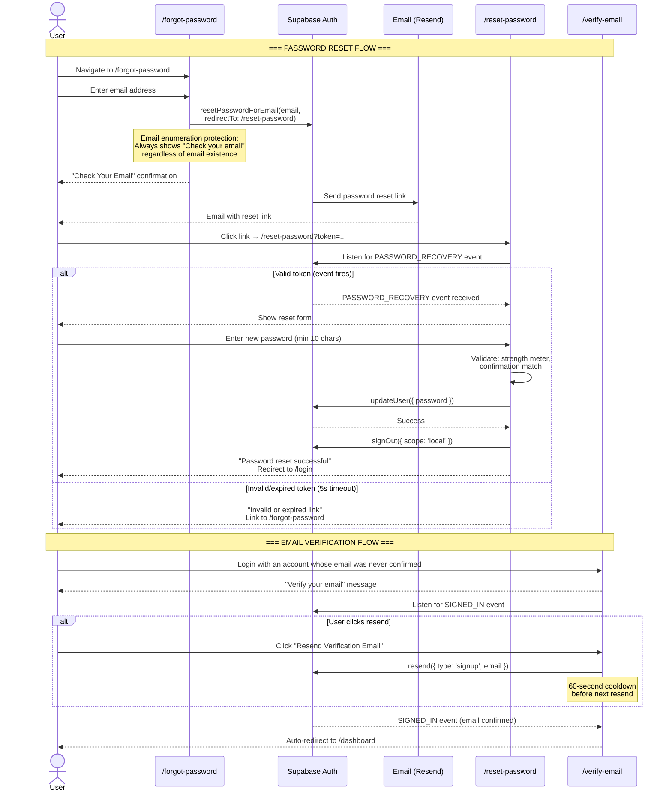

# DubGrid — Authentication & Session Management

This document covers authentication flows, session management, and security features that are separate from the core RBAC model. For role-based access control, see [RBAC_SYSTEM_DESIGN.md](../RBAC_SYSTEM_DESIGN.md). For the auth-surface edge cases and the audit of what is already hardened, see [AUTH_EDGE_CASES.md](../AUTH_EDGE_CASES.md).

> **Monorepo note.** DubGrid is an npm-workspaces + Turborepo monorepo: `apps/web`
> (Next.js 16 / React 19), `apps/mobile` (Expo), and shared `packages/*`. Auth logic that
> must run on both apps lives in the platform-neutral packages (`@dubgrid/authz`,
> `@dubgrid/domain`, `@dubgrid/mobile-api-core`). Paths below use the monorepo layout.

---

## 1. Per-Device Logout (Browser A ≠ Browser B)

### 1.1 Root Cause

> **The Problem: Two Logout Paths Need Different Scopes**
>
> **Voluntary Logout** (user clicks "Sign Out"): should only destroy the current browser's session. Other devices remain active.
>
> **Forced re-auth** (role change / org suspension): every device must pick up the new
> privilege state. DubGrid does **not** use a privileged `admin.signOut` Edge Function for
> this. A `jwt_refresh_locks` row makes the JWT hook return a `403` on the next token mint
> (forcing re-auth after a role change), and for a suspended/archived org the hook strips
> org claims while the middleware denies access — so no stale token retains elevated access.

### 1.2 user_sessions Table (Track Devices Individually)

```sql
CREATE TABLE public.user_sessions (
  id                  UUID PRIMARY KEY DEFAULT gen_random_uuid(),
  user_id             UUID NOT NULL,
  org_id              UUID,            -- audit snapshot of last-seen JWT org (not authoritative)
  active_org_id       UUID,            -- AUTHORITATIVE per-session org read by the JWT hook
  supabase_session_id UUID UNIQUE,     -- correlates web/mobile sessions to the auth session_id
  platform            TEXT,            -- 'web' | 'ios' | 'android'
  app_version         TEXT,
  device_label        TEXT,
  ip_address          INET,
  last_active_at      TIMESTAMPTZ NOT NULL DEFAULT NOW(),
  created_at          TIMESTAMPTZ NOT NULL DEFAULT NOW(),
  refresh_token_hash  TEXT UNIQUE      -- nullable: switch_org may create a row before track-session runs
);

ALTER TABLE user_sessions ENABLE ROW LEVEL SECURITY;
CREATE POLICY "own_sessions_only" ON user_sessions
  USING (user_id = auth.uid());
```

> `active_org_id` drives **per-session org isolation**: the custom access token hook reads
> the calling session's `active_org_id` (falling back to `profiles.org_id`) to decide which
> org that device's JWT is scoped to. `switch_org` writes it for the calling session only,
> so switching orgs on one device never changes another device's session. See
> RBAC_SYSTEM_DESIGN.md §10c.

### 1.3 Voluntary Logout: Local Scope, Swift, No Splash

The hook (`apps/web/src/hooks/useLogout.ts`) signs out `scope: "local"`, sweeps all `dg_*`
session/local keys (view-as-user, onboarding flags, auth-transition) while preserving
device prefs, and **always** lands on `/login` from a `finally` block so a thrown
`signOut` can never strand the user. Logout is deliberately swift, with no `<AuthSplash>`
(unlike login, which shows the splash to bridge the auth-settle gap).

```ts
// apps/web/src/hooks/useLogout.ts (shape)
async function signOutLocal(redirectTo = "/login"): Promise<void> {
  try {
    await signOutFromBrowser("local"); // scope: "local" — this browser only
    clearAllDgState(); // sweep dg_* keys, keep device prefs
    queryClient.clear();
  } finally {
    window.location.replace(redirectTo); // always reach /login, even on error
  }
}
```

### 1.4 Logout Decision Matrix

| Trigger                             | Scope  | Mechanism                                                                      | Other Devices Affected?                       |
| ----------------------------------- | ------ | ------------------------------------------------------------------------------ | --------------------------------------------- |
| User clicks "Sign Out"              | local  | `supabase.auth.signOut({ scope: 'local' })`                                    | No — all other sessions remain                |
| User clicks "Sign out all devices"  | others | `supabase.auth.signOut({ scope: 'others' })`                                   | Yes — all other sessions revoked              |
| Super admin demotes/changes role    | forced | `jwt_refresh_locks` row → JWT hook returns 403 on next mint; user must re-auth | Yes — every device re-auths with the new role |
| Org suspended/archived              | forced | JWT hook strips org claims + middleware denies access on next request          | Yes — all sessions lose access                |
| Session revoked via Active Sessions | single | revoke the target device's session (Profile → sessions)                        | Only the targeted device                      |
| JWT expires naturally               | n/a    | Token not renewed — next request hits middleware                               | No — each JWT independent                     |

---

## 2. Invite-Only Registration

Self-signup is completely disabled. Every user account must be created through an invitation issued by a super admin or gridmaster. A rogue actor who reaches the Supabase sign-up endpoint without a valid invite token is rejected before a profile row is ever created.

### 2.1 Disable Public Sign-Up

In Supabase Dashboard → Authentication → Providers → Email: set "Enable email signup" to OFF. The only account-creation path is `/api/invitations/register`, which runs with the service role and creates the invitee pre-confirmed; the browser never calls `supabase.auth.signUp()`. Locally, `supabase/config.toml` leaves `enable_signup = true` for the seeded fixtures.

### 2.2 invitations Table

```sql
CREATE TABLE public.invitations (
  id             UUID PRIMARY KEY DEFAULT gen_random_uuid(),
  org_id         UUID NOT NULL,
  invited_by     UUID,
  email          TEXT NOT NULL,
  role_to_assign org_role NOT NULL DEFAULT 'user',
  token          UUID NOT NULL DEFAULT gen_random_uuid(),
  expires_at     TIMESTAMPTZ NOT NULL DEFAULT now() + INTERVAL '72 hours',
  accepted_at    TIMESTAMPTZ,
  revoked_at     TIMESTAMPTZ,
  created_at     TIMESTAMPTZ NOT NULL DEFAULT now(),
  updated_at     TIMESTAMPTZ NOT NULL DEFAULT now(),
  employee_id    UUID,                          -- links to existing employee record
  first_name     TEXT,                          -- app-only invites: invitee details
  last_name      TEXT,                          --   stored before account creation
  phone          TEXT,
  department_ids BIGINT[] NOT NULL DEFAULT '{}',
  dept_admin_ids BIGINT[] NOT NULL DEFAULT '{}' -- depts where invitee becomes a dept admin
);

-- Partial UNIQUE: only one PENDING invite per email per org; historical
-- accepted/revoked rows for the same email are allowed.
CREATE UNIQUE INDEX one_pending_invite_per_email
  ON public.invitations (org_id, email)
  WHERE accepted_at IS NULL AND revoked_at IS NULL;

ALTER TABLE invitations ENABLE ROW LEVEL SECURITY;
```

> Acceptance runs through the hardened `accept_invitation(p_token)` RPC (migration `018`):
> `FOR UPDATE` row lock plus checks for already-accepted, revoked, expired, **and recipient
> email match**, so a token is single-use and a replay fails generically. Changing a
> pending invitation's access level goes through `replace_pending_invitation_access`
> (migration `012`), which revokes the old token and issues the replacement in one
> transaction. The `/api/invitations/lookup` route returns only live invitations and a
> uniform 404 for any dead/expired token (it used to leak org name/slug).

### 2.3 Invitation Flow

| Step | Actor       | Action                                                                                                                           |
| ---- | ----------- | -------------------------------------------------------------------------------------------------------------------------------- |
| 1    | Super Admin | Fills "Invite User" form: selects employee, enters email + role                                                                  |
| 2    | Server      | `/api/organizations/invitations/create` inserts the `invitations` row with `employee_id` FK                                      |
| 3    | Server      | The same request emails the link via Resend; a failed send removes the row                                                       |
| 4    | Invitee     | Clicks link → arrives at `/accept-invite?token=<uuid>`                                                                           |
| 5    | Accept Flow | `/api/invitations/register` validates token, creates a **pre-confirmed** auth user; `accept_invitation` sets `employees.user_id` |
| 6    | Auth Hook   | JWT issued with `platform_role`, `org_role`, `org_id`, `org_slug` claims                                                         |
| 7    | Invitee     | Redirected to their org dashboard, fully authenticated                                                                           |

### 2.4 Invitation Edge Cases

| Scenario                            | Behavior                                                       | Mechanism                                                       |
| ----------------------------------- | -------------------------------------------------------------- | --------------------------------------------------------------- |
| Duplicate invite to same email      | Old expired invite cleaned up, new one issued                  | DELETE expired + INSERT with UNIQUE constraint                  |
| Employee contact email changes      | A pending invitation to the old address is revoked and audited | `revoke_invitation_on_email_change()` trigger (migration `010`) |
| User clicks expired link            | Returns error — invite expired                                 | `expires_at` check in validation                                |
| User clicks already-used link       | Returns error — already accepted                               | `accepted_at IS NULL` check                                     |
| Two users race to accept same token | First UPDATE wins; second gets no row back                     | Atomic UPDATE ... WHERE accepted_at IS NULL                     |
| Admin revokes before user accepts   | Returns error — revoked                                        | `revoked_at IS NULL` check                                      |
| Employee already has linked account | Invite blocked — user_id already set                           | Pre-check in invite creation                                    |

---

## 3. Password Reset Flow

Self-service password reset is fully implemented with security best practices.

### 3.1 Implementation

1. **Forgot Password** (`/forgot-password`) — the page posts to `POST /api/auth/recovery-request` (`features/account/server/recovery-request.ts`), which rate-limits by source IP, target email hash, and a global surge limit, writes a `security.auth.recovery` audit event, and then calls Supabase `resetPasswordForEmail()` with an anon client. The response is always "Check your email" regardless of whether the address exists. Mobile posts to the same handler at `/api/mobile/v1/auth/recovery-request` and completes the reset in-app with the 6-digit code from the email (`verifyOtp({ type: "recovery" })` on an ephemeral client).
2. **Reset Password** (`/reset-password`) — Token-validated form with:
   - Password strength meter (4 levels: too short → weak → fair → strong)
   - Minimum 10-character requirement
   - Confirmation field with match validation
   - 5-second timeout fallback for invalid/expired tokens
   - Automatic local sign-out after successful reset
3. **Auth components** in `apps/web/src/components/auth/`: `PasswordInput` (show/hide toggle), `PasswordStrength` (visual meter), `AuthCard` (consistent layout)

### 3.2 Flow Diagram



---

## 4. Email Verification

**Invited accounts are never asked to confirm their email.** The invitation link was
mailed to that address, so clicking it already proves the address; `/api/invitations/register`
creates the auth user with `email_confirm: true` and no confirmation email is sent.
The invitee sets a password and lands on their org's login, and nothing in between
depends on them opening a second email.

This replaced a browser-side `supabase.auth.signUp()`. With "Confirm email" enabled on
the production Supabase project, that call mailed a redundant "Confirm your email" and
returned a user with **no session**, so the invitation could not be accepted until the
invitee found and clicked that mail. The route handler is now the only account-creation
path, and the flow behaves the same whether or not confirmations are enabled.

`/verify-email` remains for accounts that are genuinely unconfirmed — anyone stranded by
the old flow, reached by logging in:

- **Verify Email** (`/verify-email`) — Displays verification status with optional `?email=` param
- Resend button with 60-second cooldown to prevent abuse
- Listens for `SIGNED_IN` auth event to auto-redirect when verified
- Email enumeration protection (same UI regardless of email validity)

Re-clicking a live invitation also repairs such an account: an unconfirmed user that
belongs to no organization is an abandoned signup, so the register route confirms it and
sets the password just chosen. A **confirmed** account's password is never touched — that
person signs in with the one they already have.

### 4.1 One email per person

A linked staff record's email **is** the login email; there is no separate contact
address. The two stores are kept equal in both directions:

- **Manager changes it** (web `EditEmployeePanel`, mobile person editor): the
  `/api/employees/manage` update branch and the mobile person `PATCH` treat a changed
  email on a linked, active row as a sensitive action (`requireSensitiveActionAuth` /
  `requireMobileSensitiveActionAuth`, step-up in the client), refuse it from a test
  sandbox, and call `auth.admin.updateUserById(userId, { email, email_confirm: true })`
  **before** writing the row (`features/employees/server/login-email.ts`). GoTrue
  rejects an address another account holds, which surfaces as the usual email conflict.
  A linked row cannot be saved with a blank email. The change applies to that account in
  every organization it belongs to.
- **The person changes it** (web profile, mobile profile): after Supabase confirms the
  new address, the `on_auth_user_email_changed` trigger (migration `022`) rewrites
  `employees.email` on every linked, active row. A row in an organization where an
  unlinked staff record already holds that address is left alone with a warning rather
  than failing the confirmation.
- **Linking** (migration `023`): a staff row linked to an account without an email takes
  the account's email at link time, and rows that were already in that state were
  backfilled once. There is no separate "contact" address to explain in the editors; a
  linked row simply cannot be saved with a blank email.

---

## 4a. Post-Login Soft Nav, Auth Splash, and Onboarding Gate

Login redirects via a **soft** `router.replace("/dashboard")` (not `window.location`).
Because the JWT/session takes a moment to settle, `markAuthTransition()` sets a flag and
`<AuthSplash>` is shown so the route guards / onboarding gate do not bounce a
just-logged-in user back to `/login`. `consumeAuthTransition()` clears the flag from a
`useEffect`, not during render. Logout is the opposite: swift, no splash, always
`finally`-redirecting to `/login` (see §1.3).

Onboarding/setup state is enforced **client-side** by `OnboardingGate`
(`apps/web/src/components/onboarding/OnboardingGate.tsx`), which reads the
`@/features/onboarding/client` guards (`fetchOnboardingStatus`, `isOnboardingComplete`,
`getOnboardingPhase`, `freezeOnboardingPhase`). While setup is incomplete it renders the
onboarding wizard inline on every route for setup-capable users, and a setup-pending
screen for everyone else. This is not in the request proxy.

## 4b. Trial Activation (first super_admin login)

The 14-day trial clock starts on the **first genuine super_admin login**, via the
`start_trial_for_org(p_org_id)` RPC called from the web/mobile login flow. The RPC is
idempotent (`trial_ends_at IS NULL` guard), self-gated to a `super_admin` membership, and
only fires when `subscription_status = 'trialing'` and the org is not archived/suspended.
It is **never** called from the JWT hook, `switch_org`, or token refresh, because those
fire on every mint and cannot reliably target the org the user actually logged into. A
NULL `trial_ends_at` is the "trial pending" state, which `packages/domain/src/billing.ts`
maps to billing state `trial_pending` and which gates non-super_admins until activation.
The `/api/auth/start-trial` route additionally verifies the caller's claim is
`super_admin` for the requested org before calling the RPC (defense in depth).

## 5. Rate Limiting

All public-facing API routes are rate-limited via Upstash Redis (`apps/web/src/lib/rate-limit.ts`):

| Limiter                 | Window    | Key                 | Applied To                                                                              |
| ----------------------- | --------- | ------------------- | --------------------------------------------------------------------------------------- |
| `apiLimiter`            | 10 / 10s  | user id (or IP)     | general protected mutations (org settings/access/role-change, etc.)                     |
| `inviteLimiter`         | 100 / 1h  | user id (per-actor) | `/api/organizations/invitations/create`                                                 |
| `emailTargetLimiter`    | 5 / 1h    | `hashEmail(target)` | layered onto invite + gridmaster password-reset so one actor can't email-bomb one inbox |
| `demoLimiter`           | 3 / 1h    | IP                  | `/api/request-demo`                                                                     |
| `passwordResetLimiter`  | 5 / 15m   | `hashEmail(email)`  | recovery requests (web + mobile) and gridmaster password reset, per target address      |
| `loginLimiter`          | 15 / 15m  | `hashEmail(email)`  | login (app-level brute-force protection; `LOGIN_EMAIL_LIMIT_PER_15_MIN`)                |
| `loginIpLimiter`        | 120 / 1m  | source IP           | login burst ceiling for shared-office users (`LOGIN_IP_LIMIT_PER_MINUTE`)               |
| `loginSurgeLimiter`     | 500 / 10s | global              | login load shedding during sign-in spikes (`LOGIN_GLOBAL_LIMIT_PER_10_SECONDS`)         |
| `recoverySurgeLimiter`  | 100 / 10s | global              | recovery-email abuse and provider protection                                            |
| `scheduleReviewLimiter` | 60 / 10s  | user id             | publish/discard review dialogs                                                          |

`checkRateLimit` **fails closed** in production (returns a `misconfigured` flag so callers
respond 503) when Upstash Redis is unconfigured or unreachable; in development it allows
through unless `RATE_LIMIT_IN_DEV=1`. Rate-limited responses carry `Retry-After`, which
both clients honor before any automatic retry (`@dubgrid/client-errors`).

---

## 4c. Org-Switch on Sign-In (consolidated server-side)

Signing in to a subdomain whose organization isn't the caller's current one is
resolved inside `POST /api/auth/login`, not by the browser.
`orchestratePostSignIn` calls `switchSessionToHostOrganization`, which:

1. resolves the subdomain to an org id (service client — this grants nothing on
   its own),
2. calls `switch_org` on a token-scoped client — **this is the authorization
   boundary**, verifying live membership and that the org is active,
3. refreshes the session, minting the token that actually carries the new org.

Trial activation, sandbox teardown and the terms check then run together in one
`Promise.allSettled`. The response carries `didSwitchOrg`, and the client does
only what the server cannot: reset view-as-user, clear the React Query cache,
and hard-navigate.

**The second token mint is structural.** `switch_org` writes
`user_sessions.active_org_id` keyed on a `session_id` that does not exist until
the first token is minted, and the access-token hook only picks the new org up
on the next mint. Consolidation relocated that mint; it cannot remove it.

**Three things here are load-bearing:**

- The **hard navigation** after a switch. A soft `router.replace` leaves
  `useOrganizationData`'s one-time org context pinned to the previous org, which
  destabilises the onboarding gate.
- **`switch_org` as the authorization check.** The slug lookup must never be
  treated as one.
- **The MFA path still switches from the browser** (`findAndSwitchToOrg`),
  because a second factor is verified directly against Supabase and cannot
  re-enter this route.

Measured on a seven-organization account: the previous client-orchestrated chain
(`get_my_organizations` → `switch_org` → refresh → start-trial → sandbox exit →
terms, then a full page load) was 4.4s of serial round trips; the consolidated
route is ~0.7s warm.

---

## 5a. Request Authentication: Local JWT Verification + Revocation

Authenticated Route Handlers do **not** call `supabase.auth.getUser()`. That was a
network round trip to Supabase Auth on every request — paid 3-5× by a single shift
confirm and 6+ times concurrently by the post-login dashboard fan-out.

Instead, `lib/api-auth.ts`'s `authenticateRequest` does two things:

1. **Verify locally.** `lib/auth/verify-token.ts` checks the token's signature against
   Supabase's JWKS (ES256), plus `exp`, `iss`, `aud`, `sub`, the authenticated role,
   `session_id`, and `iat`. Requiring the final two claims is load-bearing: without
   them the app cannot enforce either a session-specific revocation or the user's
   revoke-all watermark. The keyset is module-cached and shared with `proxy.ts`.
   Tokens arrive either as an `Authorization: Bearer` header (mobile) or the Supabase
   SSR cookie (web); an explicit Bearer header wins and an invalid one never falls
   back to a cookie identity. The cookie path still goes through `getSession()`, which
   is a local cookie read that only reaches the network to refresh an expired token.
   There is **no** fallback to an unverified `decodeJwt` — middleware has one because
   RLS is the real boundary for page navigation, but a route handler acts on these
   claims.
2. **Check revocation.** `lib/auth/revocation.ts` reads two Redis markers:

   | Key                                                       | Written on                 | Invalidates  |
   | --------------------------------------------------------- | -------------------------- | ------------ |
   | `dg:auth:revoked:session:<session_id>`                    | sign-out, revoke device    | that device  |
   | `dg:auth:revokedAfter:user:<user_id>` (epoch ms vs `iat`) | employee remove/deactivate | every device |

   Reads are memoized per session for 5s, so a dashboard fan-out costs one Redis round
   trip. They **fail open** when Redis is unreachable — an Upstash outage must not sign
   everyone out.

This is why `POST /api/auth/sign-out` exists: sign-out used to be purely client-side,
which clears the browser's tokens but leaves the access token valid until it expires.
`signOutFromBrowser` now calls that route first. The same mechanism is what makes
"revoke this device" real — it previously only deleted the `user_sessions` row and left
the device fully working.

**Two deliberate exceptions.**

- `requireLiveAuthenticatedSession(req)` re-checks against Supabase Auth over the
  network. `requireSensitiveActionAuth(req)` builds on that live check and enforces the
  canonical five-minute password or verified-TOTP assurance policy before credential,
  factor, session, export, or destructive account and organization actions. A locally
  verified token can be up to an hour old, which is fine for ordinary reads and writes
  and not fine for these.
- `packages/mobile-api-core/src/auth.ts` still calls `getUser()`, solely to read enrolled
  MFA factors. `auth.mfa_factors` is not exposed through PostgREST and factors are not in
  the JWT, so there is no local answer to "does this user have a verified factor?", and
  without it a password-only (aal1) token would satisfy an MFA-enrolled user.
  `profiles.mfa_enabled` is **not** a substitute — the client writes it after enrolling,
  so a stale `false` reopens the bypass.

**Authentication is not authorization.** Local verification answers "who is this?" only.
Org access is still resolved per request by `requireOrgPermissions` against
`organization_memberships`, and the effective org by `resolveEffectiveOrgId` — never
from a client-supplied org id and never from a JWT claim alone. That separation is what
makes an hour-stale token safe.

### Request authorization contract

| Surface                         | Identity authority                                                                   | Live access authority                                                                                                 | What is never sufficient                                            |
| ------------------------------- | ------------------------------------------------------------------------------------ | --------------------------------------------------------------------------------------------------------------------- | ------------------------------------------------------------------- |
| Request proxy / page navigation | Verified JWT when available; decode-only fallback may route a non-Gridmaster request | The page's user-scoped Supabase query and RLS                                                                         | Proxy headers, decoded claims, host, or cached bootstrap data       |
| Authenticated Route Handler     | `authenticateRequest`: verified required claims plus known revocation markers        | `requireOrgPermissions` / `resolveEffectiveOrgId`, or another explicit live-membership permission check               | A request body org id, URL org id, cookie claim, or decode-only JWT |
| User-scoped Supabase query      | Supabase verifies the JWT supplied by the request-bound client                       | `caller_org_id()` and tenant RLS evaluate current membership at query time                                            | The token's possibly stale `org_id` by itself                       |
| Service-role query or mutation  | The handler's verified caller                                                        | An explicit current organization, membership, role, permission, and resource-ownership check before privileged access | RLS, because service-role access bypasses it                        |
| Test Sandbox override           | The verified caller and matching JWT session ID                                      | A live, unarchived sandbox row owned by that user and exact auth session                                              | The cookie payload, user ID, or sandbox organization ID alone       |
| Gridmaster impersonation        | A signature-verified, live Gridmaster and matching JWT session ID                    | A live impersonation row plus current target profile, membership, organization, role, and organization slug           | Client-held target IDs, role, slug, expiry, or display metadata     |

`apps/web/src/__tests__/api-authorization-boundaries.test.ts` inventories every
non-mobile Route Handler. A handler must call a canonical authorization helper,
delegate to a helper whose live authorization is itself asserted, or appear in
the exact public/system allowlist with its independent credential or public-purpose
reason. Adding an unclassified handler fails the structural test. Mobile v1 routes
have a separate complete authorization inventory.

`apps/web/src/__tests__/sensitive-action-authorization-boundaries.test.ts` separately
inventories every credential, factor, session-changing, export, and destructive
account or organization entry point. It records whether the policy is direct,
conditional, delegated to a mobile handler, or an authorized operational revocation
of another user's sessions. A newly added matching endpoint must be classified and
must satisfy the declared policy before the structural suite passes.

`apps/web/src/__tests__/privileged-authorization-boundaries.test.ts` separately
inventories every non-mobile source file that can create or receive the
service-role client. Tenant routes must use `requireOrgPermissions` or the live
`canManageEmployees` guard, platform routes must use `requireGridmasterSession`,
and every subject-owned, delegated, public, webhook, or system-job exception is
an exact documented path. A new privileged path fails until its independent
authorization and ownership contract is explicit. Gridmaster routes also recheck
the live profile role and account state rather than relying on an hour-stale token
claim.

Direct PostgREST requests cannot consult the Redis revocation markers used by Route
Handlers. Their equivalent revocation boundary is the tracked `user_sessions` row:
the access-token hook creates it when a session is minted, `caller_org_id()` and
`is_gridmaster()` require it while a JWT carries `session_id`, and every single- or
all-session revocation deletes it. Consequently, a copied access token loses direct
tenant access as soon as its tracked session is removed. Tokens without a
`session_id` cannot be individually revoked and are not accepted by the app request
authenticator; the SQL helpers retain a claim-less compatibility path only for
trusted internal/database execution, still constrained by live membership and
organization state.

Temporary tenant selection is session-bound too. A Test Sandbox row records
`sandbox_owner_session_id`, and `is_own_sandbox_org()` requires it to match the
current JWT before RLS recognizes the sandbox. New impersonation rows are stamped
with `auth_session_id` by a database trigger, and every server consumer verifies that
session before loading the target's current profile, membership, organization, and
role. Switching into or out of either mode performs a hard page transition or clears
the query cache before navigation so state from the prior tenant is not reused.

`apps/web/src/__tests__/mobile-api-authorization-boundaries.test.ts` closes the
same inventory over `/api/mobile/v1`. Every entry route must delegate to a
classified server implementation, every protected implementation must use the
shared mobile authorization context (directly or through its management guard),
and every direct mobile service-role path is exact-listed. The shared context
verifies revocation, requires the token's organization to match a live,
unarchived membership, rejects archived organizations, and reads Gridmaster
status from the live profile instead of the token claim. The locked-organization
recovery route performs those same checks independently and never falls back to
another membership when the claim is missing or stale. Resource IDs remain
client inputs, but every read and write scopes them to `auth.currentOrg.id`
before a service-role query or mutation.

Authenticated pages use the protected app layout/proxy for navigation and obtain
tenant data through classified Route Handlers or a request-scoped Supabase client.
The latter remains safe only because PostgREST evaluates the live-membership RLS
boundary for every query. `architecture-boundaries.test.ts` prevents browser UI
layers from adding raw Supabase database calls or new database adapters; there are
currently no Server Actions carrying user-scoped data.

The proxy's unverified fallback is therefore a navigation-resilience mechanism,
not an authorization mechanism. Known revocation markers reject a token before a
handler runs. The revocation store's outage policy remains fail-open and bounded by
token expiry; production fail-closed policy is reviewed separately under feature 19d4.

---

## 6. Branded Email Templates

Every email is a react-email component under `apps/web/src/emails/`: the transactional
emails (invite, trial welcome, notification, impersonation notice, demo request) and, under
`emails/auth/`, the Supabase auth templates (confirmation, invite, magic link, recovery,
reauthentication, email change, and the email-changed, password-changed, and MFA
enrolled/unenrolled security notices). `npm --workspace @dubgrid/web run email:build`
compiles the auth set to `supabase/templates/*.html`, and `npm run auth:templates:push`
syncs those compiled templates, their subjects, and the OTP settings to the linked remote
project (the dashboard copy does not update itself). `apps/web/src/lib/email.ts` keeps only
the header-safety helpers (`sanitizeHeaderValue`, `emailBaseUrl`).

---

## 7. CSRF Protection

Mutating Route Handlers call `validateCsrfOrigin(req)` (`apps/web/src/lib/csrf.ts`), which
checks the request `Origin` header's root domain against the request host's root domain
(any `*.dubgrid.com` subdomain is accepted; a foreign origin is rejected) and fails closed
in production when the header is absent. Public, mobile bearer, webhook, and cron entry
points are the explicit exceptions; `apps/web/src/__tests__/auth-integrity-entry-points.test.ts`
inventories every mutating route and fails if a browser-facing mutation lacks the check or
an exception is not classified. Redirect and OTP destinations are pinned by
`lib/auth/integrity-contract.ts`. The app uses no Server Actions.

---

## 8. Status of Earlier Recommendations

Earlier revisions of this document listed security work still to do. The
authentication hardening epic (build-plan items 19a-19e, completed 2026-09-14)
closed most of it; this section records where each item stands.

### 8.1 Security

#### Multi-Factor Authentication (MFA): Implemented, enforcement account-based

| Property          | Detail                                                                                                                                                                                                                                                                                                                                                                                                                                                                        |
| ----------------- | ----------------------------------------------------------------------------------------------------------------------------------------------------------------------------------------------------------------------------------------------------------------------------------------------------------------------------------------------------------------------------------------------------------------------------------------------------------------------------- |
| Status            | **Done.** TOTP enrollment, verification, and removal are built on web (`MFASetup.tsx`) and mobile (`ProfileSecurityScreen`), through one shared lifecycle handler (`POST /api/account/mfa-lifecycle`, `POST /api/mobile/v1/profile/mfa-lifecycle`) with `enroll`, `remove`, `reauthenticate`, and `cleanup` actions. Once an account has a verified factor, sign-in requires the TOTP challenge on both platforms and the mobile API rejects AAL1 tokens for it.              |
| Sensitive actions | MFA changes, credential updates, other-session revocation, data export, and account or organization deletion require a human authentication step within the last five minutes (`@dubgrid/authz` `assurance.ts`, `requireSensitiveActionAuth`): fresh AAL2 proof when a verified factor exists, otherwise a fresh password proof, driven by the JWT `amr` timestamps. See `internal/mfa-provider-boundary.md` for the provider-boundary qualification and its accepted limits. |
| Remaining choice  | Enforcement is account-based, not role-based: management accounts without a factor get a dismissible nag banner (`MfaNagBanner`), not a hard block. Gating `/settings` and `/gridmaster` behind AAL2 for privileged roles remains a deliberate future decision so existing admins are not locked out.                                                                                                                                                                         |

#### Failed Login Attempt Tracking & Account Lockout: Rate-limit based

| Property | Detail                                                                                                                                                                                                                                                                                                                             |
| -------- | ---------------------------------------------------------------------------------------------------------------------------------------------------------------------------------------------------------------------------------------------------------------------------------------------------------------------------------- |
| Status   | **Done as rate limiting.** Login is bounded per email (`loginLimiter`, 15/15m), per source IP (`loginIpLimiter`, 120/min), and globally (`loginSurgeLimiter`, 500/10s), all failing closed in production; failures return a generic 401 and every throttle is security-audited. Recovery requests carry the same three dimensions. |
| Not done | There is no persistent per-account lockout with an email-based unlock. The sliding windows expire on their own, which was judged sufficient for a care-facility user base that shares office IPs.                                                                                                                                  |

#### IP Allowlisting for Gridmaster: Not done

| Property       | Detail                                                                          |
| -------------- | ------------------------------------------------------------------------------- |
| Gap            | Any authenticated Gridmaster can access from any IP, including a stolen laptop. |
| Recommendation | Add a `gridmaster_allowed_ips` table and check the request IP in `proxy.ts`.    |

### 8.2 User Lifecycle

#### Soft Delete: Done for orgs and users

`organizations.archived_at` soft-deletes an org and revokes access everywhere (request
proxy, JWT hook, `get_my_organizations`, `switch_org`); a super_admin self-deletes from
Settings → Danger Zone behind fresh sensitive-action auth. Users carry
`profiles.deactivated_at` / `scheduled_deletion_at` and memberships carry `archived_at`;
migration `005` makes a live membership a precondition for every tenant claim, and
migration `016` cuts direct user-scoped Supabase queries off when the tracked session row
is removed, so an archived membership or revoked session fails closed rather than relying
on each query to filter.

### 8.3 Operational

#### Refresh Token Rotation & Reuse Detection: Configured locally, plus app-side revocation

`supabase/config.toml` enables `enable_refresh_token_rotation` with a 10-second reuse
interval for local development; the hosted project's setting lives in the Supabase
dashboard. Independently of the provider, DubGrid revokes sessions itself: Route Handlers
consult Redis revocation markers (`lib/auth/revocation.ts`) on every request, `POST
/api/auth/sign-out` with `global` scope revokes all of a user's sessions, and a forced
logout or gridmaster demotion wipes the tracked session rows.

#### Role Change Notifications: Done

The access routes (`/api/organizations/access`, the mobile person-access route) dispatch a
`role_changed` notification (`features/notifications/server/events.ts`) to the affected
member with client-friendly copy; permission-only changes list the flags that flipped in
the Activity Log.

#### GDPR / Data Export Compliance: Done

`/api/auth/data-export`, `/api/auth/delete-account`, and `/api/auth/gdpr-erase` (all
behind fresh sensitive-action auth), plus `/api/account/change-requests` for
super-admin-approved deletions. See `internal/cookies-and-gdpr.md`.

### 8.4 Summary

| Item                                     | Status                                                                    |
| ---------------------------------------- | ------------------------------------------------------------------------- |
| MFA enrollment, challenge, and step-up   | Done; account-based enforcement, nag for unenrolled management accounts   |
| Failed login tracking                    | Done as per-email, per-IP, and global rate limits; no persistent lockout  |
| IP allowlisting for Gridmaster           | Not done                                                                  |
| Password reset flow                      | Done (web link, mobile OTP, server-mediated requests)                     |
| Email verification                       | Done (invited accounts are pre-confirmed; `/verify-email` for stragglers) |
| Rate limiting on API routes              | Done                                                                      |
| Soft delete (users & orgs)               | Done, fail-closed at the membership and session level                     |
| Refresh token rotation + reuse detection | Enabled in local config; app-side revocation markers regardless           |
| Role change notifications                | Done                                                                      |
| GDPR data export                         | Done                                                                      |

---

_DubGrid — Confidential_
